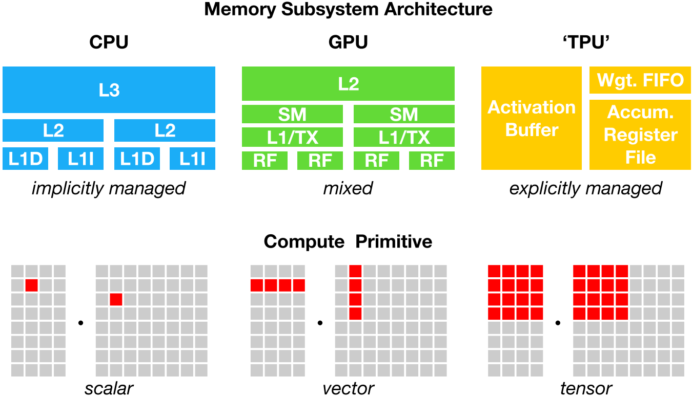
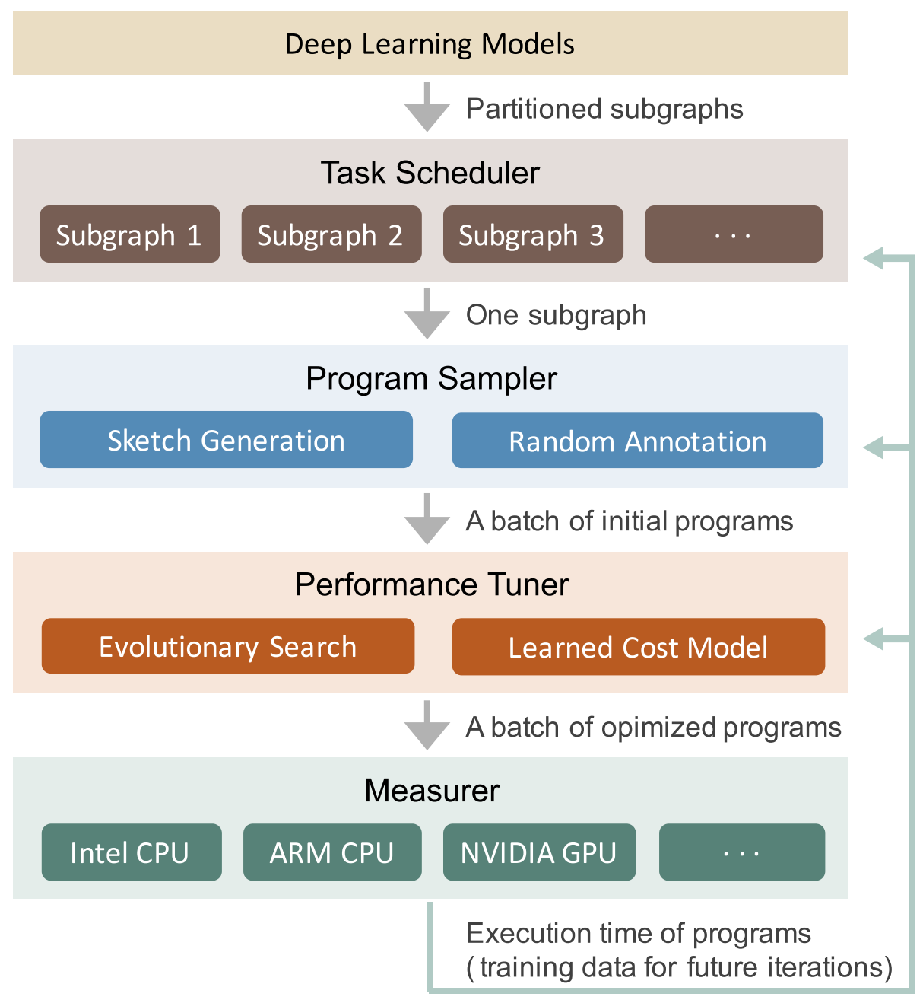
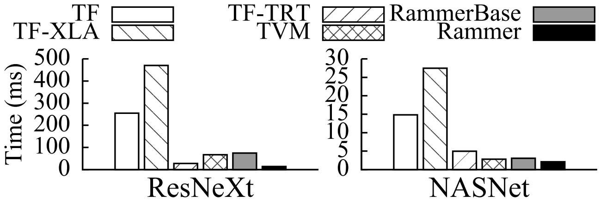

在墨奇科技，我们需要将一些包含深度神经网络（DNN）的 AI 算法移植到边缘端的设备，
这些设备往往使用 ARM 架构的 CPU 和一些特殊的边缘端推理芯片（NPU）。这个时候，我
们可以使用 NPU 产商提供的推理框架（例如瑞芯微的
[rknn-toolkit](https://github.com/rockchip-linux/rknn-toolkit)）或 TensorFlow
Lite 这样的通用边缘端推理框架。另一个选择是使用*深度神经网络编译器*，自动化的生
成对模型和硬件最适合的机器代码。我们将这个领域内的一些论文和开源项目进行了梳理。

## 为什么需要深度神经网络编译器？

深度学习在我们的日常生活中无处不在。深度神经网络（DNN）可以识别图像，处理自然语
言，甚至在一些很有挑战性的策略游戏中击败人类。当前的深度学习框架，如
TensorFlow[^9]、MXNet[^16] 和 PyTorch[^17]，支持使用 GPU 加速深度学习模型的训练
和推理，这种支持依赖于由 GPU 产商提供的高度优化的张量算子库（比如 NVIDIA 的
cuDNN）。对于一个张量算子，存在许多逻辑上等效的实现，但由于线程、内存重用、流水
线和其他硬件因素的差异，这些实现在性能上会有很大差距。为了优化张量算子，程序员必
须从这些逻辑等效的实现中选择性能最好的。这些算子级别的优化需要大量的手动调整，非
常的专业和不透明，而且无法轻松地跨硬件设备移植。因此，一个深度学习框架如果想要支
持不同的硬件后端，需要大量的工程工作。即使在当前受支持的硬件上，开发深度学习框架
和模型也受到库中优化算子集合的限制，从而阻止了可能产生不受支持的算子的优化（例如
计算图优化和算子融合）。

从云服务器到自动驾驶汽车和嵌入式设备，我们需要将包含 DNN 的 AI 应用程序部署到各
种各样不同的设备上。由于硬件的多样性，存在 CPU、GPU、ASIC（如 TPC 和 NPU）、FPGA
等不同类型的硬件，这些硬件的设计目标在内存组织、计算功能单元等方面都有很大的不同
（下图展示了 CPU、GPU 和 TPU 的不同内存组织和计算功能单元），将深度学习模型映射
到这些硬件设备变得很复杂。深度学习框架依靠计算图的中间表示来实现优化，例如自动微
分和动态内存管理。但是，计算图级别的优化通常过于高级，无法处理特定硬件后端的算子
级转换
。

为了在不同的硬件后端上同时实现计算图级别和算子级别的优化，让深度学习计算被更广泛
的应用，我们需要一套自动化的针对不同硬件后端的深度学习编译技术。

## 主要工作

这节我们介绍深度学习编译技术中的一些代表性工作。

### TVM

为了解决上一节所说的种种问题，陈天奇等人提出了 TVM[^1]，第一个端到端的深度学习自
动编译和代码生成方法。TVM 允许将高级框架（如 TensorFlow、MXNet、PyTorch 等）专用
的深度学习网络部署到多种硬件后端上（包括 CPU、GPU 和基于 FPGA 的加速器）。在设计
上，TVM 结合了内存访问、线程模式和新的硬件元语，建立一个足够大的搜索空间，保证可
能的人工工程优化全部包含在这个搜索空间里面。TVM 通过快速的搜索这个搜索空间，生成
可部署代码。其性能可与当前最优的硬件供应商库相比，且可适应新型专用加速器后端。

[TVM](https://tvm.apache.org/) 是一个由社区维护的开源项目，来自全世界的贡献者们
仍然在持续的改进它。2018 年，陈天奇等人提出了 AutoTVM[^2]，旨在通过机器学习来编
译优化深度学习系统底层算子。当 TVM 建立了足够大的搜索空间后，剩下的问题是如何在
几十亿的可能性里面去选择比较好的实现。这里有几种常见的做法。传统的高性能计算库如
会采用自动整定（auto tuning），也就是把可能的参数都尝试一遍。这样做的潜在问题是
空间太大之后枚举开销过高。另外一种常见的做法是类似于数据库做查询优化的做法，针对
程序建立一个代价估价函数，然后利用估价函数来搜索。这个做法可能碰到的主要问题是估
价函数不一定可以估计准确，并且针对每个新的硬件特性必须要重新设计估价函数。
AutoTVM 利用机器学习来学习程序空间的代价估价函数。具体地说，探索程序在一开始会
随机地选取一些设定，直接到硬件上面去运行生成的代码，再通过得到的反馈数据来更新程
序代价估计函数。这里面比较有趣的一点是模型的可迁移性。因为真正的深度学习系统需要
优化许多不一样输入类型和输入形状的算子。一个可迁移的模型可以通过学习已经看到过的
算子优化记录来预测新的目标的代价，导致最后的搜索时间可以大幅降低。

Relay[^22] 是一种功能多样的编程语言，TVM 用 Relay 作为深度学习模型的中间表示（
IR, intermediate representation）。Relay 支持代数数据类型、闭包、控制流和递归，
从而可以直接表示比基于计算图的中间表示更复杂的模型。Relay 还包括一种使用类型关系
的依赖类型的形式，来处理对参数形状有复杂的要求的操作符的形状分析。Relay 在设计上
是可扩展的，这使得机器学习的研究人员和实践者可以很容易地开发新的大型程序转换和优
化。

郑怜悯等人在 TVM 的基础上实现了 Ansor[^5]。Ansor 主要解决了 TVM 中的两个问题：
1. 如何自动化的构造一个更大的搜索空间？Ansor 使用了一个层次化的搜索空间；
2. 如何更有效的进行搜索？Ansor 在搜索过程中增加了采样，先对完整的程序进行采样然
   后再调整，提高了搜索效率。

下图展示了 Ansor 的整体架构。Ansor 的输入是一组待优化的深度神经网络（DNN）。
Ansor 使用 Relay[^22] 中的算子融合算法，将 DNN 从流行的模型格式（如 ONNX 和
TensorFlow PB）分割成的小子图。然后 Ansor 为这些子图生成张量程序。Ansor 有三个主
要部分：(1) 程序采样器（program sampler）：构建一个大的搜索空间，并从中采样不同
的程序；(2) 性能调整器（performance tuner）：对采样程序的性能进行微调；(3) 任务
调度器（task scheduler）：为优化 DNN 的多个子图分配时间资源。

### Rammer

Rammer[^6] 是微软发布的一个针对深度神经网络的自动编译框架。Rammer 针对的主要是并
行计算能力较强的 GPU 和 ASIC 神经网络加速器。在神经网络中，有两个层级可以通过并
行来加速，第一层是在神经网络的计算图上，可以将相互之间独立的算子并行化；第二层是
在一个算子的内部，比如矩阵乘法，可以使用并行计算加速。Rammer 的特点是提供了对算
子和硬件的两种抽象，统一的对两层级的并行进行调度，提高了并行编排的效率。作者在
NVIDIA GPU、AMD GPU 和 GraphCore IPU 上进行了实验，如下图所示，NVIDIA GPU 上的实
验表明，Rammer 在部分模型上的效果超越了 TensorFlow、TVM 和 TensorRT。

### MLIR

Google 在 2019 年的 [C4ML](https://www.c4ml.org/c4ml2019) 上发布了 MLIR[^13]。
MLIR (multi-level intermediate representation) 是一种用来构建可重用和可扩展编译
基础设施的新方法，它是 Google 用于统一其 TensorFlow 中众多中间表示的路径。乍看之
下，MLIR 似乎可以替代 XLA 和相关的 TensorFlow 编译器，但事实并非如此。MLIR 是用
于构建一组可互操作的中间表示「方言」的共享基础结构，可用于构建编译器。MLIR 项目
正在针对 TensorFlow 的中间表示和低级多面体中间表示的方言开展工作，但是尚没有基于
MLIR 的深度学习的端到端解决方案。MLIR 深受 LLVM 的影响，并不折不扣地重用其许多优
秀理念，比如拥有灵活的类型系统，可在同一编译单元中表示、分析和转换结合多层抽象的
图等。这些抽象包括 TensorFlow 算子、嵌套的多面循环区域乃至 LLVM 指令和固定的硬件
操作及类型。

为区分不同的硬件与软件受众，MLIR 提供中间表示「方言」，其中包括：
* TensorFlow IR，代表 TensorFlow 图中可能存在的一切
* XLA HLO IR，旨在利用 XLA[^14] 的编译功能（输出到 TPU 等）
* 实验性仿射方言，侧重于多面表示与优化
* LLVM IR，与 LLVM 自我表示之间存在 1:1 映射，可使 MLIR 通过 LLVM 发出 GPU 与
  CPU 代码
* TensorFlow Lite，将会转换以在移动平台上运行代码

### TorchScript

TorchScript[^23] 是一种类似 Python 的高级中间表示，它是作为 PyTorch 的 JIT
(Just-In-Time) 编译器的第一层。PyTorch（从 v1.0 开始）可以将一部分用户程序重写为
TorchScript（Python 的理想化子集）。然后，TorchScript 可以由 TorchScript VM 执
行，也可以通过 JIT 编译到目标平台。TorchScript 位于代码生成之上的多个层次，并且
必须适应 Python 的灵活语义，从而排除了所有的静态分析优化方法。为了优化这种动态
行为，TorchScript 有一种用于性能分析的 JIT 模式，该模式在执行期间标识稳定的程序
trace。然后，可以通过低级编译器（例如 Glow[^12] 或 Relay[^22]）来优化这些稳定的
静态 trace，以执行最后一级的代码生成。

### Glow

Glow[^12] 是 Facebook 推出的深度学习编译器。Glow 采用 TensorFlow 或 Caffe2 等框
架生成的深度学习计算图，然后将它渲染成用于硬件加速器的字节代码。Glow 包括多个工
具，如用来生成用于芯片特定内存配置的指令排程器、线性代数优化器、内存分配器，以及
用来测试硬件准确率的基于 CPU 的推断实现。

## 其它相关工作

### 基于调度语言的自动张量程序生成

Halide[^15] 是一个开源的专门设计用于简化图像处理的程序语言。Halide 引入了一种可
以描述循环优化原语的调度语言。该语言适用于手动优化和自动搜索。Halide 基于不同的
技术有三种版本的自动调度器[^18][^19][^20]。最新的一种具有波束搜索和学习成本模型的版
本表现最好。TVM[^1] 也利用了类似的调度语言。FlexTensor[^4] 是一个张量计算的调度
探索和优化框架，可以用于改进 TVM 的搜索算法。FlexTensor 首先定义了规整的优化空间
，然后使用了模拟退火结合机器学习的方法去探索优化空间，找到最优的调度策略。

### 多面体编译模型

多面体编译模型将程序的优化公式化为整数线性规划（ILP）问题。它使用仿射循环转换来
优化程序，从而使从属语句之间的数据重用距离最小化。Tiramisu[^3] 和
Tensor Comprehensions[^10] 是两个针对深度学习领域的多面体编译器。Tiramisu 提供的
调度语言类似于 Halide 语言，并且需要手动调度。Tensor Comprehensions 可以自动搜
索 GPU 代码，但尚未打算将其用于计算瓶颈区域（compute-bound）的问题。由于缺乏某些
优化和多面体公式中不准确的隐式成本模型，Tensor Comprehensions 不能在 `conv2d` 和
`matmul` 等算子上胜过 TVM。

### 深度学习的计算图级别优化

计算图级别优化将计算图中的算子视为基本单元，并在计算图级别执行优化，而无需更改算
子的内部实现。计算图级别的常见优化包括布局优化[^21]、算子融合[^1]、常数折叠[^22]
、自动批处理、自动生成图替换[^8]等。计算图形级优化通常是对算子级优化的补充。计算
图级别优化还可以从算子的高性能实现中受益。TensorFlow XLA[^14] 和 DLVM[^11] 都属
于针对深度学习的计算图级别的优化框架。TACO[^8] 是第一个使用自动生成子图替换的神
经网络优化器。它将一系列算子操作作为输入，生成一系列可替换的候选子图，利用自动定
理证明来通过形式化验证筛选，最后使用基于代价的回溯搜索法来找到最优图。TACO 可以
自动的对于图结构和数据布局进行联合优化。而其他框架如 TensorFlow、PyTorch、TVM 则
是通过一系列基于规则的手写子图组合进行图的优化，然后分开进行数据布局的优化。作为
一个计算图的优化器，因为不涉及到底层代码的生成，TACO 可以很容易的作为一个插件去
进一步提升其他框架如 TVM 的推理性能。

### 传统机器学习算法的优化

传统的机器学习算法（如决策树、支持向量机等）仍然在各种领域中广泛使用，它们使用的
框架各异（如 scikit-learn、xgboost、SparkML 等），这些框架通常只对于部分硬件后端
进行过推理性能的优化。如前面所述，由于神经网络的流行，在不同硬件后端上对深度神经
网络的推理性能优化，已经有了大量的工作。微软推出了一个名为 Hummingbird 的系统，
可以将传统的机器学习算法运行在深度学习推理引擎上，这样可以利用现成的深度学习自动
编译器来加速传统机器学习算法在不同硬件后端上的推理性能[^7]。目前 Hummingbird 已
经支持将 [scikit-learn](https://scikit-learn.org/stable/)、
[LightGBM](https://github.com/Microsoft/LightGBM) 和
[XGBoost](https://github.com/dmlc/xgboost) 中的决策树模型转换成可以在
[PyTorch](https://pytorch.org/)、
[TorchScript](https://pytorch.org/docs/stable/jit.html)、
[ONNX](https://onnx.ai/) 和 [TVM](https://docs.tvm.ai/) 上运行的模型。

## 小结

从近几年的论文和开源社区的发展来看，深度学习自动编译和优化这个方向还在蓬勃的发展
中。在开源社区中，TVM 应该是最为成功的一个，它有先发优势，并且还在不断的进步（最
近的改进 Ansor 在 OSDI'20 发表了）。同时，对于 TensorFlow 和 PyTorch 这样的深度
学习框架，自动编译和优化对于他们在边缘端设备上的推广是非常重要的，所以可以看到大
公司们也在这个方向上不断发力。

墨奇科技基础架构组专注于大规模图像搜索系统的基础架构和边缘端的 AI 算法优化两个方
向。有兴趣的朋友请发简历（校招/社招）到 <talent@moqi.ai>。

## 参考文献

[^1]: Chen, Tianqi, Thierry Moreau, Ziheng Jiang, Lianmin Zheng, Eddie Yan, Haichen Shen, Meghan Cowan, et al. “TVM: An Automated End-to-End Optimizing Compiler for Deep Learning.” In _OSDI_, 2018.
[^2]: Chen, Tianqi, Lianmin Zheng, Eddie Yan, Ziheng Jiang, Thierry Moreau, Luis Ceze, Carlos Guestrin, and Arvind Krishnamurthy. “Learning to Optimize Tensor Programs.” In _NeurIPS_, 3389–3400, 2018.
[^3]: Baghdadi, Riyadh, Jessica Ray, Malek Ben Romdhane, Emanuele Del Sozzo, Abdurrahman Akkas, Yunming Zhang, Patricia Suriana, Shoaib Kamil, and Saman Amarasinghe. “TIRAMISU: A Polyhedral Compiler for Expressing Fast and Portable Code.” In _CGO_, 2019.
[^4]: Zheng, Size, Yun Liang, Shuo Wang, Renze Chen, and Kaiwen Sheng. “FlexTensor: An Automatic Schedule Exploration and Optimization Framework for Tensor Computation on Heterogeneous System.” In _ASPLOS_, 859–73, 2020.
[^5]: Zheng, Lianmin, Chengfan Jia, Minmin Sun, Zhao Wu, Cody Hao Yu, Ameer Haj-Ali, Yida Wang, et al. “Ansor: Generating High-Performance Tensor Programs for Deep Learning.” In _OSDI_, 2020.
[^6]: Ma, Lingxiao, Zhiqiang Xie, Zhi Yang, Jilong Xue, Youshan Miao, Wei Cui, Wenxiang Hu, Fan Yang, Lintao Zhang, and Lidong Zhou. “Rammer: Enabling Holistic Deep Learning Compiler Optimizations with RTasks.” In _OSDI_, 881–97, 2020.
[^7]: Nakandala, Supun, Karla Saur, Gyeong-In Yu, Konstantinos Karanasos, Carlo Curino, Markus Weimer, and Matteo Interlandi. “A Tensor Compiler for Unified Machine Learning Prediction Serving.” In _OSDI_, 2020.
[^8]: Jia, Zhihao, James Thomas, Todd Warszawski, and Alex Aiken. “TASO : Optimizing Deep Learning Computation with Automatic Generation of Graph Substitutions.” In _SOSP_, 47–62. New York: ACM, 2019.
[^9]: Abadi, Martín, Paul Barham, Jianmin Chen, Zhifeng Chen, Andy Davis, Jeffrey Dean, Matthieu Devin, et al. “TensorFlow : A System for Large-Scale Machine Learning.” In _OSDI_, 265–83, 2016.
[^10]: Vasilache, Nicolas, Oleksandr Zinenko, Theodoros Theodoridis, Priya Goyal, Zachary DeVito, William S. Moses, Sven Verdoolaege, Andrew Adams, and Albert Cohen. “Tensor Comprehensions: Framework-Agnostic High-Performance Machine Learning Abstractions.” _ArXiv_, 2018.
[^11]: Wei, Richard, Lane Schwartz, and Vikram Adve. “DLVM: A Modern Compiler Infrastructure for Deep Learning Systems.” _ArXiv_, 2017.
[^12]: Rotem, Nadav, Jordan Fix, Saleem Abdulrasool, Garret Catron, Summer Deng, Roman Dzhabarov, Nick Gibson, et al. “Glow: Graph Lowering Compiler Techniques for Neural Networks.” _ArXiv_, 2019.
[^13]: Lattner, Chris, Uday Bondhugula, Albert Cohen, Andy Davis, Jacques Pienaar, River Riddle, Tatiana Shpeisman, Nicolas Vasilache, and Oleksandr Zinenko. “MLIR: A Compiler Infrastructure for the End of Moore’s Law.”_ArXiv_, 2020.
[^14]: [XLA: Optimizing Compiler for Machine Learning | TensorFlow](https://www.tensorflow.org/xla)
[^15]: Ragan-Kelley, Jonathan, Connelly Barnes, Andrew Adams, Sylvain Paris, Frédo Durand, and Saman Amarasinghe. “Halide: A Language and Compiler for Optimizing Parallelism, Locality, and Recomputation in Image Processing Pipelines.” In _PLDI_, 519–30, 2013.
[^16]: Chen, Tianqi, Mu Li, Yutian Li, Min Lin, Naiyan Wang, Minjie Wang, Tianjun Xiao, Bing Xu, Chiyuan Zhang, and Zheng Zhang. “MXNet: A Flexible and Efficient Machine Learning Library for Heterogeneous Distributed Systems.” In _LearningSys_, 1–6, 2015.
[^17]: Paszke, Adam, Sam Gross, Francisco Massa, Adam Lerer, James Bradbury, Gregory Chanan, Trevor Killeen, et al. “PyTorch: An Imperative Style, High-Performance Deep Learning Library.” In _NeurIPS_, 2019.
[^18]: Mullapudi, Ravi Teja, Andrew Adams, Dillon Sharlet, Jonathan Ragan-Kelley, and Kayvon Fatahalian. “Automatically Scheduling Halide Image Processing Pipelines.” _TOG_ 35, no. 4 (2016).
[^19]: Li, Tzu Mao, Michaël Gharbi, Andrew Adams, Frédo Durand, and Jonathan Ragan-Kelley. “Differentiable Programming for Image Processing and Deep Learning in Halide.” _TOG_ 37, no. 4 (2018).
[^20]: Adams, Andrew, Karima Ma, Luke Anderson, Riyadh Baghdadi, Tzu Mao Li, Michaël Gharbi, Benoit Steiner, et al. “Learning to Optimize Halide with Tree Search and Random Programs.” _TOG_ 38, no. 4 (2019).
[^21]: Liu, Yizhi, Yao Wang, Ruofei Yu, Mu Li, Vin Sharma, and Yida Wang. “Optimizing CNN Model Inference on CPUs.” In _USENIX ATC_, 1025–39, 2019.
[^22]: Roesch, Jared, Steven Lyubomirsky, Marisa Kirisame, Logan Weber, Josh Pollock, Luis Vega, Ziheng Jiang, Tianqi Chen, Thierry Moreau, and Zachary Tatlock. “Relay: A High-Level Compiler for Deep Learning.” _ArXiv_, 2019.
[^23]: [TorchScript](https://pytorch.org/docs/stable/jit.html)
