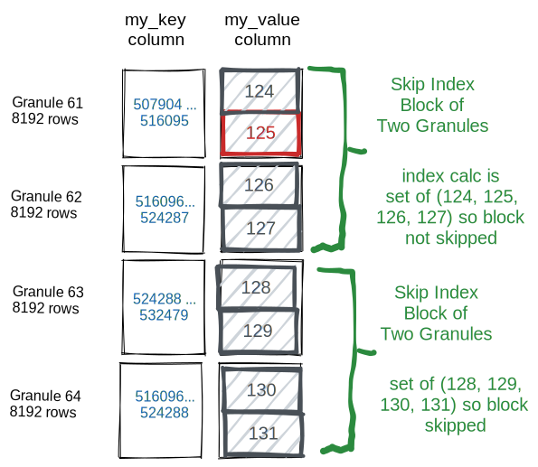

+++
title = "Clickhouse 存储引擎"
date = "2022-12-08T10:42:45+08:00"

tags = ["database", "clickhouse"]
+++

ClickHouse 实现高效 OLAP 查询的秘诀，在于它强大的存储引擎 MergeTree（合并树）。
MergeTree 在写入一批数据时，数据总会以数据片段 (data part) 的形式写入磁盘，且数据片段不可修改。
而为了避免数据片段过多，ClickHouse 会通过后台线程定期的合并 (merge) 这些数据片段，属于相同分区的数据片段会
被合并成一个新的数据片段，这种数据片段往复合并的过程，正是 MergeTree 名称的由来。

用 MergeTree 表引擎建表的语法如下：

```sql
CREATE TABLE [IF NOT EXISTS] [db_name.]table_name(
    name1 type [DEFAULT|MATERIALIZED|ALIAS expr],
    name2 type [DEFAULT|MATERIALIZED|ALIAS expr],
    ......
) ENGINE = MergeTree()
[PARTITION BY expr]
ORDER BY expr
[PRIMARY KEY expr]
[SETTINGS name1=value1, name2=value2, ......]
```

这里主要介绍 MergeTree 创建时需要指定的三种 key：

1. `PARTITON BY`: 选填，表示分区键 (partition key)，用于指定表数据以何种标准进行分区 (partition)。
   分区键既可以是单个字段、也可以通过元组的形式指定多个字段，同时也支持使用列表达式。如果不指定分区键，
   那么 ClickHouse 会生成一个名称为 `all` 的分区，合理地使用分区可以有效的减少查询时数据量。
   最常见的莫过于按照时间分区了，数据量非常大的时候可以按照天来分区，一天一个分区，这样查找某一天的数据时
   直接从指定分区中查找即可。
2. `ORDER BY`: 必填，表示排序键 (sorting key)，用于指定在一个数据片段内，数据以何种标准进行排序。
   排序键既可以是单个字段，例如 `ORDER BY CounterID`，也可以是通过元组声明的多个字段，例如
   `ORDER BY (CounterID, EventDate)`。如果是多个字段，那么会先按照第一个字段排序，如果第一个字段
   中有相同的值，那么再按照第二个字段排序，依次类推。总之在每个数据片段内，数据是按照分区键排好序的，
   但多个数据片段之间就没有这种关系了。
3. `PRIMARY KEY`: 选填，表示主键 (primary key)，声明之后会依次按照主键字段生成一级索引，用于加速表查询。
   如果不指定，那么主键默认和排序键相同，所以通常直接使用 `ORDER BY` 代为指定主键，无须使用 `PRIMARY KEY` 声明。
   所以一般情况下，在每个数据片段内，数据与一级索引以相同的规则升序排列（因为数据是按照排序键排列的，
   而一级索引也是按主键、也就是排序键进行排列的）。

MergeTree 可以被看成简化后的 Log-Structured Merge-tree (LSM-tree)。
在 ClickHouse 中一张 MergeTree 本地表对应一个目录。前面提到，MergeTree 中是有数据片段 (data part) 的，
并且每个数据片段都对应一个目录，所以表对应的目录里面存储的是每个数据片段的目录，而数据片段目录里面存储的才是负责
容纳数据的文件。所以一张 MergeTree 数据表在磁盘上的物理结构分为三个层级，依次是数据表 (table) 目录、
数据片段 (data part) 目录和各目录内的数据文件。我们来看看一个名叫 `part_names` 的表格对应目录下的内容：

```bash
$ tree -L 1 part_names
part_names
|-- 202212_1_1_0
|-- 202212_1_4_1
|-- 202212_1_4_1_9
|-- 202212_2_2_0
|-- 202212_3_3_0
|-- 202212_4_4_0
|-- 202212_5_5_0
|-- 202212_5_5_0_9
|-- detached
|-- format_version.txt
`-- mutation_9.txt
```

上面的 `202212_*` 目录，就是代表数据片段的目录。数据片段的文件夹命名规则是：

```text
<partition_id>_<min_block_number>_<max_block_number>_<level>_<data_version>
```

下面来解释一下这几个部分：

1. `partition_id`：分区 ID，分区 ID 是由分区键的取值决定的。分区键支持使用任何一个或一组字段表达式声明，
   其业务语义可以是年、月、日或者组织单位等任何一种规则，而针对取值数据的类型不同，有不同规则，详见脚注[^1]。
2. `min_block_number`、`max_block_number`：最小数据块编号和最大数据块编号，这里的命名很容易让人联想到后面要说的数据压缩块，
   甚至产生混淆，但实际上这两者没有任何关系。这里的 `block_number` 是一个自增的整数，从 1 开始，每当创建一个新的数据片段
   时就会自增 1，并且对于一个新的分区目录而言，它的 `min_block_number` 和 `max_block_number` 是相等的，例如 `202212_3_3_0`。
   当分区目录发生合并的时候，其 `min_block_number` 和 `max_block_number` 为参与合并的数据片段的
   `block_number` 的最小值和最大值，例如 `202212_1_4_1` 就是 `block_number` 为 1 - 4 的数据片段合并后的新数据片段。
3. `level`：合并的层级，可以理解为该数据片段被合并的次数，这里的 `level` 和 `block_number` 不同，它不是全局累加的。
   对于每个因为插入而创建的目录而言，其初始值都为 0，之后如果相同分区的几个数据片段发生合并操作，则合并后的数据片段
   为合并前数据片段的最大 `level` 加 1。因此，`202212_1_4_1` 就经过了 1 次合并。
4. `data_version`: 数据的版本号，如果存在，说明该数据片段是经历了 mutation 后的生成的数据。在 ClickHouse 中，
   UPDATE/DELETE 等操作较为昂贵，使用 mutation 的方式来进行。Mutation 时，相关的数据片段会被完全重写成新版本的
   数据片段（重写时会生成新的数据片段目录，没有被修改的列会采用硬链接 (hard link) 的方式被复制到新的数据片段文件夹内，
   减少开销）。例如，`202212_1_4_1_9` 就是 `202212_1_4_1` 经过编号 9 的 mutation 后生成的。Mutation 的介绍详见
   [ClickHouse 官方文档](https://clickhouse.com/docs/en/sql-reference/statements/alter/#mutations)。

在 MergeTree 中，伴随着每一次数据的插入 (insert)，MergeTree 都会生成一个新的数据片段 (data part)。
数据片段在落盘后，就是不可改变的 (immutable)。ClickHouse 后台会调度合并 (merge) 线程将多个小的数据片段不断合并起来，
形成更大的数据片段，从而获得更高的压缩率、更快的查询速度。因此，如果插入的粒度太小，且插入频率很高，可能会导致目录数过多
进而耗尽文件系统的 inode，也会降低后台数据合并的性能，这也是为什么 ClickHouse 推荐使用大插入粒度
进行写入且每秒不超过 1 次的原因。在选择数据片段合并时，ClickHouse 只会选择同一个分区 (partition) 中数据块编号
`block_number` 相邻的数据片段进行合并。因此，新数据片段的 `partition_id` 与旧数据片段相同。合并后，新的数据片段
会自动变为活跃状态 (active)，被用于新的查询语句；旧的数据片段会被标记为不活跃，过一段时间（默认 8 分钟）后被删掉。
而由于被合并的数据片段 `block_number` 相邻，所以当前活跃的数据片段的 `block_number` 总是不相交的。

[^1]: 分区 ID 的生成逻辑目前拥有四种规则：
      1. 不指定分区键：如果不使用分区键，即不使用 `PARTITION BY` 声明任何分区表达式，则分区 ID 默认为 `all`，
        所有的数据都会被写入 `all` 这个分区；
      2. 使用整型：如果分区键的取值为整型（`UInt64`、`Int8` 等等都算），且无法转成日期类型 `YYYYMMDD` 格式，
        则直接按照该整型的字符串形式作为分区 ID 的取值；
      3. 使用日期类型：如果分区键取值属于日期类型，或者是能够转换为 `YYYYMMDD` 格式的整型，则使用按照
        `YYYYMMDD` 进行格式化后的字符串形式作为分区 ID 的取值；
      4. 使用其它类型：如果分区键取值既不是整型、也不是日期类型，比如 `String`、`Float` 等等。则通过
        128 位 Hash 算法取其 Hash 值作为分区 ID 的取值。

数据片段有 `Memory`、`Compact` 和 `Wide` 三种格式。最常用的格式是列存储格式 `Wide`。`Memory` 和 `Compact`
仅用于较小的数据片段。下面用
[官方文档](https://clickhouse.com/docs/en/guides/improving-query-performance/sparse-primary-indexes/sparse-primary-indexes-design/)
中的例子来说明数据片段目录内文件的作用。用以下 DDL 语句创建表：

```sql
CREATE TABLE hits_UserID_URL
(
    `UserID` UInt32,
    `URL` String,
    `EventTime` DateTime
)
ENGINE = MergeTree
PRIMARY KEY (UserID, URL)
ORDER BY (UserID, URL, EventTime)
SETTINGS index_granularity = 8192, index_granularity_bytes = 0;
```

然后导入数据并强制合并成一个数据片段：

```sql
INSERT INTO hits_UserID_URL SELECT
   intHash32(c11::UInt64) AS UserID,
   c15 AS URL,
   c5 AS EventTime
FROM url('https://datasets.clickhouse.com/hits/tsv/hits_v1.tsv.xz')
WHERE URL != '';
OPTIMIZE TABLE hits_UserID_URL FINAL;
```

操作之后，这个表的所有数据都会被存在一个 `Wide` 格式的数据片段中。总数据量有 887 万行。
由于采用了列存储格式，所以不同列使用独立的物理文件存储。每个列至少有 2 个文件构成，分别是 `.bin` 和 `.mrk` 文件。
其中 `.bin` 是数据文件，保存着实际的数据；而 `.mrk` 是保存元数据的 mark 文件（后面会详细介绍）。
由于排序键为复合键 `(UserID, URL, EventTime)`，因此如下图所示，三列的 `.bin` 文件中，数据会按照
`(UserID, URL, EventTime)` 的字典序升序排列。


如下图所示，数据片段内的每列数据被按照参数 `index_granularity` 切分为多个 granule，
默认值为 8192 行对应一个 granule。


主键索引 `primary.idx` 中存储着每个 granule 对应的第一行数据，也即在每个 granule 中各个列的最小值。
主键索引中的每一行被称为一个 mark。


该表的主键索引共有 1083 个 mark，对应 1083 个 granule 的主键的最小值：


在查找时，如果查询包含主键索引条件，则首先在 `primary.idx` 的所有 mark 中进行二分查找，找到符合条件的 granule。
例如，假如想查找 `UserID = 749927693` 的数据，我们可以通过二分查找锁定数据在 mark 176 中。
因为 749,927,693 大于 mark 176 的最小值 742,414,531，小于 mark 177 的最小值 751,802,947。


ClickHouse 中的每列还有一个对应的 mark 文件，也就是上面提到的 `.mrk` 文件。当多个 grandule 的总大小达到
`min_compress_block_size`（默认 64KB）时，ClickHouse 会将多个 granule 压缩成一个 block。
Mark 文件中保存了每个 mark 的两个信息：

1. block offset: 当前 granule 所在的 block 在压缩后的物理文件中的 offset；
2. granule offset: 当前 granule 在解压后 block 中的 offset。

所以 block 是 ClickHouse 与磁盘进行 I/O 操作、压缩和解压缩的最小单位，而 granule 是 ClickHouse
在内存中进行数据扫描的最小单位。ClickHouse 支持多种压缩算法（比如常用的 lz4，对时序数据优化的 DoubleDelta 等）。
下面这幅图展示了三列对应的 mark 文件：


下图展示了 ClickHouse 如何在 `UserID.bin` 数据文件中定位 granule 176。首先，如上文所描述 ClickHouse
通过二分查找在 `primary.idx` 中定位到了 mark 176。然后我们通过图中的 `UserID.mrk` 文件，拿到了 granule
176 的 block offset 和 granule offset。通过 block offset，我们在 `UserID.bin` 文件中找到了包含
granule 175 - 177 的 block，并解压缩。最后我们通过 granule offset 在解压后的数据中找到 granule 176。


借助于 mark 文件，ClickHouse 在定位出符合条件的 granule 之后，可以将 granule 平均分派给多个线程进行并行处理，
最大化利用磁盘的 I/O 吞吐和 CPU 的多核处理能力。

常规的 OLTP 数据库一般采用 B+ 树索引，索引可以直接定位到行，显得更加稠密。
而 ClickHouse 的主键索引的查找单位是 granule，相对来说比较稀疏，因此我们将这类索引
称为稀疏索引 (sparse index)。ClickHouse 还支持用 skip index 为其他列创建稀疏索引。
创建后，会额外增加两个文件 `skp_idx_<index_name>.idx` 和 `skp_idx_<index_name>.mrk`，
用来记录对应 granule 的统计信息。比如：

- minmax: 会记录各个 granule 的最小、最大值；
- set: 会记录各个 granule 中所有不同的 (distinct) 值；
- bloomfilter: 会使用近似算法 Bloom Filter 记录对应 granule 中，某个值是否存在；

这里举例说明，假设一个表有两列 `my_key` 和 `my_value`，并且我们想查找所有 `my_value = 125` 的数据。
我们可以为 `my_value` 列创建 set 类型的 skip index。这里我们假设我们为每两个 granule 维护一个 set。
如下图所示，我们可以通过 skip index 在查找时直接跳过 granule 63 和 64，但无法跳过 granule 62。


