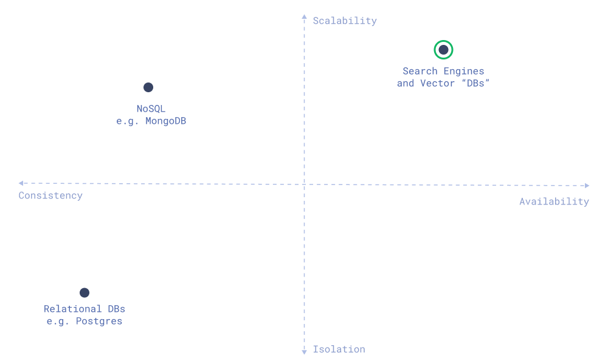
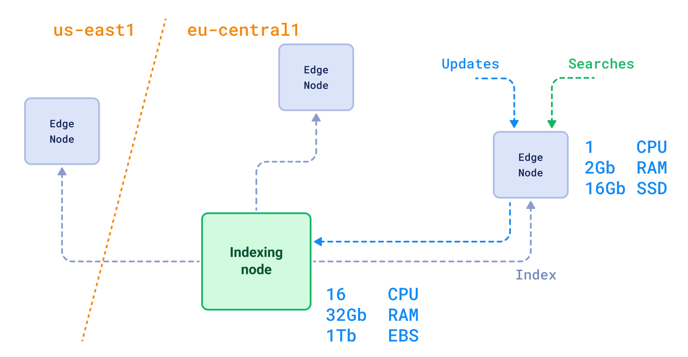

+++
title = "译文 | 向量搜索作为一项专门的服务"
date = "2023-12-21T10:00:00+08:00"
description = "解释为什么以及何时您实际上需要专门的向量解决方案，驳斥一些毫无根据的说法和在构建向量搜索系统时应避免的反模式。"

tags = ["Database", "vector-database", "System", "Translation"]
+++

> 原文由 [Andrey Vasnetsov](https://vasnetsov.com/)（开源向量数据库 Qdrant 的创始人和 CTO）发布在 [Qdrant 博客](https://qdrant.tech/articles/dedicated-service/)。翻译已经过原作者同意，转载请保留原文链接和译者信息。
>
> 译者：[lqhl](https://lqhl.me)，来自 [MyScale](https://myscale.com/)（一个基于 SQL 的全托管向量数据库）的软件工程师。

自从数据科学界发现向量搜索显著改善了大语言模型的答案以来，各种供应商和爱好者一直在就存储嵌入向量的合适解决方案进行争论。

有人说将它们存储在专用引擎（又称向量数据库）中更好。其他人则认为只需使用现有数据库的插件就足够了。

[这里](https://nextword.substack.com/p/vector-database-is-not-a-separate)只是[其中](https://stackoverflow.blog/2023/09/20/do-you-need-a-specialized-vector-database-to-implement-vector-search-well/)的[一部分](https://www.singlestore.com/blog/why-your-vector-database-should-not-be-a-vector-database/)。
（译者注：这是一部分[中文](https://vonng.com/cn/blog/db/svdb-is-dead/)的[相关文章](http://gaocegege.com/Blog/vector)）

这篇文章提出了我们对这个主题的愿景和论点。我们将：

1. 解释为什么以及何时您实际上需要专门的向量解决方案。
2. 驳斥一些毫无根据的说法和在构建向量搜索系统时应避免的反模式。

目录：

- [回应对向量数据库的常见误解](#回应对向量数据库的常见误解)
  - [每个数据库供应商迟早都会引入向量功能。这将使每个数据库都成为一个向量数据库](#每个数据库供应商迟早都会引入向量功能这将使每个数据库都成为一个向量数据库)
  - [拥有专用的向量数据库需要复制数据](#拥有专用的向量数据库需要复制数据)
  - [拥有专用的向量数据库需要复杂的数据同步](#拥有专用的向量数据库需要复杂的数据同步)
  - [你需要为两种解决方案的向量服务的运行时间和数据传输付费](#你需要为两种解决方案的向量服务的运行时间和数据传输付费)
  - [什么比您当前的数据库更无缝地添加向量搜索功能更好呢？](#什么比您当前的数据库更无缝地添加向量搜索功能更好呢)
  - [数据库可以全面支持 RAG 使用案例](#数据库可以全面支持-rag-使用案例)
- [总结](#总结)

## 回应对向量数据库的常见误解

### 每个数据库供应商迟早都会引入向量功能。这将使每个数据库都成为一个向量数据库

这种误解的根源在于对向量*数据库*这个术语的粗心使用。当我们想到*数据库*时，下意识地会想到像 Postgres 或 MySQL 这样的关系型数据库。或者更科学地说，是建立在 ACID 原则上的服务，提供事务、强一致性保证和原子性。

大多数向量数据库并非传统意义上的*数据库*。更准确地说，它们更像是*搜索引擎*，但不幸的是，营销术语*向量数据库*已经深入人心，而且可能不太可能改变。

*是什么使得搜索引擎与数据库不同，以及为什么向量数据库是作为搜索引擎构建而非数据库？*

首先，搜索引擎假定与数据库不同模式的工作负载并优先考虑系统的其他需求。搜索引擎的核心架构是围绕与数据库不同的优先级构建的。

搜索引擎优先考虑哪些类型的属性？

- 可扩展性。搜索引擎被设计用于处理大量数据和查询。它们被设计为横向可扩展，并且能够处理超出单台机器容量的更多数据。
- 搜索速度。搜索引擎应该保证查询的低延迟，而更新的原子性则不那么重要。
- 可用性。如果集群中的大多数节点都宕机，搜索引擎必须保持可用。与此同时，它们可以容忍更新的最终一致性。

这些优先级导致了不同的架构决策，这些决策在通用数据库中是无法复现的，即使它支持向量索引。

### 拥有专用的向量数据库需要复制数据

本质来说，向量嵌入是主要源数据的衍生物。

在绝大多数情况下，嵌入是从其他数据（如文本、图像或系统中存储的其他信息）派生而来的。因此，实际上，系统中所有的嵌入都可以被视为对某些原始来源的转换。

衍生数据的显著特点在于当转换流水线发生变化时，数据也会发生变化。以向量嵌入为例，这种变化的情况非常简单：每当更新编码器模型 (encoder model) 时，所有嵌入都会发生变化。

在将向量嵌入与主数据源融合的系统中，要进行这样的迁移是不可能的，因为这将会对生产系统产生显著影响。

因此，即使您想要使用单个数据库存储各种数据，您仍然需要在内部复制数据。

### 拥有专用的向量数据库需要复杂的数据同步

大多数生产系统更倾向于将不同类型的工作负载隔离到单独的服务中。在许多情况下，这些隔离的服务甚至与搜索使用案例无关。

例如，用于分析的数据库 (OLAP DB) 和用于提供服务的数据库 (OLTP DB) 可以从同一来源进行更新。然而，它们可以以最适合它们典型工作负载的方式存储和组织数据。

搜索引擎通常是隔离的，原因是为了避免产生*坏邻居效应* (noisy neighbor problem)，从而影响主数据库的性能。

*为了让你有一些直觉，让我们考虑一个实际的例子：*

假设我们有一个包含 100 万条记录的数据库。按照现代任何关系型数据库的标准来看，这是一个小型数据库。你可能可以使用任何云服务提供商的最小免费套餐来托管它。

但是，如果我们想要将这个数据库用于向量搜索，100 万个 OpenAI `text-embedding-ada-002` 嵌入将占用大约 6Gb 的内存。正如你所看到的，向量搜索用例完全超出了主数据库的资源需求。实际上，这意味着你的主数据库将承担高内存需求，并且无法有效扩展，受限于单台机器的大小。

幸运的是，数据同步问题并不是新问题，而且绝对不是向量搜索所独有的。有许多众所周知的解决方案，从消息队列开始，到专门的 ETL 工具结束。

例如，最近我们发布了[与 Airbyte 的集成](https://qdrant.tech/documentation/frameworks/airbyte/)，允许您将来自各种来源的数据逐步同步到 Qdrant 中。

### 你需要为两种解决方案的向量服务的运行时间和数据传输付费

在开源世界中，您支付所使用的资源，而不是您运行的不同数据库的数量。资源更多取决于每种用例的最佳解决方案。因此，运行专用的向量搜索引擎甚至可能更便宜，因为它允许针对向量搜索用例进行优化。

例如，Qdrant 实现了许多[量化技术](https://qdrant.tech/articles/dedicated-service/documentation/guides/quantization/)，可以显著减少嵌入的内存占用。

在数据传输成本方面，大多数云服务提供商在同一地区内的网络使用通常是免费的。只要您将原始数据和向量存储放在同一地区，就不会产生额外的数据传输费用。

### 什么比您当前的数据库更无缝地添加向量搜索功能更好呢？

与集成解决方案的短期吸引力相比，专用搜索引擎提供了灵活性和模块化方法。每次更新一些向量插件时，您无需更新整个生产数据库。专用搜索引擎的维护与主数据库一样独立。

事实上，利用专用的向量解决方案，集成更复杂的场景，比如读/写分离，要容易得多。您可以轻松构建跨区域复制，以确保用户的低延迟。

将向量数据库与现有数据库分离在大型企业组织中尤其重要，因为系统的不同部分责任分散在不同团队之间。在这种情况下，为人工智能团队维护一个专用的搜索引擎要比说服核心团队更新整个主数据库容易得多。

最后，全能数据库的向量功能与整个软件栈的开发和发布周期紧密相关。它们长期的使用历史也意味着它们需要为向后兼容性付出很高的代价。

### 数据库可以全面支持 RAG 使用案例

暂且不论性能和可扩展性问题，关于在数据库中实现 RAG 的整个讨论都假设传统数据库唯一缺失的细节是向量索引和快速进行近似最近邻查询的能力。

事实上，目前向量搜索的能力只是触及了可能性的表面。例如，在我们最近的文章中，我们讨论了构建一个[探索 API](https://qdrant.tech/articles/vector-similarity-beyond-search/) 的可能性，以推动发现过程 --- 这是 kNN 搜索的一种替代方案，你甚至不知道自己究竟在寻找什么。

## 总结

最终，如果你只是在寻找一个简单的向量搜索功能，并且数据量较小，那么你并不需要一个向量数据库。我们真诚建议你从你已有的技术栈中开始原型设计。但如果你希望做更多的事情，并且这是你的应用的核心功能，那么你就需要一个向量数据库。这就好比用多功能工具快速制作东西，或者使用专门针对特定用例进行高度优化的专用工具。

大规模生产系统通常由不同的专业服务和存储类型组成，这是现代软件架构的最佳实践之一。类似于微服务架构中独立构建块的编排。

当您向数据库填充向量索引时，会影响主数据库的性能和可扩展性，以及向量搜索功能。没有一种适合所有情况且不会影响性能或灵活性的方法。因此，如果您的用例在很大程度上利用向量搜索，值得投资于专用的向量搜索引擎，也就是向量数据库。
