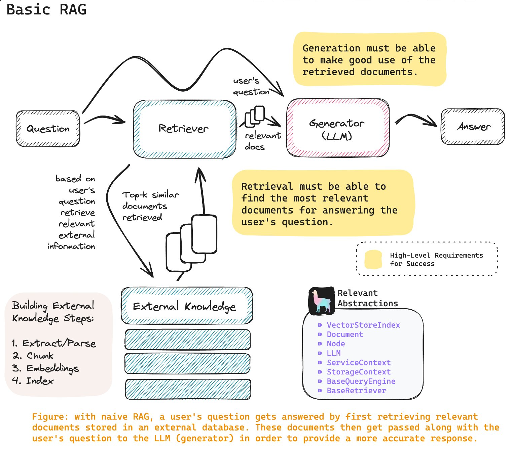
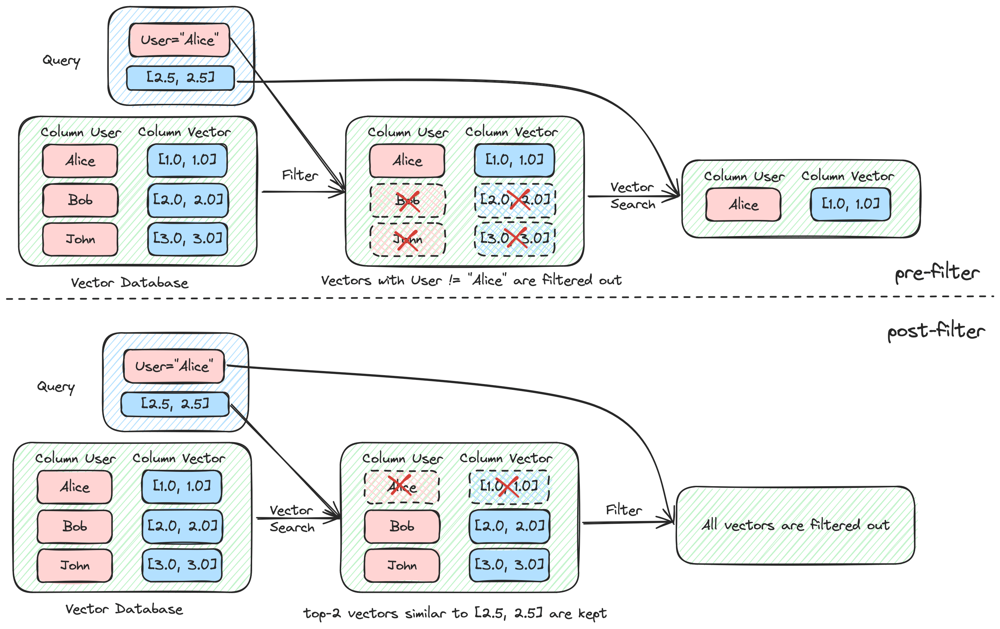
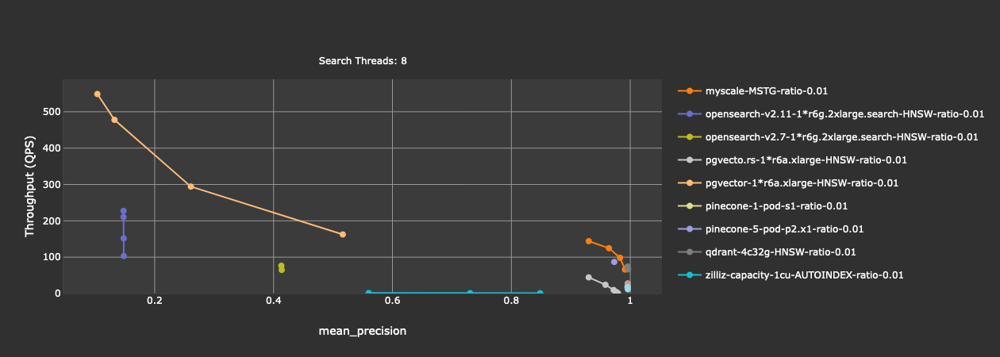
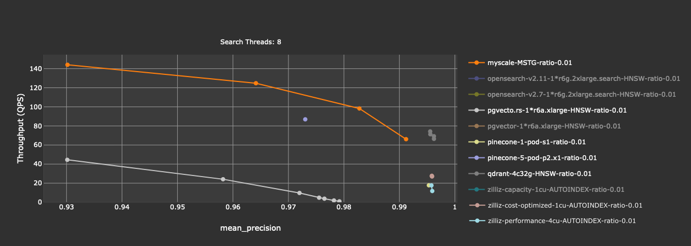

+++
title = "RAG 与带过滤条件的向量搜索"
date = "2024-01-18T17:56:47+08:00"

#
# description is optional
#
# description = "An optional description for SEO. If not provided, an automatically created summary will be used."

tags = ["vector-database"]
+++

在一个基本的 RAG (Retrieval-Augmented Generation) 中，文档（文本、PDF、Word、PPT 等）被切割 (chunking) 后提取嵌入向量 (embedding) 后存放到向量数据库中进行索引。在用户提问时，系统会先从索引中查找跟用户问题最相关的文档，然后将用户问题和相关文档的片段一起发给大语言模型 (LLMs) 进行生成，得到一个更为准确的答案。

*来源：[@jerryjliu0](https://twitter.com/jerryjliu0/status/1743323278100529254/photo/1)*

有很多文章证明了 RAG 的有效性[^1][^2][^3]，有几点结论：

1. RAG 显著改善了 GenAI 应用的结果；
2. 即使向量数据库里的数据是 GPT-4 训练时见过的，使用 RAG 的 GPT-4 也比不用 RAG 的 GPT-4 更好；
3. 一些开源的小模型，在使用 RAG 时，效果能与使用 RAG 的 GPT-4 接近。

RAG 系统的核心，是一个存储了大量文档的向量数据库。向量数据库能否快速并且准确的搜索到问题相关的文档，对 RAG 系统的效果非常重要。然而，向量数据库所要关心的并不只是向量数据，还有向量所对应的元数据。充分利用这些元数据进行过滤搜索，能大大的提高搜索的准确度和整个 RAG 系统的效果，改进 GenAI 应用的体验。

例如，如果向量数据库中存储了大量的论文，用户可能只关心某些学科或某些作者，那么在搜索时加上相应的过滤条件，显然就能大大提高搜索结果的相关性。带过滤的向量搜索的另一个用途是多租户 (multi-tenancy)。在聊天或者 ChatPDF 类的应用中，用户想要搜索的只是自己的聊天记录或者文档，这时候将每个用户都作为一个数据库中的分区 (partition)，对数据库本身会带来比较大的负担。大部分的数据库只能支持上千或上万的分区，并且对于查询性能会有很大的影响。这时候，将用户 ID 作为过滤条件，进行带过滤的向量搜索是一个比较自然的操作。

## 前过滤 vs. 后过滤

然而，并不是所有的向量数据库或者支持向量插件的数据库都对带过滤的向量搜索有很好的支持。在实现上，我们可以看到带过滤的向量搜索有前过滤和后过滤两种实现方式。以下面这张图为例，前过滤 (pre-filtering) 会先通过元数据筛选符合条件的向量，然后在符合条件的向量中进行搜索。这样的好处是，如果用户需要 k 个最相似的文档，数据库能够保证返回 k 个结果。而后过滤 (post-filtering) 则是先进行向量搜索，得到 m 个结果。再对这 m 个向量的元数据进行过滤。此时由于不确定 m 个结果中有多少符合元数据的过滤条件，有可能导致最终结果数量不足 k 个。特别是在符合过滤条件的向量在整个数据集中都很少的时候，很可能最终结果是空的。

然而，前过滤也不是没有挑战。如何高效的进行元数据的过滤，以及过滤后向量数量很少时，向量索引是否还能高效的进行搜索，都是问题。很多向量数据库常用的 HNSW 算法，在过滤比例较高时（比如过滤后只留下了 1% 的向量），搜索的效果会非常低。因为 HNSW 是基于图的算法，在搜索过程中，它可能很长时间也找不到符合条件的点，导致长时间都在进行图遍历。对这个问题，[Qdrant](https://blog.vasnetsov.com/posts/categorical-hnsw/) 和 [Weaviate](https://weaviate.io/developers/weaviate/current/architecture/prefiltering.html) 很早都做了一些探索。常见的做法是当过滤比例较低的时候，从 HNSW 算法回退成暴力搜索。

## Benchmark 结果

那么，哪些向量数据库对带过滤的向量搜索支持较好呢？我们对向量数据库的云服务做了一些测试。完整的结果和测试方法见 [MyScale Vector Database Benchmark](https://myscale.github.io/benchmark/)。我们来看一下过滤比例为 1% 时（在施加过滤条件后，只有 1% 的向量满足条件）的结果：

可以看到，OpenSearch (两个版本 v2.7 和 v2.11)、pgvector 的精度过低，不足 50%。Zilliz 的 capacity 模式，性能过低，不到 1 QPS (query per second)。我们排除掉这几个，再看一下：

这时候可以比较清晰的看出，性能较好的有 MyScale、Qdrant 和 Pinecone (p2 pod)。Pgvecto.rs、Zilliz (Performance & Cost-optimized 模式)、Pinecone (s1 pod) 的性能低一些。

[^1]: https://www.pinecone.io/blog/rag-study/
[^2]: https://myscale.com/blog/teach-your-llm-vector-sql/
[^3]: https://arxiv.org/abs/2005.11401
