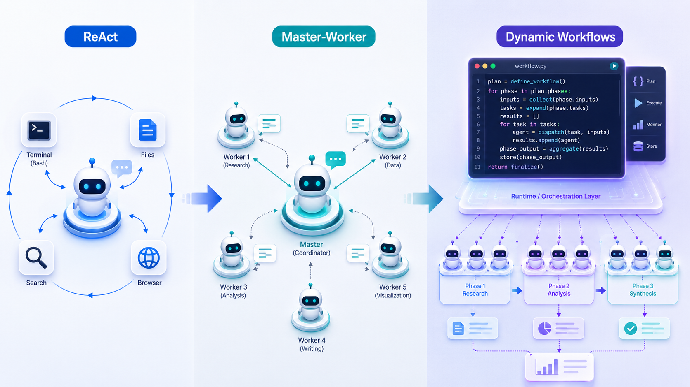

+++
title = "从 ReAct 到 Dynamic Workflows：Agent 开始用代码调度 Agent"
date = "2026-05-31T23:35:00+08:00"
description = "从 ReAct 到 master-worker 再到 Dynamic Workflows，agent harness 的控制平面正在从模型上下文中迁移到 code runtime。这不是更花哨的 subagent 功能，而是 agent 开始用代码调度 agent。"
tags = ["AI", "Agent", "Claude Code", "LLM", "Workflow"]
+++

如果回头看最近一两年的 agent 演进，会发现一个很清楚的变化：agent 一开始是在学会使用工具，后来是在学会管理别的 agent，现在则开始把这种管理过程写成程序。

这不是一个小的实现细节，而是 agent harness 控制平面的变化。

最早的 Manus、Claude Code、Devin、OpenHands 这一类系统，本质上都可以看作 [ReAct](https://arxiv.org/abs/2210.03629) 风格的 agent。模型看到任务，调用一个工具，拿到 observation，再决定下一步。工具可以是 bash、读文件、改文件、搜索、浏览器、MCP tool，甚至是一整个虚拟机环境。

这种模式很自然。人类开发者调试代码时也是这样：先 grep，读文件，跑测试，看报错，改代码，再跑测试。很多问题没法一开始就写出完整计划，只能边探索边调整。所以 ReAct 的强处在于开放性。它让模型可以在真实环境里行动，而不是只在 prompt 里空想。

但 ReAct 的问题也很明显：**所有控制逻辑都隐含在主模型的上下文里**。

模型要记住自己查过哪些文件，排除了哪些假设，下一步要验证什么，哪些结果可信。任务短的时候没问题；任务一长，context 里就会塞满搜索结果、日志、报错、文件片段和中间推理。模型不仅要理解问题，还要承担大量本该由程序完成的工作：循环、分支、去重、分配任务、汇总结果、决定是否重试。

所以第一阶段可以简单理解为：一个 agent 自己边看边干。它很通用，但主模型很累。

## 从单 agent 到 master-worker

为了缓解这个问题，subagent 出现了。

Claude Code 之前使用 subagent 的主要方式，就是典型的 master-worker 模式。主 Claude 仍然负责整体任务，但可以把局部任务派给专门的 subagent。比如让一个 subagent 探索某个模块，让另一个 subagent 做 code review，让另一个 subagent 查某类 bug。每个 subagent 有自己的 context，可以独立读文件、调用工具、完成任务，最后只把结果返回给主 Claude。

这一步解决了 ReAct 的一个核心痛点：context isolation。

主模型不必亲自读完所有文件、看完所有日志、记住所有细节。它可以让 worker 在自己的上下文里消耗大量 token，最后只接收摘要或结论。对于大型代码库、复杂 research、多方向 debugging，这个模式明显更可扩展。

但 master-worker 仍然没有解决最核心的问题：主模型还是 coordinator。

它要决定派几个 worker，每个 worker 做什么，什么时候继续派，什么时候停止，怎么合并结果，发现冲突怎么办，要不要复查。worker 的执行被分摊出去了，但 workflow 本身仍然由主模型在 turn-by-turn 的对话循环中维护。

换句话说，subagent 让 agent 有了 worker，但还没有让 agent 有一个真正的调度系统。

## Dynamic Workflows：把 manager 写成程序

[Claude Code Dynamic Workflows](https://code.claude.com/docs/en/workflows) 的关键变化就在这里。

它不是简单地「多开几个 subagent」，而是让 Claude 先写一段 JavaScript workflow script，再由 workflow runtime 执行这段脚本。脚本负责任务拆解、启动 subagents、并发执行、收集中间结果、交叉验证和最终汇总。Anthropic 的发布文章 [Introducing dynamic workflows in Claude Code](https://claude.com/blog/introducing-dynamic-workflows-in-claude-code) 里也强调了这一点：Claude 会动态写 orchestration scripts，在一个 session 里运行大量并行 subagents，并在结果返回用户前检查自己的工作。

这就把控制逻辑从主模型上下文里拿出来，放进了代码里。

以前是主 Claude 在对话中临场决定：「我现在再派一个 subagent 去查这个方向。」
现在是 Claude 先写出一个 workflow：「把这些文件分成 N 组，每组派一个 subagent 检查；每个发现再派 reviewer 交叉验证；最后按置信度汇总。」

这两个模式看起来相似，都是 subagent 在干活，但本质不同。

在 master-worker 模式里，主模型是 manager。
在 Dynamic Workflows 里，workflow script 是 manager。
模型从「调度者」变成了「调度程序的作者」。

这就是最重要的变化。

一旦 workflow 被写成代码，它就能表达很多自然语言 agent loop 里很笨重的东西：并发 fan-out、循环、条件分支、失败重试、预算控制、投票、去重、分阶段执行、结构化输出检查。中间状态也不必都塞进模型上下文，而是可以留在 script variables 里。

这不是把 Claude Code 变成传统 workflow engine。workflow 仍然是 Claude 根据当前任务动态生成的，不是人提前写死的 DAG。它保留了 LLM 的灵活规划能力，同时借用了程序的稳定执行能力。

## 这不是 Bash，而是控制平面

这里容易误解。Claude Code 本来就能跑 bash、改文件、执行测试。那 Dynamic Workflows 是不是只是让它「多跑一点代码」？

不是。

Claude Code 普通模式里的 bash 是环境动作。Claude 通过 bash 操作外部世界：跑测试、看日志、启动服务、执行 git 命令。它的核心是 environment interaction。

Dynamic Workflows 里的 JavaScript script 不是替代 bash，也不是直接去改文件。它更像 agent harness 里的控制平面。script 负责任务拆解、subagent 调度、中间状态管理和结果合成；真正进入代码库、读写文件、运行命令的，仍然是被它调度出来的 subagents。

所以它不是「LLM 通过 bash 操作电脑」的延伸，而是另一层东西：LLM 写程序来调度一批能操作电脑的 agents。

## Deep Agents：开源世界里的类似抽象

[LangChain Deep Agents](https://docs.langchain.com/oss/python/deepagents/overview) 的 interpreter 可以放在同一条线上看。

Deep Agents 本来就有 [subagents](https://docs.langchain.com/oss/python/deepagents/subagents) 机制。主 agent 可以通过 task tool 把工作派给子 agent，让子 agent 在自己的上下文里完成任务。这对应的是 master-worker 阶段。

但 [Deep Agents interpreter](https://docs.langchain.com/oss/javascript/deepagents/interpreters) 往前走了一步。它给 agent 一个轻量 code runtime，让模型可以写代码来组合 tools、调用 subagents、处理中间结果。allowlisted tools 会暴露在 runtime 里，比如 `tools.task()`，模型可以在代码里循环、并发、过滤、聚合，再把最后结果返回给主模型。

这和 Claude Code Dynamic Workflows 的味道很像。

区别在于，Claude Code Dynamic Workflows 是产品化的、深度集成在 Claude Code 里的 workflow runtime。Deep Agents 更像是把底层原语开源出来：一个嵌在 agent loop 里的 interpreter，一个显式暴露工具的 bridge，一套可以调度 subagent 的 API，以及一块不污染模型上下文的 runtime state。

所以 Deep Agents 不必被理解成「给 agent 一个 sandbox」。sandbox 是让 agent 在外部环境里执行命令、安装依赖、跑测试。interpreter 更像是 agent loop 内部的工作区，用来保存 live working values、组织控制流、决定哪些结果应该返回模型。

它不是为了让 agent 有一台电脑，而是为了让 agent 有一个可以写调度逻辑的地方。

## 真正变化的是谁持有计划

把这几个阶段放在一起看，演进路线会清楚很多。

ReAct 阶段，主模型持有计划，也亲自执行每一步。它一边观察环境，一边决定下一步。

master-worker 阶段，主模型仍然持有计划，但可以把局部任务派给 subagents。worker 帮它分担上下文和执行压力。

Dynamic Workflows / interpreter orchestration 阶段，主模型不再直接持有整个动态计划，而是把计划写进一段程序。程序持有控制流，runtime 保存中间状态，subagents 执行具体工作。

所以 agent 的下一步不是简单地「更多 subagents」。更多 worker 当然有帮助，但如果 master 仍然靠上下文临场调度，系统很快会遇到新的瓶颈。真正的变化是 subagent 调度逻辑开始代码化。

这就是 code runtime 在 multi-agent 系统里的价值。它不是替代 subagent，而是让 subagent 变得可编排。

## 结尾

我现在更愿意把 agent harness 的演进理解成控制平面的演进。

最早，控制平面在主模型的上下文里。模型自己决定下一步 tool call。后来，系统引入 subagents，主模型变成 manager，把局部任务派出去。但 manager 仍然是模型自己，计划仍然靠上下文维护。

Dynamic Workflows 和 Deep Agents interpreter 往前推了一步：让模型写代码，把 manager 的一部分职责交给 code runtime。模型仍然负责理解目标、设计策略、判断最终结果，但循环、并发、任务分配、中间状态和结果合成，可以由程序来承担。

这也是为什么 Claude Code Dynamic Workflows 值得关注。它不是一个更花哨的 subagent 功能，而是在说明一个更大的方向：当 agent 开始管理 agent，下一步自然不是继续让主模型手工调度，而是让主模型写一个调度程序。

Agent 开始用代码调度 agent。这个变化可能会成为下一代 agent harness 的核心抽象。
