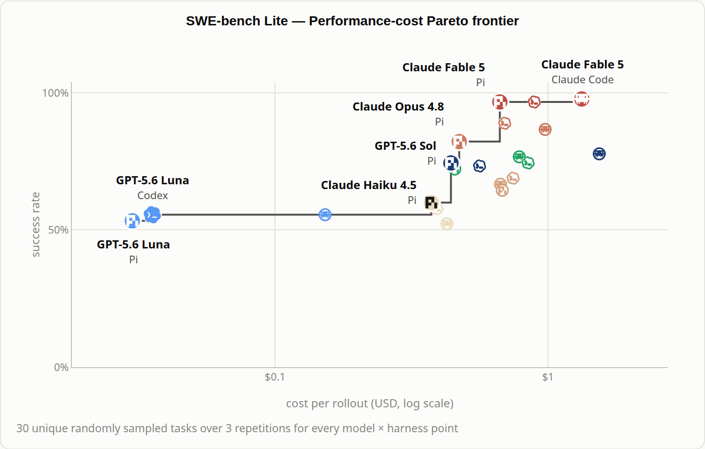
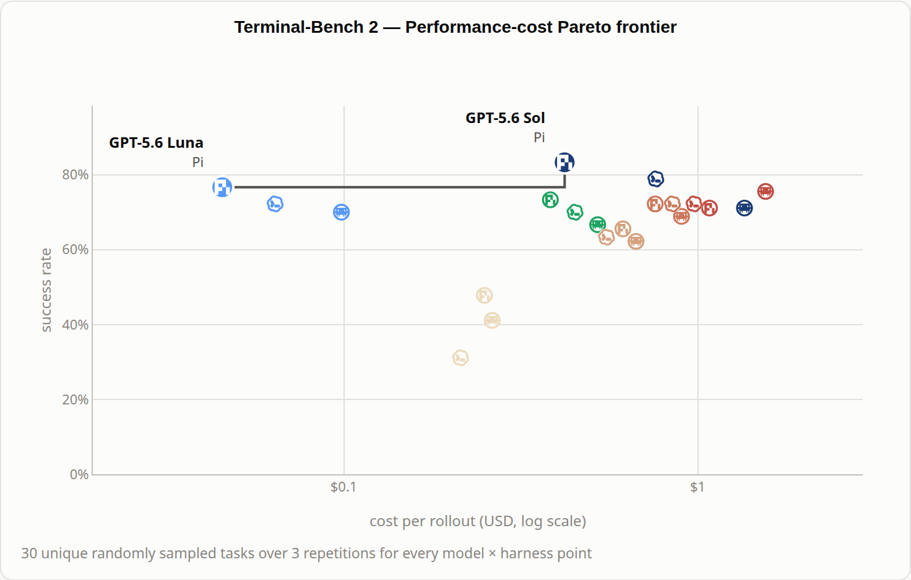
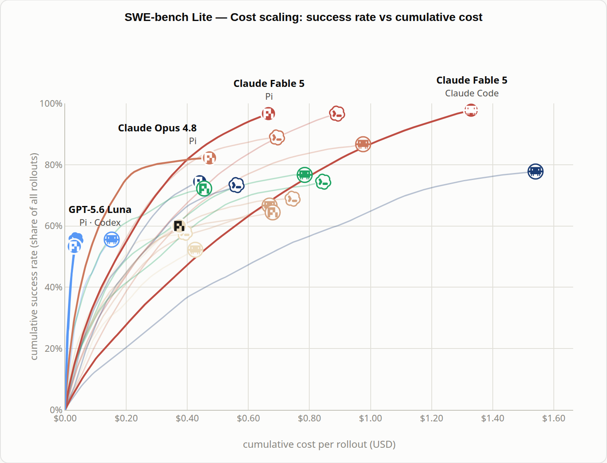
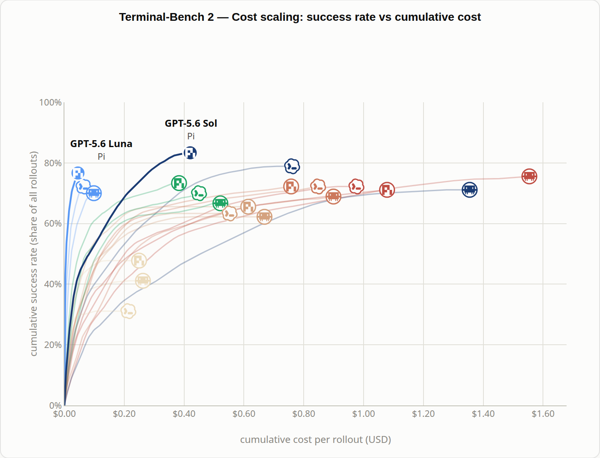
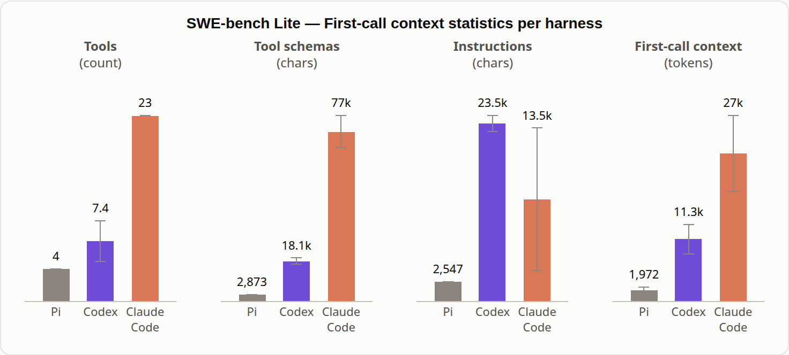
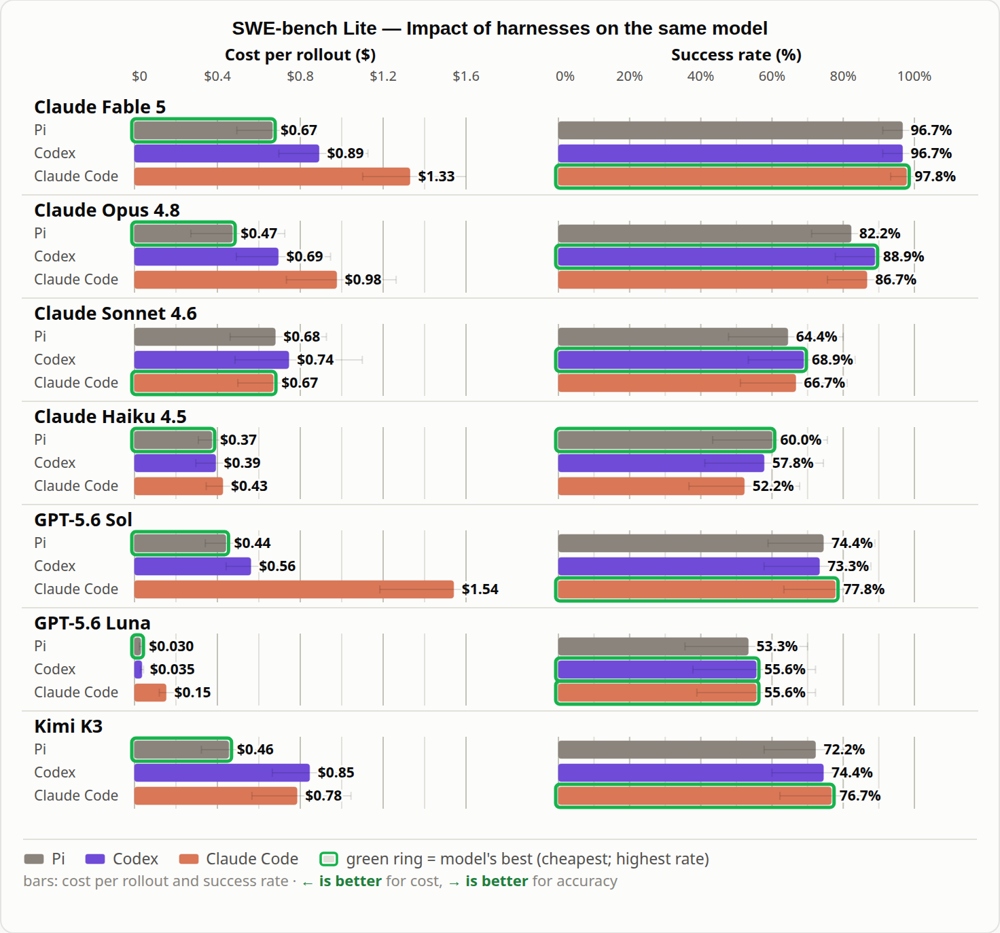
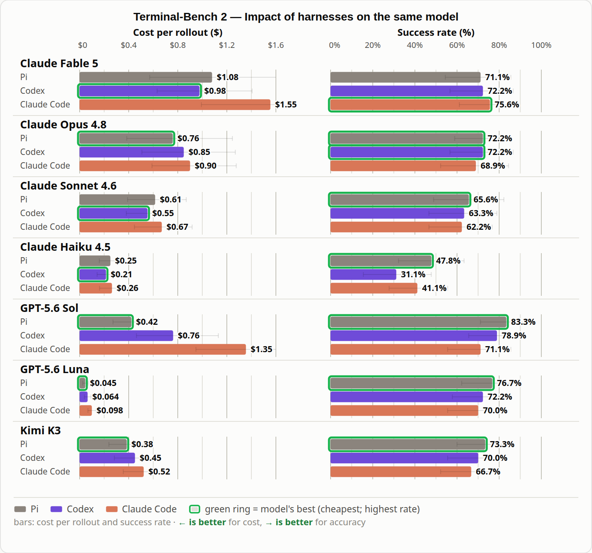

+++
title = "译文 | HarnessTax：harness 对编码 agent 到底有多重要？"
date = "2026-09-29T21:00:00+08:00"
description = "同一个模型换一个 harness，任务成功率变化不大，成本却能差到 5 倍——UC Berkeley 的 HarnessTax 在 SWE-bench Lite 与 Terminal-Bench 2.0 上评测了 21 组模型–harness 组合，发现 harness 对成本的影响远大于对正确率的影响：极简的 Pi 只提供四个工具就能站上帕累托前沿，而 Claude 模型在别人的 harness 里反而常常表现更好。"
tags = ["AI", "Agent", "Software Engineering", "Paper", "Translation"]
+++

> **原文**：HarnessTax: How Much Does the Harness Matter for Coding Agents?
>
> **作者**：Melissa Z. Pan, Shuo Yang, Negar Arabzadeh, Wei-Lin Chiang, Ion Stoica, Matei Zaharia（UC Berkeley；Arena Intelligence Inc.）
>
> **原文链接**：<https://harnesstax.github.io/>（图表可交互）

---

语言模型正在改变我们构建软件、求解计算问题的方式<sup class="cite"><a href="#ref-1">1</a>,<a href="#ref-2">2</a></sup>。编码 agent 通过 harness 把这些能力落地：harness 是一个管理模型的工具、上下文与任务执行的软件系统<sup class="cite"><a href="#ref-3">3</a>,<a href="#ref-4">4</a></sup>。模型为编码 agent 提供核心智能，但 harness 越来越被视为决定这份智能能被多有效利用的关键<sup class="cite"><a href="#ref-5">5</a>,<a href="#ref-3">3</a></sup>。因此，选择编码 agent 就意味着同时选择了一个模型和一个 harness——即便你关注的只是模型<sup class="cite"><a href="#ref-6">6</a></sup>。

已有数百万人使用编码 agent<sup class="cite"><a href="#ref-7">7</a></sup>，但 harness 选择带来的影响仍不清楚。**换一个 harness 能否让同一个模型解决更多任务，或者降低成本？**

我们在 SWE-bench Lite 与 Terminal-Bench 2.0 上评测了 21 组模型–harness 组合，覆盖七个模型与三个 harness——Claude Code、Codex CLI 和 Pi<sup class="cite"><a href="#ref-8">8</a>,<a href="#ref-9">9</a></sup>。在这两个开源基准上，我们的研究给出三个出人意料的发现：

1. **harness 的选择对任务成功率影响很小，却能显著影响成本**（在我们测试的基准上）。同一个模型可以在成本相差最多 5 倍的情况下达到相近的成功率。
2. **简单的 harness 也能有竞争力。** Pi 是一个极简的*开源* harness，在成本与任务成功率上都很有竞争力。
3. **模型在自己的 harness 之外的 harness 里可能表现更好。** *所以，你的 Claude 模型可能并不需要 Claude Code……* 🤔

我们下面逐一分析这些发现，并会公开我们的 profiling trace。





> <a id="fig-1"></a>**图 1**：平均 token 成本与成功率。阶梯线表示在每一成本水平及以下我们观察到的最高成功率（帕累托前沿）。上为 SWE-bench Lite，下为 Terminal-Bench 2.0。

## 实验设置

我们在两个基准上比较 21 组模型–harness 组合，每个基准使用同样随机抽样的 30 个任务：SWE-bench Lite 与 Terminal-Bench 2.0。每个组合在每个任务上运行三次，以捕捉不同尝试之间的波动。我们从各 harness 的原生配置出发，选择其 high effort 设置，并把每次尝试限制在 100 个 agent 轮次以内，以控制长时间运行的成本。轮次计数与 effort 设置都遵循各 harness 自身的定义。我们用每个基准的官方评估器衡量任务是否成功。

*测量细节。* 我们先对每个任务的三个尝试求成本与成功率的平均，再在 30 个任务上求平均。我们用 10,000 次 bootstrap 重采样估计 95% 置信区间，每次有放回地抽取 30 个任务平均值并重新计算总体均值。token 成本按 2026 年 9 月 1 日的一份固定直连 API 价目表计算，同一个模型在不同 harness 下使用同样的价格。

对于 SWE-bench Lite，我们阻断所有任务容器的外部网络访问，关闭 Claude Code 与 Codex 的默认网页工具，并在 API 请求层面拒绝托管工具声明。

对于 Pi，我们添加两个包来配置订阅密钥并控制 agent 轮次。我们通过 Fireworks AI 访问 Kimi K3，并在三个 harness 中都使用该模型唯一的原生思考模式。

## 发现 1/3：harness 对成本的影响大于对正确率的影响

**同一个模型常常在成本相差悬殊的情况下达到相近的成功率。** GPT-5.6 Luna 在两个基准上都是成本最低的，而 Claude Fable 5 在 SWE-bench Lite 上达到最高成功率。开放权重模型 Kimi K3 在 SWE-Bench Lite 上紧贴帕累托前沿、靠近 GPT 5.6 Sol，在 Terminal-Bench 2.0 上则略低于帕累托前沿。不过，这些模型在不同 harness 之间并没有表现出实质性的性能差异。Claude Fable 5 在 Claude Code 中解决了 97.8% 的尝试，在 Codex 中为 96.7%，在 Pi 中也是 96.7%，但 Claude Code 的成本约为 Pi 的两倍（$1.33 vs $0.67）。

**Fable 5 在 Claude Code 中的成功率略高于 Pi，代价是约两倍的成本。** 成本差距并不只出现在 Fable 5 上。在共同评测的模型上，按成本比值的几何平均计算，**在 SWE-bench Lite 上 Claude Code 的成本约为 Pi 的 2.0 倍、Codex 的 1.6 倍**，**在 Terminal-Bench 2.0 上约为 Pi 的 1.5 倍**。与此同时，harness 对成功率的平均影响在 SWE-bench Lite 上保持在 ±2% 以内，在 Terminal-Bench 2.0 上保持在约 ±5% 以内。

为了几乎相同的质量，仅仅因为用了不同的 harness 就要多付钱，这就像是在交一笔……*Harness Tax*（harness 税）💰……<sup class="cite"><a href="#ref-10">10</a></sup> **而且**，**当你直接接受编码 agent 的默认 harness、不去比较其他选择时，你可能就在支付这样一笔隐藏的「harness 税」。** 因此，模型评测应当在常用的 harness 之间比较同一模型的成本与任务成功率。

## 发现 2/3：简单的 harness 也能有竞争力

**Pi 只提供四个工具——read、write、edit 和 bash——就登上了两个基准的帕累托前沿**<sup class="cite"><a href="#ref-11">11</a></sup>**。** 为了理解 harness 设计如何影响开销，我们考察了已完成尝试的成本、记录的轮次计数以及初始上下文。





> <a id="fig-2"></a>**图 2**：成本累积–成功率曲线。我们把已完成的尝试按成本从低到高排序，把成本相同的归为一组，然后累加它们的成本与成功数。两个总量都除以尝试总数。失败的尝试只增加成本，不增加成功。曲线使用九点移动平均；未平滑的端点与[图 1](#fig-1) 一致。上为 SWE-bench Lite，下为 Terminal-Bench 2.0。

**agent 可以在轮次数量相近的情况下产生相差悬殊的成本。** 对于 SWE-bench Lite 上的 Fable 5，Pi 与 Claude Code 平均每次尝试分别为 15.4 与 15.3 个轮次，但 Claude Code 的成本约为两倍，成功率只高出 1.1%。这意味着每个记录轮次的花费更高，尽管各 harness 对轮次的定义并不相同。



> <a id="fig-3"></a>**图 3**：SWE-bench Lite 上首次主模型调用中的上下文，以均值 ± 标准差表示。指令与工具 schema 的长度以字符计。厂商上报的输入 token 衡量的是总初始上下文，包含任务提示。

**harness 税可以从第一次模型调用就开始。** 在全部七个模型上，Claude Code 的平均初始上下文都超过 Pi 的 10 倍，指令更长、工具 schema 更大。这些额外的上下文会推高成本，尽管总花费还取决于缓存、生成的 token 以及后续调用。

**Pi 与 Codex 的有效性说明，用现有模型做开源 harness 研究大有空间。** 研究者无需访问闭源 harness、也无需与模型共同训练，就能在 SOTA 编码 harness 上开展工作。更丰富的 harness 功能或许仍会惠及其他模型、工作负载或交互场景。因此，harness 的复杂度应当被当作一种需要实证权衡的取舍。

## 发现 3/3：模型在自家 harness 之外也能有竞争力

**针对自家 harness 的专门优化并不保证最好的搭配。** 厂商有时会针对自家的编码环境优化模型：例如 OpenAI 把 GPT-5-Codex 描述为针对 Codex 中的软件工程做过优化<sup class="cite"><a href="#ref-12">12</a></sup>。然而，在六个 Anthropic 与 OpenAI 模型、两个基准上，**十二组比较中有九组的最高观测成功率来自另一个 harness**。





> <a id="fig-4"></a>**图 4**：每个模型在 SWE-bench Lite 与 Terminal-Bench 2.0 上使用 Pi、Codex CLI 与 Claude Code 的平均每次尝试 token 成本与成功率。须线表示 95% 置信区间。绿色外框分别标出每个模型的最低成本与最高成功率。断裂的成本条表示它超出了所显示的坐标轴范围。上为 SWE-bench Lite，下为 Terminal-Bench 2.0。

**这一结论不只适用于 Opus，也不只适用于 Claude Code。** Sonnet 4.6 在 SWE-bench Lite 上用 Codex 解决了 68.9% 的尝试，用 Claude Code 则是 66.7%，而两者成本相近。GPT-5.6 Sol 在自家厂商的 harness 之外同样有竞争力：在 Terminal-Bench 2.0 上，它在 Pi 中达到 83.3% 的成功率，在 Codex 中为 78.9%，而成本约为一半（$0.42 vs $0.76）。在六个 Anthropic 与 OpenAI 模型、两个基准上，**十二组比较中有九组的最高观测成功率来自另一个 harness**。

这些结果表明，**模型的能力是兼容的、可泛化的，并且可以迁移到其他 harness 上。** 厂商确实会说明某些模型针对自家编码环境做了优化：例如 OpenAI 把 GPT-5-Codex 描述为针对 Codex 中的 agentic 软件工程做过优化<sup class="cite"><a href="#ref-12">12</a></sup>。但我们观察到，同属一家厂商并不保证最好的搭配。实际的问题仍然是：对给定模型与工作负载，哪个 harness 能带来成本与任务成功率的最佳平衡。

## 结语

我们的结果表明，**同一个模型可以在成本相差悬殊的情况下达到相近的成功率。** 在我们测试的基准上，简单的开源 harness 也能有竞争力，模型在自己的 harness 之外也能表现良好。如果我们只关注任务成功率，harness 税就可能被忽略。

在各个模型上，Pi 与 Codex 常常以比 Claude Code 更低的成本达到相近的成功率。这些发现可能仅限于我们测试的这两个开源基准，模型在训练中或许见过它们。在其他基准与工作负载上，结果可能不同。

许多先前的工作，包括[我们关于检索 agent 的工作](https://arxiv.org/abs/2605.27361)<sup class="cite"><a href="#ref-13">13</a></sup>，都说明把模型与系统配置放在一起选择的价值。考虑到编码 agent 的使用量与普及程度，harness 选择是一个更紧迫的问题。下一步自然是评测 harness，并在真实开发工作流中自动完成选择——在那里需求不断演变、开发者会给出反馈<sup class="cite"><a href="#ref-14">14</a></sup>、任务会跨越多个会话<sup class="cite"><a href="#ref-3">3</a></sup>。

更广泛地说，对不同 harness 的需求取决于编码 agent 扮演的角色。对于日常任务，编码 agent 本质上是通向模型智能的接口：它们管理上下文、访问工具、执行任务<sup class="cite"><a href="#ref-15">15</a></sup>。随着模型变得更强，编码 agent 或许不再需要今天这么多脚手架。因此，通用编码 agent 应当优先考虑成本效率与可靠性，因为许多任务可能并不需要花哨的附加功能。对于处在模型能力边界上的更难问题，包括科学发现，（编码）agent 或许仍能受益于那些提供结构化指导的 harness——帮助探索想法、评估候选方案、从反馈中学习。harness 研究可以被视为一种帮助模型突破知识边界的方式，并在此过程中开启智能的下一个阶段。但用户不应该自己去做出这些配置决策。我们应当设想一种重新设计的 harness：它能随任务展开而自适应，同时保持通用。

## 引用方式

如果 HarnessTax 对你的研究或工作有帮助，请按以下方式引用本项目：

```bibtex
@misc{pan2026harnesstax,
  title  = {{HarnessTax: How Much Does Harness Matter for Coding Agents?}},
  author = {Pan, Melissa Z. and Yang, Shuo and Arabzadeh, Negar and Chiang, Wei-Lin and Stoica, Ion and Zaharia, Matei},
  year   = {2026},
  url    = {https://harnesstax.github.io/},
}
```

## 致谢

感谢 Amazon AI Fellowship 提供 AWS 计算额度，感谢 Arena Intelligence 赞助我们 profiling 实验的 API 访问，感谢 Laude Institute 提供 Anthropic API 额度。感谢 Michael Chang 和 Tyler Griggs 为我的研究支持 AI 订阅。感谢 Tianyin Xu 和 Mert Cemri 对这篇博客的宝贵反馈。

Sky Lab 的研究得到 Accenture、AMD、Anyscale、Broadcom Inc.、Google、IBM、Intel、Intesa Sanpaolo、Lambda、Mibura Inc.、Samsung SDS 和 SAP 的资助。我们感谢所有对开放研究的支持。

## 参考文献

1. <a id="ref-1"></a>Saffron Huang et al. “[How AI Is Transforming Work at Anthropic](https://www.anthropic.com/research/how-ai-is-transforming-work-at-anthropic).” Anthropic Research, December 2, 2025.
2. <a id="ref-2"></a>AlphaEvolve team. “[AlphaEvolve: A Gemini-powered coding agent for designing advanced algorithms](https://deepmind.google/blog/alphaevolve-a-gemini-powered-coding-agent-for-designing-advanced-algorithms/).” Google DeepMind, May 14, 2025.
3. <a id="ref-3"></a>Justin Young. “[Effective harnesses for long-running agents](https://www.anthropic.com/engineering/effective-harnesses-for-long-running-agents).” Anthropic Engineering, November 26, 2025.
4. <a id="ref-4"></a>Michael Bolin. “[Unrolling the Codex agent loop](https://openai.com/index/unrolling-the-codex-agent-loop/).” OpenAI Engineering, January 23, 2026.
5. <a id="ref-5"></a>John Yang et al. “[SWE-agent: Agent-Computer Interfaces Enable Automated Software Engineering](https://arxiv.org/abs/2405.15793).” NeurIPS, 2024.
6. <a id="ref-6"></a>Vinay Gaba, Ankit Mathur, Rishabh Singh, Patrick Wendell, and Matei Zaharia. “[Benchmarking Coding Agents on Databricks’ Multi-Million Line Codebase](https://www.databricks.com/blog/benchmarking-coding-agents-databricks-multi-million-line-codebase).” Databricks, July 8, 2026.
7. <a id="ref-7"></a>OpenAI. “[Codex is becoming a productivity tool for everyone](https://openai.com/index/codex-for-knowledge-work/).” June 2, 2026.
8. <a id="ref-8"></a>Carlos E. Jimenez, John Yang, and Jiayi Geng. “[SWE-bench Lite](https://www.swebench.com/lite).” Official benchmark description. Accessed September 16, 2026.
9. <a id="ref-9"></a>Mike A. Merrill et al. “[Terminal-Bench: Benchmarking Agents on Hard, Realistic Tasks in Command Line Interfaces](https://arxiv.org/abs/2601.11868).” arXiv:2601.11868, January 17, 2026.
10. <a id="ref-10"></a>Siddharth Sambharia. “[The Harness Tax: The Dead Weight Inside Your Coding Agent](https://portkey.ai/blog/the-harness-tax/).” Portkey, April 13, 2026.
11. <a id="ref-11"></a>Pi contributors. “[Pi coding agent](https://github.com/earendil-works/pi/blob/main/packages/coding-agent/README.md).” GitHub README. Accessed September 16, 2026.
12. <a id="ref-12"></a>OpenAI. “[Introducing upgrades to Codex](https://openai.com/index/introducing-upgrades-to-codex/).” September 15, 2025.
13. <a id="ref-13"></a>Melissa Z. Pan, Negar Arabzadeh, Mathew Jacob, Fiodar Kazhamiaka, Esha Choukse, and Matei Zaharia. “[Natural Language Query to Configuration for Retrieval Agents](https://arxiv.org/abs/2605.27361).” arXiv:2605.27361, May 26, 2026.
14. <a id="ref-14"></a>Yifan Wu et al. “[SWE-Together: Evaluating Coding Agents in Interactive User Sessions](https://arxiv.org/abs/2606.29957).” arXiv:2606.29957, June 29, 2026.
15. <a id="ref-15"></a>Anthropic. “[How Claude Code works](https://code.claude.com/docs/en/how-claude-code-works).” Claude Code documentation. Accessed September 16, 2026.
