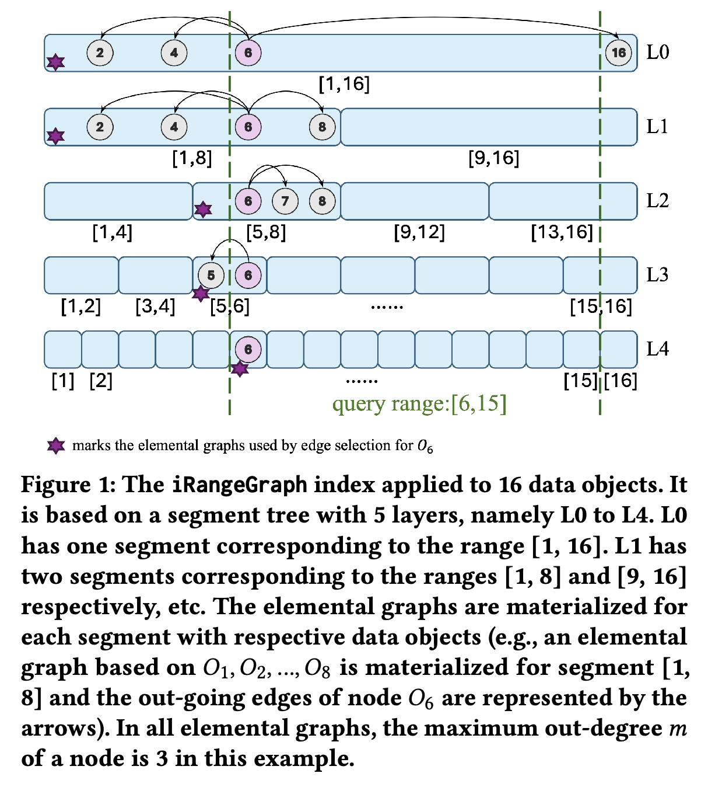
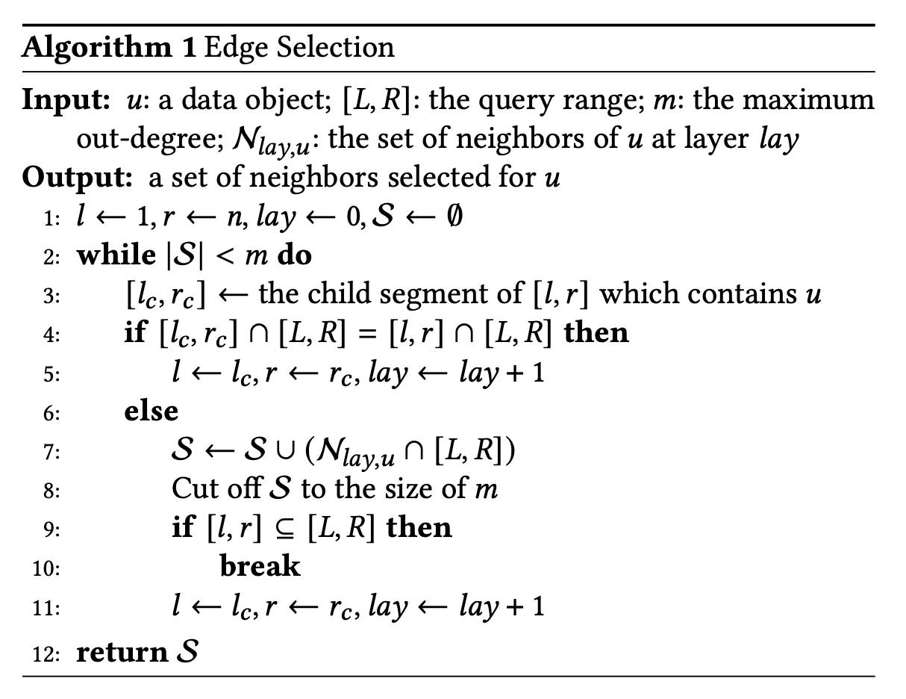

+++
title = "论文分享｜iRangeGraph - 为范围过滤 (range-filtering) 的近似向量搜索 (ANN) 实时构建图索"
date = "2025-06-29T22:50:00+08:00"
description = "探索 AI 编程工具分野：深度解析 Cursor 的「精巧设计」与 Claude Code/Amp的「暴力美学」之争，揭示理查德·萨顿「苦涩的教训」在LLM时代的终极预言——为何原始算力终将战胜人类巧思？"
tags = ["Vector-Database"]
+++

* **论文标题**：iRangeGraph: Improvising Range-dedicated Graphs for Range-filtering Nearest Neighbor Search
* **作者**：Yuexuan Xu, Jianyang Gao, Yutong Gou, Cheng Long, and Christian S. Jensen
* **会议**：SIGMOD 2025
* **论文链接**：[https://arxiv.org/abs/2409.02571](https://arxiv.org/abs/2409.02571)
* **源代码**：[https://github.com/YuexuanXu7/iRangeGraph](https://github.com/YuexuanXu7/iRangeGraph)

***

你是否遇到过这样的场景？

* 在电商平台，你想上传一张图片，寻找“价格在 500 到 800 元之间”的同款连衣裙。
* 在内容推荐系统中，你想为用户推荐“最近一周发布”，且内容最相关的文章。
* 在 AI 应用中，你想在海量知识库里检索“长度在 500 字以内”，且与问题最匹配的文档片段。

这些场景的核心技术挑战，就是 **范围过滤近似最近邻搜索（Range-Filtering Approximate Nearest Neighbor Search, RFANN）**。简单来说，就是在高维向量空间中找最近邻，同时附加一个或多个数值范围的过滤条件。

传统的解决方案通常顾此失彼：

1. **先过滤，后搜索 (Pre-filtering)**：先筛选出所有价格在范围内的商品，再逐一比较相似度。如果价格范围很宽，这种方法会退化为对大规模数据的线性扫描，速度极慢。
2. **先搜索，后过滤 (Post-filtering)**：先用图索引等方法找到最相似的几个商品，再看它们的价格是否符合范围。如果价格范围很窄，找到的近邻可能大部分都不在范围内，导致访问大量无关对象，效率低下。
3. **搜索中过滤 (In-filtering)**：在图搜索的每一步，都只访问价格符合范围的邻居。这听起来不错，但一个为全数据集构建的“通用图”，在面对特定范围时，很可能导致图的连通性变差，找不到最优解，从而降低搜索性能。

为了解决这些固有矛盾，有研究者提出了一种“终极”方案：为**每一个可能**的查询范围都预先构建一个专用的图索引。这样一来，任何查询都能找到完美匹配的索引，问题就退化成了最高效的普通 ANN 搜索。但这显然不现实，对于一个有 n 个对象的数据库，可能的范围组合有 $O(n^2)$ 个，存储所有这些图索引的开销是完全无法承受的。虽然有工作尝试对这些海量图进行有损压缩，但这又不可避免地因为信息的丢失而牺牲了查询的性能和精度。

那么，有没有一种方法，既能拥有“专用图”的高性能，又不必承受其天文数字般的存储开销呢？这正是 **iRangeGraph** 想要回答的问题。

## iRangeGraph 的核心思想：化整为零，即时构建

iRangeGraph 的思路十分巧妙：**我们不需要为所有可能的范围预先构建图，我们只需要准备一些“基础积木”，在查询时，用这些积木为任意查询范围“即时拼装”出一个专用的图**。

这些“基础积木”被称为**元素图（elemental graphs）**。

### 索引构建：准备好“元素图”积木

iRangeGraph 借助了经典数据结构——**线段树（Segment Tree）** 的思想来组织这些元素图。

想象一下，我们将所有数据对象按照其数值属性（如价格）从低到高排序，形成一个 `[1, n]` 的完整区间。

* **第 0 层**：为整个 `[1, n]` 区间的所有对象构建一个图索引。
* **第 1 层**：将区间一分为二，为 `[1, n/2]` 和 `[n/2+1, n]` 这两个子区间的对象分别构建图索引。
* **第 2 层**：继续分裂，为 `[1, n/4]`, `[n/4+1, n/2]`, ... 等 4 个子区间构建图索引。
* ...以此类推，直到区间长度为 1。

整个索引结构是一个多层的分段结构，每一层都由若干个不相交的段组成，每个段都对应一个预先构建好的元素图（具体为近似 RNG 图）。

这样做的好处是显而易见的：
一个数据对象在每一层只会出现在一个元素图中。对于一个有 `n` 个对象的数据集，总共只有 $O(\log n)$ 层，因此总的索引空间复杂度为 $O(nm \log n)$，这与为所有 $O(n^2)$ 个可能范围构建图的 $O(n^3m)$ 相比，大大降低了存储开销，使其变得完全可行。

### 查询处理：即时、高效地拼装“专用图”

当一个带有特定范围 `[L, R]` 的查询到来时，iRangeGraph 的魔法才真正开始。它并不会物化一个完整的专用图，而是在图搜索的过程中，**“按需”为遇到的每个节点动态构建其邻居边**。

具体如何构建呢？对于范围内的任意一个对象 `u`，它在索引的每一层都存在于一个元素图中，总共有 $O(m \log n)$ 组可以参考的邻居边。iRangeGraph 会基于一个聪明的策略从中进行选择：

**优先选择来自与查询范围 `[L, R]` 重叠度更高的元素图中的边**。

直觉上，一个元素图所覆盖的范围与查询范围重叠越大，其内部的连接关系就越能反映查询范围内的真实近邻结构，这些边也就越“可靠”。基于这个原则，论文设计了一套高效的边选择算法，该算法甚至可以智能地“跳过”某些层次的边选择。这套算法的平均时间开销为 $O(m + \log n)$，相对于访问 `m` 个邻居本身所需的 $O(md)$ 计算量来说，开销极低

## 实验效果如何？

iRangeGraph 的表现非常出色，可以说是“既要又要还要”的典范。

### 性能卓越且稳定

* 在多个真实数据集和不同查询负载（大范围、中范围、小范围和混合范围）下，iRangeGraph 的查询速度（QPS）在达到 90% 召回率时，比目前最强的基线方法快了 **2 到 5 倍**。
* 更重要的是，它在各种范围下都能稳定地获得高精度，而其他一些方法在某些场景下（如小范围或混合范围查询）则无法达到 0.8 以上的召回率。

### 以实用空间，达理想性能

研究者们做了一个有趣的对比，他们将 iRangeGraph 与 **Oracle-HNSW** 进行了比较。这个 Oracle-HNSW 为测试中的每一个查询都离线构建了一个完美的、专用的 HNSW 图。这在现实中是不可能做到的，因为它需要不切实际的巨大空间（$O(n^3m)$），但它代表了性能的理论上限。

结果惊人：**iRangeGraph 的性能仅比这个不切实际的 Oracle-HNSW 慢不到 2 倍**（在 0.9 召回率下）。这证明了 iRangeGraph 以一种非常聪明的方式，用极小的性能代价换取了巨大的空间节省，达到了接近理想情况的性能，而其空间开销却是实际可用的 $O(nm \log n)$。

### 支持多属性过滤

该方法还能自然地扩展到多个数值属性的联合查询（例如，价格在`[500, 800]` **且** 好评率在`[95%, 100%]`）。其扩展版本同样取得了当前最佳的性能，在达到 90% 召回率时，查询速度比最强的基线方法快了 **2 到 4 倍**。

## 总结

对于任何需要处理带范围过滤的向量搜索任务的开发者和研究者来说，iRangeGraph 提供了一个全新的、高效且实用的解决方案。它通过“即时构建专用图”的核心思想，巧妙地绕过了现有方法在性能、空间和准确性之间的两难困境。

通过预先构建一组可控的“元素图”，并在查询时动态、高效地组合它们，iRangeGraph 在保持中等存储占用的同时，实现了接近理论最优的查询性能。这无疑为高维数据检索系统的设计和实现提供了重要的参考和强大的新工具。
