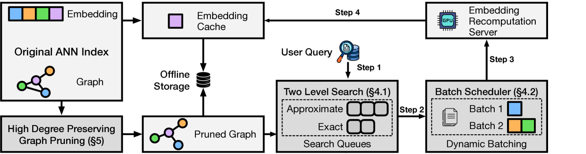

+++
title = "LEANN：一个技术上很出色，但问题日益过时的解决方案"
date = "2025-08-09T22:00:00+08:00"
description = ""
tags = ["Vector Database"]
+++

每当学术界的顶尖人物，尤其是像来自伯克利的 Ion Stoica（Spark 和 Ray 的联合创始人）和 Matei Zaharia（Spark 的作者和 Databricks 的 CTO）这样曾定义了数个计算范式的大师发布新作时，整个行业都应该予以关注。他们的新作 **LEANN: A Low-Storage Vector Index** ([arXiv](https://arxiv.org/abs/2506.08276), [GitHub](https://github.com/yichuan-w/LEANN)) 也不例外，它旨在解决一个长期困扰向量搜索领域的难题：巨大的存储开销。

论文的核心承诺极具吸引力：LEANN 能够将向量索引的存储大小，降低到原始数据体积的 5% 以下，相比传统方案实现了高达 50 倍的压缩。这是一个惊人的数字。但为了实现它，LEANN 提出了一种激进的架构性权衡——以显著增加的计算成本和查询延迟，换取极致的存储压缩。

问题在于，在 2025 年，这个交易还划算吗？

## LEANN 的架构：深入理解其核心权衡

要理解 LEANN 的价值，首先要理解它的工作原理。其设计的出发点是，索引体积的罪魁祸首是存储了数百万甚至数十亿个高维 embedding 向量。因此，LEANN 的选择是：**根本不存储它们**。

这一决策引出了一整套精巧但复杂的设计：

**1. 离线阶段：精密的图“骨架”构建**

在索引构建时，LEANN 并非简单地丢弃一切。它首先构建一个标准的 HNSW 图，然后通过一种名为“高保留度图剪枝”的算法对其进行“瘦身”。该算法会识别出图中连接度最高的少数“枢纽”节点，并保护它们的连接；而对其他大量普通节点，则大幅削减其连接数，只保留与枢纽节点的通路。

完成这步后，所有完整的 embedding 向量被彻底丢弃，最终只留下这个轻量级的图“骨架”存入磁盘。这从根本上解决了存储问题。

**2. 在线阶段：按需发生的“昂贵”计算**

当查询请求到来时，真正的挑战开始了。由于没有现成的向量，LEANN 必须在途中将它们创造出来。

* **两阶段搜索**：它首先使用预存的、极度压缩的 PQ 编码进行一次快速的近似搜索，目的是从图中筛选出一个规模很小的、最有可能包含答案的候选节点集。
* **选择性重新计算**：接下来是整个流程中最昂贵的一步。只有被选中的那一小撮候选节点，才会触发一次完整的神经网络前向传播。系统会调用原始的 embedding 模型（如论文中使用的 110M 参数的 Contriever 模型），为这些节点动态生成全精度的 embedding。
* **动态批处理**：为了提升效率，这些计算请求会被攒成一个批次，统一交由 GPU 处理，以最大化硬件利用率。

## 数据分析：当论点遭遇现实

LEANN 的架构设计逻辑自洽且技术上令人印象深刻。但当我们审视论文自己的实验数据时，这个方案的现实可行性开始出现裂痕。

**1. 无法回避的延迟成本**

论文的实验数据坦诚地揭示了计算成本：对于一个批次的处理，**76% 的时间都消耗在了 embedding 的重新计算上**。最终，在强大的数据中心级 GPU NVIDIA A10G 上，一次高精度检索需要“不到 2 秒”。

然而，当测试平台切换到更符合“边缘端”定义的 Apple M1 Ultra 时，其**性能比 A10G 慢了 2.28 到 3.01 倍**。这意味着在消费级设备上，用户为一次本地搜索付出的时间成本是数秒甚至更长。这并非微不足道的延迟，而是其架构带来的必然结果。

**2. 对“存储危机”前提的再审视**

LEANN 的整个动机，都建立在边缘设备存在“存储危机”的叙事上。这个叙事在智能手机等场景下部分成立。但在论文自己选择测试的 M1 MacBook 等现代笔记本电脑上，TB 级的 NVMe SSD 已经相当普及。在这种设备上，为了一个核心功能，付出 1.5 到 2 倍的存储开销，往往是一个完全可以接受的工程选择。

更有趣的是，论文自己的一项消融研究，无意中削弱了其核心论点。研究发现，如果将模型从 110M 参数的 Contriever 更换为 34M 参数的 GTE-small，**检索速度能提升 2.3 倍，而最终任务精度损失极小**。这恰恰证明，通过选用更高效的现代模型，可以在不牺牲太多精度的前提下大幅降低计算成本，这似乎是一条比 LEANN 的极端方案更均衡、更具吸引力的路径。

**3. 对“高精度”的执念与 RAG 的实践**

LEANN 追求高精度的初衷值得肯定。它通过重新计算来使用全精度向量，避免了量化带来的信息损失。

但在大多数 RAG 应用的实践中，这种对初始检索阶段绝对精度的追求，可能是一种过度优化。初始检索更多扮演的是一个“过滤器”的角色。由现代量化技术（论文在相关工作中也提到了 RabitQ）带来的微小精度损失，在经过 Rerank 模型和最终 LLM 的处理后，对生成答案的质量影响通常微乎其微。相比之下，用户对延迟的感知却非常敏感。

## 被遗忘的维度：功耗与系统响应

对于以电池供电的边缘设备而言，还有一个至关重要的维度：**功耗**。

为了一次搜索就完整运行一个庞大的神经网络模型，无疑是一项高能耗的操作。这将直接影响笔记本电脑的续航和手机的发热。遗憾的是，**通篇论文并未提供任何关于能耗影响的分析**，对于一个为边缘端设计的方案来说，这是一个重大的疏漏。

此外，高强度的计算任务会持续占用 CPU 和 GPU 资源，可能导致系统上其他应用的响应变慢，影响整体用户体验。

## 结论：为昨日问题打造的优雅方案

LEANN 无疑是一项技术上极为出色的研究，它展现了顶级研究者在算法和系统设计上的深厚功力。

但它所提供的核心交易——用巨大的计算和延迟成本换取存储空间的节省——与当前的技术发展趋势显得有些脱节。边缘端的存储正变得越来越大、越来越便宜，而算力，特别是能效比高的算力，依然是宝贵的资源。

LEANN 用计算的“蛮力”解决了存储问题，却也因此在延迟、系统响应，以及被忽略的能耗上，创造出了新的、可能更棘手的问题。它是一个优雅的答案，但回答的，或许已不再是当今行业最迫切需要解决的问题了。
