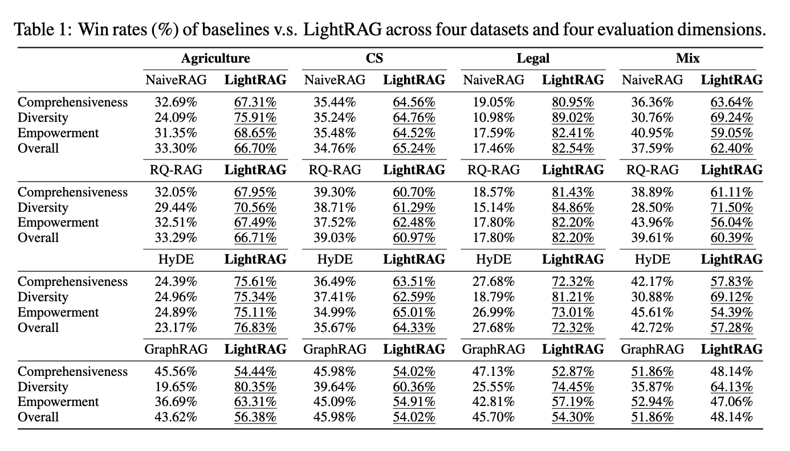
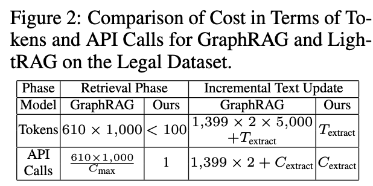

+++
title = "LightRAG: 改进版的 GraphRAG，便宜多了！"
date = "2024-10-25T16:08:22+08:00"

description = ""

tags = ["Vector-Database", "RAG", "Graph", "Paper"]
+++

微软的 GraphRAG 使 RAG（Retrieval-Augmented Generation）与知识图谱结合的概念备受关注。然而，GraphRAG 在构建知识图谱时需要频繁调用大型语言模型（LLM），导致成本高且速度慢。相比之下，LightRAG（[arxiv](https://arxiv.org/abs/2410.05779v1), [repo](https://github.com/HKUDS/LightRAG)）利用 LLM 将文档转化为知识图谱，并结合向量数据库进行检索和回答问题。LightRAG 显著减少了 LLM 的调用次数，从而降低了知识图谱构建的成本。

以下是 LightRAG 的工作流程和原理的详细介绍：

## 文档处理与知识图谱构建

1. **文档分块**：
   - LightRAG 首先将输入文档分块处理，每块大小不超过 1200 token，并设置 100 token 的重叠，以确保块大小适中且相邻块间有适当重叠，便于后续处理。

2. **实体提取**：
   - 使用 LLM 从文档块中提取实体（entity）。LLM 会根据预定义的提示模板（prompt template）生成实体提取的指令。
   - 提取的实体信息包括实体名称、类型和描述等，这些信息将被用于构建知识图谱的节点。

3. **关系提取**：
   - 在提取实体的同时，LightRAG 还会提取实体之间的关系（relationship）。这些关系信息包括源实体、目标实体、关系类型和描述等，用于构建知识图谱的边。

4. **知识图谱构建**：
   - 提取的实体和关系信息会以图的形式存储，实体作为节点（vertex），关系作为边（edge）。LightRAG 使用 [NetworkX](https://networkx.org/) 作为知识图谱的存储后端，在生产级别的系统中，你可能需要一个图数据库。

5. **向量数据库存储**：
   - 提取的实体和关系信息会被转换为向量，并存储在向量数据库中，以便后续进行相似度检索。LightRAG 使用 [nano-vectordb](https://github.com/gusye1234/nano-vectordb)，这是一个基于 `numpy` 实现的简易向量数据库。在生产级别的系统中，建议使用真正的向量数据库，例如 [MyScaleDB](https://github.com/myscale/MyScaleDB)。

## 基于知识图谱和向量数据库的检索与回答

1. **查询处理**：
   - 当用户提出查询时，LightRAG 首先使用 LLM 提取查询中的关键词（keywords）。这些关键词用于后续的检索过程。关键词分为
     - **低级关键词**：关注具体实体、细节或具体术语
     - **高级关键词**：关注总体概念或主题

2. **本地查询（Local Query）**：
   - 在本地查询模式下，LightRAG 使用提取的**低级关键词**在存储实体的向量数据库中搜索。然后，根据搜索到的实体，在知识图谱中寻找相关的关系（边），将这些实体和关系构建查询的上下文（context），并使用 LLM 生成回答。

3. **全局查询（Global Query）**：
   - 在全局查询模式下，LightRAG 使用提取的**高级关键词**在向量数据库中查找相关的关系。然后，根据这些关系和它们对应的实体构建查询的上下文，并使用 LLM 生成回答。

4. **混合查询（Hybrid Query）**：
   - 在混合查询模式下，LightRAG 同时使用本地查询和全局查询的结果，构建一个更全面的上下文，并使用 LLM 生成回答。

## 实验结果

LightRAG 使用 LLM 生成问题并评估问答结果。在四个数据集（Agriculture/CS/Legal/Mix）和四个维度（Comprehensiveness/Diversity/Empowerment/Overall）上，LightRAG 都战胜了四个对手：NaiveRAG (朴素的 RAG)、[RQ-RAG](https://arxiv.org/abs/2404.00610)、[HyDE](https://arxiv.org/abs/2212.10496) 和 [GraphRAG](https://arxiv.org/abs/2404.16130)。

LightRAG 与 GraphRAG 在消耗的 token 数量和 API 调用次数方面进行了比较。从下表可以看出，LightRAG 消耗的 LLM token 明显更少：

{width=40%}

### 总结

LightRAG 通过 LLM 将文档处理成知识图谱和向量数据库，并基于这些数据结构进行高效的检索和回答。它支持多种查询模式，包括本地查询、全局查询、混合查询，以满足不同场景下的需求。通过这种方式，LightRAG 能够有效地利用 LLM、知识图谱和向量数据库的优势，提供高质量的检索和回答服务。
