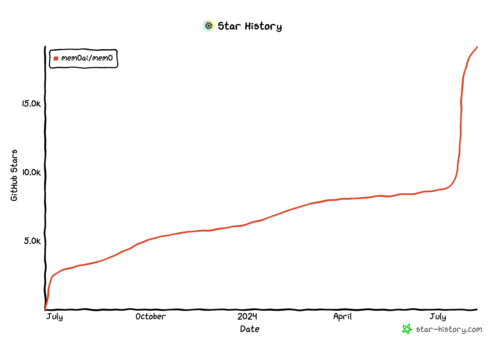

+++
title = "Mem0: 个性化 AI 的记忆层"
date = "2024-08-07T19:58:40+08:00"
description = "探索 Mem0 如何通过向量数据库和智能提示提升 AI 的个性化记忆能力，适应用户需求并不断改进。"
tags = ["AI","LLM","vector-database",]
+++

在人工智能快速发展的今天，如何让 AI 系统具备持续学习和适应个体用户需求的能力成为一个重要课题。Mem0 项目通过创新的记忆层设计，为这一挑战提供了一种独特的解决方案。本文将深入探讨 Mem0 的工作原理及其潜在应用。

[GitHub](https://github.com/mem0ai/mem0)

Mem0 是一个最近在 GitHub 上迅速走红的项目，旨在通过智能记忆层提升 AI 的个性化和适应性：



## Mem0 的核心理念

Mem0 的核心理念是利用向量数据库和智能提示（prompts）来帮助 AI 记住用户偏好，适应个体需求，并随着时间的推移不断改进。其工作流程如下：

1. **记忆提取**：对于一段新的数据（如用户的聊天记录），Mem0 使用 **MEMORY_DEDUCTION_PROMPT** 提取相关记忆。
2. **记忆搜索**：将提取的记忆进行嵌入（embedding），在向量数据库中搜索相似的记忆。
3. **记忆更新**：利用 **UPDATE_MEMORY_PROMPT** 让 LLM 决定是将新记忆加入数据库，还是修改或删除现有记忆。
4. **记忆回答**：在回答用户问题时，Mem0 先在向量数据库中搜索相关记忆，然后用 **MEMORY_ANSWER_PROMPT** 生成回答。

这种方法的优势在于：

- 灵活性：可以根据新信息动态更新记忆，而不是简单地累积数据。
- 个性化：能够捕捉和适应用户的个人偏好和行为模式。
- 效率：通过智能提取和合并记忆，避免了存储冗余信息。
- 可解释性：由于记忆是由 LLM 生成的结构化信息，比原始交互数据更容易理解和分析。

## 核心提示（Prompts）

以下是 Mem0 的核心提示：

```python
UPDATE_MEMORY_PROMPT = """
You are an expert at merging, updating, and organizing memories. When provided with existing memories and new information, your task is to merge and update the memory list to reflect the most accurate and current information. You are also provided with the matching score for each existing memory to the new information. Make sure to leverage this information to make informed decisions about which memories to update or merge.

Guidelines:
- Eliminate duplicate memories and merge related memories to ensure a concise and updated list.
- If a memory is directly contradicted by new information, critically evaluate both pieces of information:
    - If the new memory provides a more recent or accurate update, replace the old memory with new one.
    - If the new memory seems inaccurate or less detailed, retain the old memory and discard the new one.
- Maintain a consistent and clear style throughout all memories, ensuring each entry is concise yet informative.
- If the new memory is a variation or extension of an existing memory, update the existing memory to reflect the new information.

Here are the details of the task:
- Existing Memories:
{existing_memories}

- New Memory: {memory}
"""

MEMORY_DEDUCTION_PROMPT = """
Deduce the facts, preferences, and memories from the provided text.
Just return the facts, preferences, and memories in bullet points:
Natural language text: {user_input}
User/Agent details: {metadata}

Constraint for deducing facts, preferences, and memories:
- The facts, preferences, and memories should be concise and informative.
- Don't start by "The person likes Pizza". Instead, start with "Likes Pizza".
- Don't remember the user/agent details provided. Only remember the facts, preferences, and memories.

Deduced facts, preferences, and memories:
"""

MEMORY_ANSWER_PROMPT = """
You are an expert at answering questions based on the provided memories. Your task is to provide accurate and concise answers to the questions by leveraging the information given in the memories.

Guidelines:
- Extract relevant information from the memories based on the question.
- If no relevant information is found, make sure you don't say no information is found. Instead, accept the question and provide a general response.
- Ensure that the answers are clear, concise, and directly address the question.

Here are the details of the task:
"""
```

Mem0 的独特之处在于其处理记忆的方式。Mem0 不直接将用户的互动数据存入向量数据库，而是先通过 LLM 将其转化为结构化的记忆，再利用向量数据库搜索相关记忆，最后由 LLM 决定如何将新记忆与现有记忆融合。
