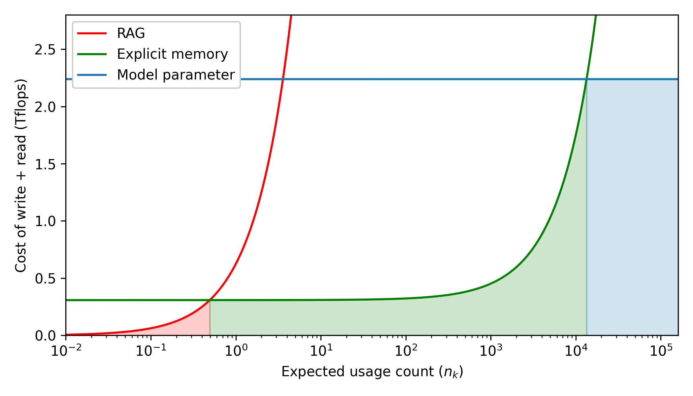

+++
title = "AI 记忆架构探索（一）：Memory³ 架构深度解析"
date = "2025-08-03T10:00:00+08:00"
description = "本文将深入剖析 Memory³ 论文，不仅解释其“显性记忆”的技术实现，更会引入其核心的“记忆电路理论”，量化分析其成本收益。我们将共同探讨这一架构如何通过记忆稀疏化和两阶段预训练，实现对无限长上下文的支持，并审视其在事实性与效率上的双重优势。"
tags = ["AI", "System", "Memory", "LLM"]
+++

## 1. 引言：在参数和上下文之间，寻找第三条路

当前的大语言模型主要通过两种方式利用知识。第一种是**参数化记忆**，即将知识在预训练阶段编码进模型数以亿计的权重中。这种记忆响应快，但更新成本极高。第二种是**工作记忆**，即我们熟知的上下文窗口，通过检索增强生成等方式在推理时将外部文档放入其中。这种方式灵活，但受限于上下文长度和检索带来的延迟，是一种相对浅层的结合。

这两种方式都非完美。一个核心问题始终存在：我们能否设计一种新的知识表示形式，它既能像参数化记忆一样与模型深度融合，又能像工作记忆一样灵活更新？Memory³ 论文正是对这一问题的严肃探索，它引入了第三种记忆形式：**显性记忆**。

## 2. 理论基石：记忆电路理论

要理解 Memory³ 的设计，首先要理解其理论基础——记忆电路理论。该理论尝试从模型内部的计算过程来定义“知识”。它认为，一项具体知识（例如“中国的首都是北京”）可以被看作一个**电路**，这个电路由模型中特定的**注意力头**和 **MLP 神经元**构成。

这个理论将知识分为两类：

* **抽象知识**：指那些通用的、难以被具体实例化的能力，例如语言的语法规则、逻辑推理能力等。这些知识的电路非常复杂且泛化，难以从模型中剥离。
* **具体知识**：指那些与特定事实或实体相关的知识，例如“埃菲尔铁塔在巴黎”。这些知识的电路相对简单和固定。

Memory³ 的核心思想是：**将“具体知识”的电路从模型参数中“外化”出来，存储为显性记忆，而让模型参数专注于更核心的“抽象知识”。** 这样，模型可以变得更小、更高效。

## 3. 什么是“显性记忆”？

Memory³ 提出的核心概念是**显性记忆**。它并非一个外部数据库，而是一种深入模型内部的架构层优化。我们可以从以下几点来理解它与传统方式的区别：

* **与模型参数的区别**：模型参数是隐性的、高度压缩的，且更新成本极高。显性记忆是外置的、结构化的，并且可以被随时添加、删除或修改，无需重新训练整个模型。
* **与检索增强生成的区别**：传统的检索增强会将检索到的原始文本作为输入，模型需要花费计算资源去阅读和理解。显性记忆存储的则是模型可以直接利用的预计算状态，即**稀疏的注意力键值对**，从而跳过了阅读理解的步骤，大幅提升了效率。

本质上，显性记忆是一种为模型注意力机制量身打造的高效数据结构。

## 4. 技术实现：从生成、存储到检索

**记忆的生成与存储：稀疏化是关键**

显性记忆的本质，是一组**稀疏的注意力键值对**。其写入过程如下：

1. **编码**：使用一个“记忆生成器”（在论文中，这是一个经过训练的 Transformer 模型）读取一篇参考文献。
2. **筛选与稀疏化**：这是关键一步。在编码过程中，通过计算注意力分数等方式，识别出文档中信息量最大的少数关键 token。**只有这些最关键的 token 会被保留**。
3. **存储**：系统只保存这些关键 token 的**键**和**值**向量。这组稀疏的键值对，就是这篇文档被“编译”后的精华。这种稀疏化处理，极大地降低了存储需求，使得构建大规模记忆库成为可能。

**记忆的检索与使用**

当用户提出问题时，系统利用向量检索技术从记忆库中召回相关的记忆单元：

* **向量库**：论文明确指出，他们使用了基于 Faiss 的向量索引。
* **存储内容**：索引中存储的，是所有已生成记忆单元的**键向量**。
* **查询内容**：用于查询的，是用户问题经过编码后生成的**查询向量**。
* **使用流程**：检索到的键值对会被直接**拼接**到模型当前注意力层正在计算的键和值矩阵中。这意味着，外部知识没有经过繁琐的阅读理解，而是直接成为了模型计算过程的一部分，实现了最高效的融合。

## 5. 成本收益的量化分析

Memory³ 的价值不仅在于理论创新，更在于其经济性。论文提供了一个清晰的成本分析，比较了三种记忆形式在不同使用频率下的总成本（写入成本 + 读取成本）。

* **模型参数**：写入成本极高（需要昂贵的训练），但读取成本很低。适合存储使用频率极高的“抽象知识”。
* **检索增强生成**：写入成本几乎为零（存储纯文本），但每次读取成本都很高（需要模型实时编码和理解）。适合存储使用频率极低的知识。
* **显性记忆**：写入和读取成本都处于中等水平。

结论是显而易见的：**显性记忆在“中等使用频率”的知识存储上，具有无与伦比的成本优势。** 这正是其“用武之地”。

## 6. 关键问题解答

**模型是如何训练的？**

这是一个关键事实。根据论文，Memory³ 模型**并非基于任何开源模型进行微调**。研究团队**从头开始预训练**了一个 2.4B 参数的模型，该模型在架构上原生集成了对显性记忆的支持。训练过程分为两个阶段：

1. **热身阶段**：在此阶段，模型学习将知识编码到其**参数**中，就像传统的预训练一样。
2. **持续训练阶段**：在此阶段，模型学习如何**从显性记忆中读取和利用知识**。它会接触到一个不断增长的、由第一阶段处理过的文档编译而成的记忆库。

**如何处理长文本以支持“无限上下文”？**

为避免上下文割裂，Memory³ 采用了一种“先编码，后切分”的策略。它首先对整篇长文档进行一次完整的编码，以捕获全局信息。然后，在保留这些全局信息的前提下，再将长序列的键值对切分成多个可管理的记忆片段。这样，每个片段的向量中都蕴含了来自整篇文档的上下文信息。由于记忆被存储在外部，并在需要时才被检索，这在理论上打破了传统上下文窗口的长度限制。

**显性记忆带来了哪些额外的好处？**

除了效率和成本，显性记忆还带来了两大优势：

* **提升事实性**：由于知识以更接近原始形式的方式被存储和检索，减少了模型在参数化过程中可能出现的信息损失和“幻觉”。
* **增强可解释性**：当模型做出回答时，我们可以追溯到它具体依赖了哪些记忆单元，而这些记忆单元又对应着哪些原始文本。这为理解和调试模型的决策过程提供了重要线索。

## 7. 潜力与局限

Memory³ 的实验结果展示了巨大的潜力：其 2.4B 模型在多个知识密集型任务上超越了 Llama2-7B，且速度更快。这证明了其架构的有效性。

然而，作为一个前沿探索，它依然面临着严肃的开放性问题：

* **可扩展性**：当记忆库的规模达到万亿级别时，存储成本和检索效率是否还能保持在可接受的范围内？
* **知识更新**：对于需要实时更新的知识，重新编译记忆的延迟和成本有多大？
* **通用性**：在问答任务上的成功，能否迁移到需要更复杂推理和创造性的任务中？

总而言之，Memory³ 提出了一种极具启发性的、在模型架构层面的优化方案。它用一个精巧的数据结构设计，为我们揭示了在检索增强和微调之外的第三条道路。但同时，它也让我们不得不思考一个更深层次的问题：当记忆的数量和复杂度超越了优化的范畴，我们是否需要一个全新的系统来对其进行管理？这正是我们下一篇文章将要探讨的 MemOS。
