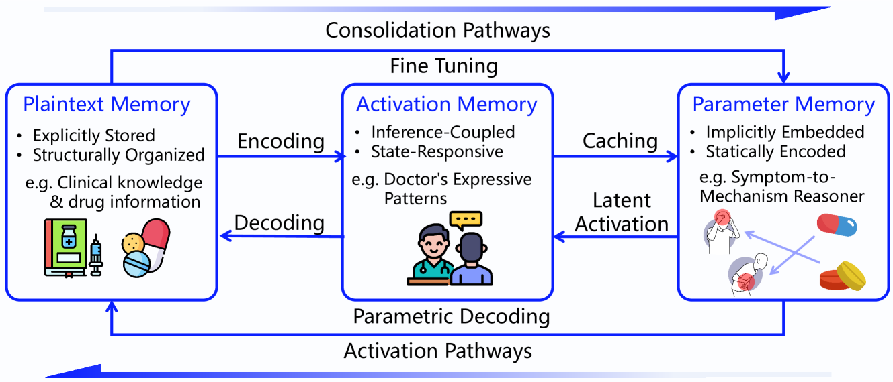
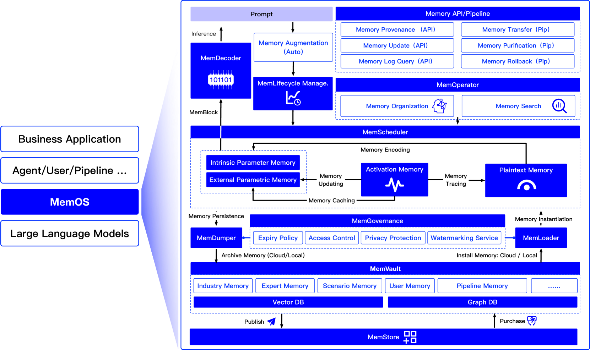

+++
title = "AI 记忆架构探索（二）：MemOS 的系统化设想与治理框架"
date = "2025-08-06T21:00:00+08:00"
description = "本文将深入剖析 MemOS 论文，探讨其从 Memory³ 的思想演进而来的系统化设想。我们将详细拆解其核心抽象 MemCube、三种记忆类型的动态转化机制，并结合“前缀缓存”技术，分析其对闭源模型的兼容策略，最终审视其“LLM 即内核”的宏大愿景与现实挑战。"
tags = ["AI", "System", "Memory", "LLM"]
+++

> 论文：MemOS: A Memory OS for AI System  
> 链接：<https://arxiv.org/abs/2507.03724v2>  
> GitHub: <https://github.com/MemTensor/MemOS>

## 1. 引言：从“数据结构”到“管理系统”

上一篇文章中，我们解析了 Memory³ 如何设计出一种高效的“记忆数据结构”。然而，一个孤立的数据结构，无论多么精巧，都无法解决系统层面的复杂性问题。当大量的记忆需要被不同的智能体并发使用、长期持有、更新和授权时，我们就需要一个**管理系统**。

MemOS 论文正是在这一背景下，提出了一个宏大的系统性设想：我们是否需要一个类似**操作系统**的框架，来统一管理 AI 的记忆和行为？它试图回答的，不是如何让单次记忆的利用更高效，而是如何构建一个能够支撑复杂、多智能体长期演进的**治理框架**。

## 2. 核心思想：三种记忆形态的统一管理

MemOS 并非凭空出现，它明确地继承并极大地扩展了 Memory³ 的核心思想。它的核心是将所有 AI 相关的知识和状态，归纳为三种可以相互转化的记忆形态：

1. **明文记忆 (Plaintext Memory)**：最基础、最稳定、人类可读的记忆。它对应于计算机中的**硬盘存储**。MemOS 进一步将其细化，支持多种后端存储，例如：
    * **通用文本记忆**：存储非结构化的文本块，如对话历史、文档段落。
    * **树状文本记忆**：用于存储具有层级关系的数据，如文件系统结构或思维导图。
    * **图数据库记忆**：利用 Neo4j 等图数据库，将知识以实体和关系的形式进行结构化存储，便于进行复杂的关联查询和推理。

2. **激活记忆 (Activation Memory)**：为了加速访问而存在的“热”记忆，其标准实现即 **KV 缓存**。这完全采纳了 Memory³ 的“显性记忆”概念，即预先计算好的、稀疏的键值对缓存。它对应于计算机中的**内存**。

3. **参数记忆 (Parametric Memory)**：被深度内化到模型权重中的知识。例如，通过 LoRA (Low-Rank Adaptation) 微调生成的适配器权重。它对应于 **CPU 缓存**，与计算单元结合最紧密。

MemOS 的目标，就是设计一套机制，对这三种形态的记忆进行**统一的、全生命周期的管理**。

## 3. 核心抽象：记忆的“集装箱”—— MemCube

为了实现对不同形态记忆的统一管理，MemOS 提出了其最重要的核心抽象：**MemCube** (记忆立方)。这是一个标准化的“记忆容器”，其设计思想对理解整个系统至关重要。

每个 MemCube 由两部分构成：

1. **载荷 (Payload)**：存储记忆的实际内容。它的形态是多样的，可以是一段明文，一组激活记忆的键值对，或是一个 LoRA 模型的权重文件。
2. **元数据 (Metadata)**：这是实现治理的基石。它是一组描述载荷的标签，定义了诸如记忆的 `user_id`、`source`、`timestamp`、`importance_score`、`access_control_list` 和 `version` 等系统级信息。

通过将所有记忆都封装进这种标准化的、带元数据的容器中，MemOS 才有可能在系统层面实现对它们的追踪、调度、授权和演进管理。MemCube 让记忆从单纯的数据变成了**可被管理的系统资产**。

## 4. MemOS 系统架构

根据官方文档，MemOS 采用分层架构，主要包括存储层、服务层和应用层。

* **存储层 (Storage Layer)**：负责记忆的持久化，对接各种后端，如本地文件系统、对象存储 (S3) 或图数据库 (Neo4j)。
* **服务层 (Service Layer)**：系统的核心，提供了记忆管理、用户管理、API 接口等核心服务。服务层包含两种部署模式：
  * **MemOS NEO**：一个功能完备的、可独立部署的记忆操作系统服务，提供完整的记忆管理能力。
  * **MemOS MCP (MemOS Coze Plugin)**：一个轻量级的、可嵌入的记忆插件，设计用于在 Coze 等第三方平台中作为工具，提供记忆能力。
* **应用层 (Application Layer)**：开发者基于 MemOS 的服务和 API，构建自己的 AI 应用。

这种分层架构和灵活的部署模式，使得 MemOS 既能作为强大的中央记忆枢纽，也能作为便捷的嵌入式记忆组件，适应不同的应用场景。

## 5. 记忆的动态转化：智能的“缓存”与“固化”

MemOS 理论框架的亮点，在于它描绘了一幅记忆在三种形态间动态流转、自我优化的蓝图：

* **“缓存”**：当系统发现某个“硬盘”中的明文记忆被频繁访问时，可以自动将其“编译”成“内存”中的激活记忆（KV 缓存），以加速未来的调用。这类似于数据库的查询缓存或物化视图。
* **“固化”**：当某些知识或技能需要被更深度地内化时，系统可以将相关的明文或激活记忆，通过训练（如 LoRA 微调）“固化”成“CPU 缓存”里的参数记忆。这好比将反复练习的技能，变成了“肌肉记忆”。
* **“归档”**：反之，长期不被使用的激活记忆或参数记忆，也可以被“降级”为明文记忆，以释放宝贵的计算资源。

这种动态转化的能力，使得系统在理论上可以根据实际使用情况，智能地调整不同记忆的存储形态，在成本、速度和效果之间取得动态平衡。

## 6. 详解：利用“前缀缓存”兼容闭源模型

这是一个现实且关键的问题。对于像 GPT-4o 这样的闭源模型，我们无法访问其内部，自然也无法直接向其注意力层注入键值对缓存。MemOS 对此的应对策略是一种功能上的模拟，它巧妙地利用了现代 LLM 推理服务普遍具备的一项优化技术：**前缀缓存 (Prefix Caching)**。

**前缀缓存的工作原理**

在 LLM 推理时，首先需要对用户输入的提示（Prompt）进行一次完整的计算，这个过程称为**预填充 (Prefill)**。在预填充阶段，模型会为输入的每一个 token 计算出其对应的“键”和“值”向量，并将它们存储在 GPU 显存中，这就是 **KV 缓存**。在后续生成每一个新词时，模型都可以直接利用这个缓存，而无需重新计算整个提示，从而大大加快生成速度。

前缀缓存技术，就是将这个 KV 缓存**在不同的推理请求之间共享**。如果系统检测到多个请求的开头部分（前缀）是完全相同的（例如，多轮对话中的历史记录，或者 RAG 应用中被反复查询的同一篇文档），它就可以直接重用已经计算好的前缀 KV 缓存，只计算新增加的那部分内容。这极大地降低了处理重复信息时的延迟和计算成本。

**MemOS 的模拟策略**

理解了前缀缓存后，MemOS 的策略就一目了然了：

1. **检索明文**：首先，系统找到“激活记忆”所对应的原始**明文记忆**。
2. **前置拼接**：然后，系统将这段明文内容**前置拼接**到当前用户的提问之前，形成一个组合式的提示。

当这个组合式的提示被发送给闭源模型时，推理引擎的**前缀缓存机制就会自动生效**。如果这段明文内容（作为前缀）在近期被频繁使用，它的 KV 缓存很可能已经被保留了下来。因此，模型无需重新计算这个前缀，可以直接利用缓存，从而在功能上达到了“模拟”注入激活记忆的效果，同时享受了性能优化的红利。

## 7. 优势与代价：兼容性与性能的权衡

现在，我们可以更清晰地对比 MemOS 的兼容策略与 Memory³ 的原生架构在处理记忆时的优劣势：

* **Memory³ (原生注入)**：
  * **优势**：**极致的性能和效率**。它跳过了模型对明文的阅读、理解和编码过程，直接将预计算好的、最关键的稀疏键值对注入计算中枢。这是理论上最高效的方式。
  * **劣势**：**缺乏灵活性和兼容性**。这种方法要求对模型进行底层架构的修改，因此它无法适用于任何闭源模型，也无法与非 Memory³ 架构的开源模型兼容。

* **MemOS (利用前缀缓存模拟)**：
  * **优势**：**极高的灵活性和兼容性**。该策略适用于任何支持前缀缓存的黑盒模型。这使得 MemOS 的系统治理能力有更广泛的应用前景。
  * **劣势**：**性能妥协**。虽然利用了前缀缓存，但其效果依然弱于原生的稀疏键值对注入。它依赖于推理引擎的缓存策略，并且缓存的粒度是完整的稠密 KV，而非 Memory³ 中经过优化的稀疏 KV，在存储和利用效率上都打了折扣。

总而言之，MemOS 用一种聪明的“降级兼容”策略，换取了在异构模型环境下的生存能力，而 Memory³ 则专注于在理想环境下，将单一架构的性能推向极致。

## 8. 宏大愿景：“LLM 即内核”

MemOS 最具雄心的设想，是提出 **“LLM 即内核”** 的概念。它认为，未来的操作系统内核，其核心调度器可能就是一个 LLM。这个 LLM 不再仅仅是一个被调用的“程序”，而是成为整个系统的“大脑”，负责：

* **意图理解**：解析用户的自然语言指令。
* **记忆调度**：根据意图，决定从存储层加载哪些 MemCube 到工作记忆中。
* **工具选择**：选择合适的模型或外部工具来执行任务。
* **响应生成**：整合所有信息，生成最终的、上下文感知的响应。

这是一个极具颠覆性的想法，但也面临着巨大的挑战：

* **性能与成本**：用 LLM 作为内核进行每一次调度，其延迟和成本在现阶段是难以想象的。
* **可靠性与确定性**：操作系统的内核必须是高度可靠和确定性的，而 LLM 的随机性在目前来看是一个难以逾越的障碍。

尽管如此，这个设想为我们描绘了一幅足够激动人心的未来图景。

## 9. 审视与展望

MemOS 提供了一个极其全面和深刻的理论框架，它指出了当前智能体架构在系统性上的普遍缺失。将操作系统和数据库系统的思想引入 AI 领域，无疑是极具启发性的。

然而，我们必须清醒地认识到，这是一个具有挑战性的系统性设想。其复杂的抽象和管理机制，对于大多数应用场景而言，也可能是“过度设计”。

MemOS 最大的价值，或许不在于它给出的答案，而在于它**定义了问题**。它为我们思考如何构建更健壮、更可演进的 AI 系统，提供了一套宝贵的、尽管存在争议的词汇和蓝图。
