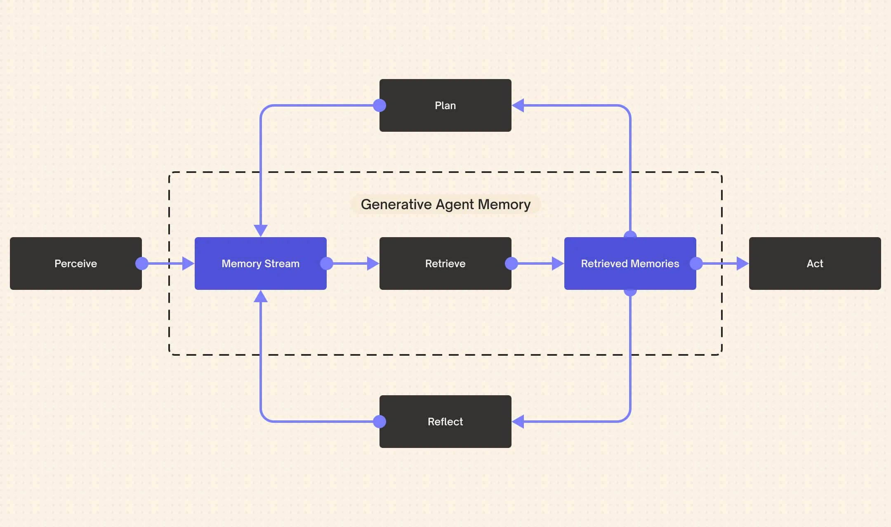

+++
title = "AI 记忆架构探索（三）：从工程原型到架构蓝图的演进之路"
date = "2025-08-06T22:00:00+08:00"
description = "本系列终篇将 Memory³ 与 MemOS 的顶层设计，与 mem0 等开源记忆库的工程实践进行对焦。通过剖析当前原型在记忆形态和治理能力上的局限，我们为开发者提供了一条从“基础 RAG”到“多层缓存”再到“智能体状态运行时”的务实演进路线，最终勾勒出 AI 记忆系统从“外部依赖”走向“一等公民”的未来。"
tags = ["AI", "System", "Memory", "LLM"]
+++

## 1. 引言：连接理论蓝图与工程原型

在本系列的前两篇文章中，我们分析了一场从“微观架构”到“宏观系统”的思想演进。Memory³ 如同一份精密的芯片设计图，定义了高效的“记忆电路”；而 MemOS 则是一份宏大的城市规划方案，为整个 AI 系统构想了可持续的“记忆治理框架”。它们共同构成了一套前瞻性的**架构蓝图**。

与此同时，在工程领域，开发者们已经构建出了另一番景象。以 [mem0](https://github.com/mem0ai/mem0)、[LangMem](https://github.com/langchain-ai/langmem) 等为代表的开源记忆库，是解决当下问题的**工程原型**。它们务实、可用，为大量 AI 应用提供了即插即用的记忆能力。本文作为终篇，我们的目标是**连接蓝图与原型**：

* 分析当前工程原型的设计与局限。
* 思考架构蓝图对当前实践的指导意义。
* 为开发者铺设一条从现有原型通往未来蓝图的、切实可行的演进路径。

## 2. 当前的工程原型：以 mem0 为例

当前主流的开源记忆库，其核心思想可以概括为**基于 RAG 的智能记忆层**。它们致力于解决一个核心痛点：如何让无状态的 LLM 拥有跨会话的长期记忆。



其工作模式通常是：

1. **监听与捕获**：捕获用户与智能体的对话历史。
2. **筛选与存储**：使用一个（通常是 LLM）判断器，决定哪些信息是“重要的”，然后将其转换为向量，存入向量数据库。
3. **检索与注入**：当新的交互发生时，从数据库中检索出最相关的历史记忆，并将其作为上下文注入到提示词中。

这种方案直接有效，且易于集成，极大地推动了 AI 智能体的落地。然而，如果我们用 MemOS 的架构蓝图来审视它，就会发现其在设计上的局限性。

## 3. 用“架构蓝图”审视“工程原型”：两大核心局限

**局限一：记忆形态的单一性**

MemOS 蓝图将记忆划分为三种核心形态：明文记忆、激活记忆、参数记忆。而当前的工程原型，其核心是**对“明文记忆”的向量化管理**。所有记忆，无论其性质如何，最终都被处理成文本块的向量表示。

这带来了两个问题：

* **缺乏“激活记忆”**：它们没有采纳 Memory³ 的核心洞见——将高频使用的知识预“编译”成模型可以直接利用的 KV 缓存。这意味着，即使是完全相同的知识被反复检索，模型每次依然需要花费算力去“阅读”和“理解”注入的明文上下文，这在性能和成本上是次优的。
* **缺乏“参数记忆”**：它们无法将某些核心技能或知识“固化”为模型的一部分（如 LoRA 权重）。用户的核心偏好，本应成为智能体“本能”的一部分，但在当前框架下，它仍然只是一条需要被反复检索的“外部记录”。

**局限二：记忆治理的初级阶段**

MemOS 蓝图的核心是“治理”，它通过标准化的 MemCube 容器和丰富的元数据，实现了对记忆全生命周期的精细化管理。相比之下，当前原型的治理能力尚处于初级阶段。

* **元数据不完善**：虽然可能包含时间戳等基本信息，但普遍缺乏 MemOS 设想的、系统的元数据框架，如 `importance_score`、`access_control_list`、`version` 等。这使得实现更高级的治理策略（如智能遗忘、权限控制、记忆溯源）变得困难。
* **生命周期管理缺失**：记忆在不同形态间的动态流转（缓存、固化、归档）是 MemOS 的精髓。而当前实践中，记忆一旦存入向量数据库，其形态便基本固定，缺乏根据使用情况自动“升降级”的机制。

## 4. 演进之路：从记忆“数据库”到“运行时”

认识到局限性，我们便可以为开发者勾勒出一条从当前原型出发，逐步吸收架构蓝图思想的演进路线。这条路的核心，是推动 AI 记忆系统从一个**外部依赖**，演进为一个真正的**智能体状态运行时**。

**第一步：实现你自己的“多级缓存”**

这是对 Memory³ 思想最直接的借鉴。在现有的 RAG 流程之上，增加一个**内存缓存层 (In-Memory Cache)**。

* **Level 1 (热数据)**：在内存中，用一个简单的字典或 LRU 缓存，存储那些被频繁检索的、已经由 LLM“消化”过的**结构化知识**（例如，将“我的 API 密钥是 xyz”这条信息，缓存为 `{ "api_key": "xyz" }`）。当请求命中 L1 缓存时，直接将结构化结果注入提示，避免了 LLM 重复处理自然语言的开销。
* **Level 2 (温数据)**：对于未命中 L1 的请求，再从向量数据库中检索相关的**明文记忆块**。这就是当前 `mem0` 的工作模式。

**第二步：构建标准化的“记忆对象”**

这是对 MemOS 中 MemCube 思想的借鉴。不要再将记忆视为简单的文本字符串，而是将其封装成一个标准的**记忆对象 (Memory Object)**。

```python
@dataclasses.dataclass
class MemoryObject:
    content: Any  # 可以是字符串、结构化数据、甚至未来可以是 LoRA 权重路径
    timestamp: float
    source: str
    importance: float
    access_count: int
    # ... 更多元数据
```

一旦你开始用这种方式来组织记忆，你就为实现更高级的治理能力（如基于重要性和访问频率的遗忘策略）打开了大门。

**第三步：迈向“智能体状态运行时”**

当你的系统拥有了多级缓存和标准化的记忆对象后，它就不再仅仅是一个记忆库，而开始成为一个真正的**运行时 (Runtime)**。这个运行时，是智能体的大脑和中枢神经，它负责：

* **统一管理状态**：对话历史、用户偏好、文档知识、工具状态，都作为标准化的记忆对象被运行时统一管理。
* **调度记忆流转**：运行时会成为一个主动的管理者，根据元数据，自动在不同缓存层和持久化存储之间移动记忆。
* **对接多种“记忆后端”**：未来，这个运行时可以对接更多样的后端，比如 Memory³ 架构的模型（实现原生 KV 注入）、微调服务（实现参数记忆固化）等，从而拥有一个可插拔、可扩展的记忆架构。

## 5. 总结：记忆，终将成为 AI 的一等公民

从 Memory³ 的架构巧思，到 MemOS 的系统宏图，再到 mem0 的工程实践，我们看到了一条清晰的脉络：**AI 记忆，正在从一个临时的、外部的“上下文信息”，逐渐演变为一个系统的、内在的、需要被主动管理的“一等公民”**。

对于今天的开发者而言，最重要的不是去争论哪条路是唯一的真理，而是要认识到这场演进的必然性。从改进你的 RAG 流程开始，引入多级缓存，封装你的记忆对象。每一步看似微小的工程优化，都是在为构建那个更强大、更鲁棒、更智能的未来 AI 系统添砖加瓦。这条路，道阻且长，但行则将至。
