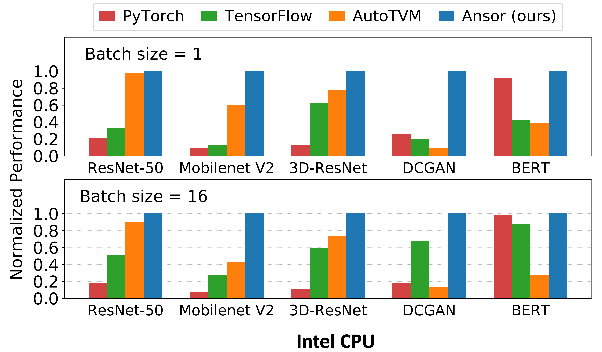
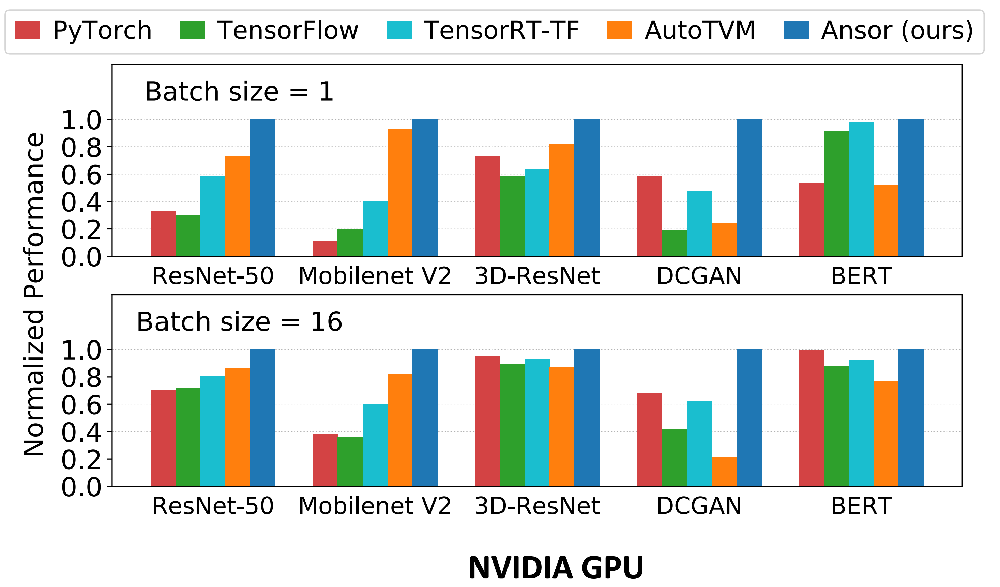
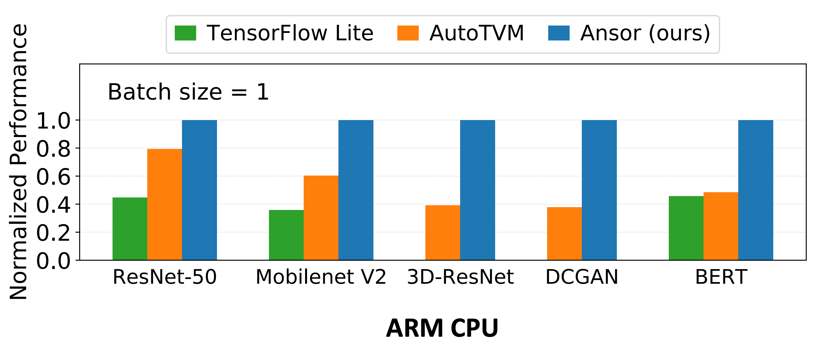
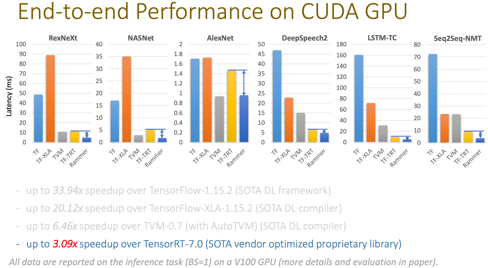

## Correctness

### Theseus: an Experiment in Operating System Structure and State Management

传统的 OS 中不同进程会共享很多状态，这会导致 state spill 的问题，即一个系统服务的崩溃，可能导致整个系统的崩溃，这时候其他不使用这个系统服务的进程的数据也会丢失。作者利用 Rust 语言中 memory ownership model 的特性实现了不同内核模块之间的 isolation 和 zero-cost state transfer，从而增强了系统的 evolvability 和 availability，能够实现比传统 OS 更强的 live evolution (我理解为加强版的的 live update) 和 fault recovery。他们通过一种名为 **intralingual** 的设计，让 Rust 编译器来保证他们的操作系统（名为 **Theseus**）实现是正确的。

### RedLeaf: Isolation and Communication in a Safe Operating System

也是一个用 Rust 写的 OS，利用 Rust 的内存安全特性，不依赖硬件而实现了不同模块的隔离。在这个名为 **RedLeaf** 的 OS 上，作者实现了 10Gbps 网卡和 NVMe SSD 的驱动程序，并达到了和 DPDK/SPDK  相同的性能。说明 Rust 写的 OS 既安全，性能又好。

### Specification and verification in the field: Applying formal methods to BPF just-in-time compilers in the Linux kernel

为了扩展 Linux 的功能，用户可以用 Berkeley Packet Filter (BPF) 来对网络数据进行分析和处理。为了加速，Linux 可以用  just-in-time (JIT) 编译器来把 BPF 的命令编译成机器代码。作者开发了 **Jitterbug**，一种用来实现 JIT 编译器的框架，可以形式化的验证 JIT 的正确性。作者用 Jitterbug 为 RISC-V 实现了一个新的 JIT 编译器，并发现了之前 JIT 编译器中的 16 个 bug（这些修改还都合并到了 Linux 中）。

### Cobra: Making Transactional Key-Value Stores Verifiably Serializable

大家期望数据库有着可串行性（serializability）的性质，不过云服务供应商提供的数据库到底是否满足这个性质，大家也不知道。作者实现了 **Cobra**，是第一个可以用来**验证真实世界的数据库是否具有可串行性**的系统。

### Determinizing Crash Behavior with a Verified Snapshot-Consistent Flash Translation Layer

这篇论文实现了一种叫做 snapshot-consistent flash translation layer (**SCFTL**) 的 FTL，也就是 SSD 控制器里面的系统。主要作用是提供更强的 crash guarantee。

### Storage Systems are Distributed Systems (So Verify Them That Way!)

作者实现了一种经过形式化验证的分布式 key-value 存储服务，叫做 **VeriSafeKV**。所谓形式化验证，指的是这个数据库的功能正确性不是由各种单元测试和回归测试来保证，而是可以在数学上证明的。
VeriSafeKV 的数据结构是基于 B^ε-tree 而非常见的 LSM。它的插入性能比 RocksDB 慢了 6 倍，对于一个经过形式化验证的系统，算是不错了。

## Storage

### Fast RDMA-based Ordered Key-Value Store using Remote Learned Cache

SJTU IPADS 的[魏星达](http://xmm4ok69.com/)（OSDI x 2 + SOSP + ATC 一作，ATC + EuroSys 二作……）基于他们以前的系统 **DrTM** (SOSP’15)，又搞了一个叫做 **XSTORE** 的 RDMA-based key-value store。这次是在客户端用机器学习学出了一个 cache 来加速读操作。

### CrossFS: A Cross-layered Direct-Access File System

以前的文件系统实现在三个地方：linux kernel（如常见的 ext4 和 xfs 等）、user space（比如各种基于 FUSE 实现的文件系统）以及存储设备的 firmware 里。它们有各自的优缺点：kernel FS 的读写需要经过 syscall，增大了延迟；user FS 无法利用硬件上的计算资源，firmware FS 无法利用 host 上强大的 CPU。本文的 **CrossFS** 实现了一个横跨 kernel、user space、firmware 三个层次的文件系统（Cross-layered Direct-Access File System），达到的效果是更好的支持文件并发访问，同时保证 crash-consistency。

### From WiscKey to Bourbon: A Learned Index for Log-Structured Merge Trees

这篇论文来自 Wisconsin 的 Arpaci-Dusseau 夫妇团队，描述了一个叫做 **Bourbon** 的新 LSM tree。他们用机器学习模型（准确的说是用了 greedy piecewise linear regression）改进了 LSM 数据结构（一种 key-value store 的常用数据结构）。查找性能是最好的生产级别 LSM 的 1.23x-1.78x。使用机器学习的思路有点像同一个 session 的 XSTORE。

### LinnOS: Predictability on Unpredictable Flash Storage with a Light Neural Network

本文介绍了一个叫做 **LinnOS** 的操作系统，可以用机器学习预测 SSD 的每一次 I_O 操作的速度。基于这个预测，他们可以降低系统的延迟。比如在 Cassandra 里，如果他们预测到某个 I_O 操作的速度比较慢，那么他们就可以向另外一个节点发送一个同样的 I_O 操作。在论文的实验中，LinnOS 降低了 9.6-79.6% 的系统平均延迟，每次 I_O 操作预测的延迟大概是 4-6μs（SSD 的平均延迟是 100μs 级别）。

### A large scale analysis of hundreds of in-memory cache clusters at Twitter

作者研究了 Twitter 里的 153 个 in-memory cache cluster，有如下发现：

1. In-memory caching 里有超过 35% 的 cluster 的 workload 是 write-heavy (write ratio > 30%)
2. 用 TTL (time to live) 限制被 cache 的数据规模十分重要，比 eviction 算法更重要
3. Cache 的访问分布一般来说遵循 Zipf’s law，例外一般出现在 write-heavy 的 cluster 里
4. Cache 中的元素大小并不是一成不变的，有时候还可能突变（对于 memcache 这样按照 slab 组织内存的系统是个问题）
5. 除非 cache 的 size 很小，否则 FIFO 基本跟 LRU 的效果一样好

### Generalized Sub-Query Fusion for Eliminating Redundant I/O from Big-Data Queries

印度的微软研究院通过减少 I/O 操作，优化了 SparkSQL 上的查询速度。

## OS & Networking

### A Simpler and Faster NIC Driver Model for Network Functions

作者说现在的网卡驱动都是注重 performance 和 flexibility，而选择忽略了代码的 simplicity。本文实现了一个新的网卡驱动，注重 simplicity 和 performance，但牺牲了一定的 flexibility。由于注重 simplicity，他们的驱动更易于被形式化验证（用数学证明功能的正确性），同时 throughput 甚至比一些无法被形式化验证的驱动还要好。他们的 key idea：
> the driver can efficiently reuse packet buffers because buffers follow a single logical path.

没有明白这句话是什么意思……

### PANIC: A High-Performance Programmable NIC for Multi-tenant Networks

作者设计了一种叫做 *PANIC* 的可编程网卡，并在 FPGA 上测了一下。重点是他们的设计可以在 100 Gbps 带宽下实现 multi-tenant isolation。

### Semeru: A Memory-Disaggregated Managed Runtime

首先得从 *Datacenter Resource Disaggregation* 说起。传统数据中心中有很多服务器，每台服务器上有自己的 CPU、内存和存储设备。有人说这样的配置不够灵活，比如我可能只是内存不够用了，想加内存，但并不想花钱在 CPU 和存储设备上。所以现在数据中心里出现了 resource-disaggregated architectures，把 CPU、内存和存储设备用高速网络（一般是 RDMA）连起来。Google 了一下，近年来，这个概念玩的比较六的是 UCSD [WukLab](http://wuklab.io/) 的 [Prof. Yiying Zhang](https://cseweb.ucsd.edu/~yiying/) 和她的 PhD [单一舟](http://lastweek.io/)。话说，Prof. Yiying Zhang 还是 Wisconsin 某著名夫妇的弟子。

回过头来，这篇论文跟 WukLab 似乎并没有关系，主要作者来自 UCLA。他们 argue，在 resource-disaggregated architectures 中，Java 这种需要 GC 的语言性能不好，因为他们用的内存跨越了网络，所以 GC 算法可能经过了 RDMA。于是，他们设计了一种名为 *Semeru* 的 distributed JVM 来解决这类问题。

### Caladan: Mitigating Interference at Microsecond Timescales

为了保证不同任务的延迟要求，一般的办法是做资源隔离。比如有时候我们会把低延迟的任务绑定到某个 CPU 上。本文另辟蹊径，设计了一个叫做 Caladan 的 interference-aware CPU scheduler，它会动态的调整操作系统中 high-priority, latency-critical 任务和 low-priority, best- effort 任务的 CPU 核分配策略。在摘要中，他们 claim 比采用资源隔离方案的 state-of-the-art 系统 Parties[ASPLOS’19] 有 11,000x 的提升。这个提升实在太夸张了，不过看了正文，他们提升的是 low-priority, best-effort 任务的 tail latency。所以这个 claim 似乎不是很 fair，因为我想没什么人关心 low-priority, best-effort 任务的 latency。

### Overload Control for µs-scale RPCs with Breakwater

在微服务架构中，如果一个 RPC 服务想要达到微秒级的延迟，那么它的通讯开销就占了很大的比中（相比于真正用来处理请求的时间）。作者设计了一个叫做 *Breakwater* 的 overload control scheme 来控制微服务架构中的通讯开销。

### AIFM: High-Performance, Application-Integrated Far Memory

这篇论文的背景类似 Semeru，也是 *Disaggregated Memory*。他们提供了一个 far memory system，叫做 *AIFM* (application-integrated far memory)。AIFM 可以让程序员使用别的服务器上的 far memory，只要他们在代码中使用相应的 API。在 local memory 不够用的时候，AIFM 会自动交换 local/far memory。他们 claim 比目前最好的 kernel-integrated, paging- based far memory system Fastswap[EuroSys’20] 快了 61x。

值得一提的是，本文的一作 [Zhenyuan Ruan](https://zainryan.github.io/)，也是 Semerus 的作者之一，他在这次 OSDI 发了三篇论文。他的老板 [Adam Belay](http://www.abelay.me/) 更是发了四篇……

## Consistency

### Performance-Optimal Read-Only Transactions

存储系统中的 read-only transaction 比 simple read 昂贵，因为需要 coordination 来维护 transaction 内多次 read 看到的都是同一个 snapshot。在 web 应用中，read-only transaction 是必须的，并且 read-only transaction 占据了总访问的 99% 以上。所以本文希望优化 read-only transaction 的 latency 和 throughput。

从算法角度分析 read-only transaction 的 overhead 来自：blocking、messages、metadata。因此理想的 read-only transaction 应该有 NOC 的性质

- Non-blocking: 减少等待导致的 latency 和 throughput 下降
- One-round communication: 减少 latency
- Constant metadata: 需要保存的 metadata 不随着 transaction 数量增长

结合起来是 *non-blocking messages that complete in one-round with constant metadata*。

作者提出了 NOCS 理论，S 代表最强的一致性等级 strict serializabiliity。作者用反证法证明了不可能同时达到 NOC 和 S。作者提出了一种新的设计 **PORT**，可以同时达到 NOC 和一种比 strict serializability 稍弱的一致性等级 process-order serializability。

作者在 ScyllaDB (Cassandra in C++) 和 Eiger (Stronger Semantics for Low-Latency Geo-Replicated Storage, NSDI'13) 上实现了 PORT。然后用 YCSB benchmark 进行测试，比较了 simple read 和 read-only transaction 的性能，用 PORT 实现的 read-only transaction 最多只有 8% 的 overhead，性能基本和 simple read 一样，大大超越了用 OCC 实现的 read-only transaction。

## Machine Learning 1

### Serving DNNs like Clockwork: Performance Predictability from the Bottom Up

在 GPU 上，DNN 模型的 inference 时间是非常固定的。但是之前的 distributed model serving system（例如 Clipper[NSDI’17]）在实现 low-latency inference 的时候，没有利用模型 inference 时间固定这一特性，而是使用 over-provision 和 fair queueing 之类的手段，增加了资源的消耗。本文提出的 *Clockwork* 利用模型 inference 时间固定这一特性，可以为数千个不同的模型提供 inference 服务，同时保证 99.9999% 的 request 延迟低于 100ms。在保证非常好的 SLO 的同时，Clockwork 也做到了不同用户之间的 performance isolation。

### A Unified Architecture for Accelerating Distributed DNN Training in Heterogeneous GPU/CPU Clusters

这是字节跳动公司搞的一个名为 *BytePS* 的分布式 DNN 训练框架，训练的大部分工作还是由 GPU 来完成，特点是利用闲置的 CPU 资源来加速 aggregating gradients（Intel CPU 的 AVX 指令集比较适合做这个）。值得一提的是，作者里有传说中大陆第一篇 SIGCOMM 的作者[郭传雄](http://sysnetome.com/index.html)，他最近两篇在字节跳动 AI Lab 的工作都是关于机器学习系统的。

## Consensus

### Virtual Consensus in Delos

本文的一作是 [Mahesh Balakrishnan](https://maheshba.bitbucket.io/)，在这篇论文中，他基于他之前关于 shared log 的几篇工作（NSDI'12 CORFU, OSDI'18 FuzzyLog），在 Facebook 实现了一个基于 shared log 的分布式强一致的存储层 Delos。Delos 在 Facebook 的地位类似于 Google 的 Chubby 和开源的 etcd 和 Zookeeper。

Delos 的 shared log 使用一个叫 VirtualLog 的接口，而 VirtualLog 提供一层新的抽象（All problems in computer science can be solved by another level of indirection），可以将多个 loglet 串在一起，这样 Delos 可以很容易的从一个 shared log 实现切换到另一个。比如可能早期的 Delos 基于用 Zookeeper 实现的 shared log，性能较差，利用 VirtualLog，它可以很容易的切换到性能更好的 shared log 而不影响 production 的使用。此外，这篇论文介绍了 Facebook 实现的几种 loglet，包括 `NativeLoglet` 和 `StripedLoglet`。

## Bugs

## Scheduling

## Machine Learning 2

### Ansor: Generating High-Performance Tensor Programs for Deep Learning

Ansor 是一个针对深度学习网络的张量计算优化和编译框架。类似 Apache TVM[OSDI'18, NIPS’18]，Ansor 可以用来优化深度学习网络在不同硬件架构（Intel、ARM、NVIDIA GPU）上的推理速度。Ansor 主要解决了两个问题：(1) 如何自动化的构造一个足够大的搜索空间（TVM 和 Halide[PLDI'13] 的搜索空间不够大，同时 TVM 还是需要不少人工操作）？Ansor 使用了一个层次化的搜索空间解决这个问题；(2) 如何有效的进行搜索？Ansor 先对完整的程序进行采样然后再进行调整。

从实验结果来看，对于各种神经网络，Ansor 在 Intel CPU、NVIDIA GPU、ARM CPU 上，都超过了 TensorFlow、TensorFlow Lite、PyTorch 和 AutoTVM[NIPS’18]。对于 Single Operator，Ansor 也超过了 Halide、FlexTensor[ASPLOS’20] 和 PyTorch。

这篇论文的第一作者[郑怜悯](http://lmzheng.net/)也是 TVM 的贡献者之一，[陈天奇](https://tqchen.com/)大牛的学弟。Ansor 的代码已经被合并进了 TVM：[RFC Ansor: An Auto-scheduler for TVM (AutoTVM v2.0) - RFC - Apache TVM Discuss](https://discuss.tvm.apache.org/t/rfc-ansor-an-auto-scheduler-for-tvm-autotvm-v2-0/7005)。

### Rammer: Enabling Holistic Deep Learning Compiler Optimizations with rTasks

*Rammer* 也是一个针对深度神经网络的编译框架。神经网络的并行有两层，第一层是从一个神经网络的 dataflow graph 上，我们可以找到独立的算子，进行并行；第二层是在一个算子的内部，比如矩阵乘法，可以进行并行。Rammer 的特点是提供了对算子和硬件的两种抽象，统一的对两层及的并行进行调度，提高了效率。作者在 NVIDIA GPU、AMD GPU 和 GraphCore IPU 上进行了实验，其中在 NVIDIA GPU 上的实验表明 Rammer 超越了 TensorFlow、TVM 和 TensorRT：

Rammer 和 Ansor 在同一个 session 里，互相之间没有直接比较（实验中用到的网络也不太一样）。不过他们的侧重点有所不同，Rammer 针对各类并行度很高的 XPU 进行优化，而 Ansor 还支持各类 CPU。

Rammer 的作者来自于北京大学、上海科技大学和 MSRA，它们的代码已经在 GitHub 上开源：[nnfusion](https://github.com/microsoft/nnfusion)。

### A Tensor Compiler for Unified Machine Learning Prediction Serving

传统的机器学习算法（如决策树、SVM）仍然在各种领域中广泛使用，它们的框架各异（如 scikit-learn、xgboost、SparkML 等），这些框架对于各种硬件平台（各类 CPU 和 GPU）上的 inference 性能优化做的并不一定很好。同时由于神经网络的流行，对深度神经网络的 inference 性能优化，已经有了大量的工作，比如同一个 session 中的 Ansor 和 Rammer，以及更早的 TVM 等。所以本文的作者推出了一个名为 *Hummingbird* 的系统，可以将传统的机器学习算法运行在深度学习推理引擎上，这样可以利用现成的深度学习框架来加速传统机器学习算法的 inference。

本文的作者来自于微软，代码已经开源：[hummingbird](https://github.com/microsoft/hummingbird)。目前已经支持将 [scikit-learn](https://scikit-learn.org/stable/)、[LightGBM](https://github.com/Microsoft/LightGBM) 和 [XGBoost](https://github.com/dmlc/xgboost) 中的决策树模型转换成可以在 [PyTorch](https://pytorch.org/)、[TorchScript](https://pytorch.org/docs/stable/jit.html)、[ONNX](https://onnx.ai/) 和 [TVM](https://docs.tvm.ai/) 上运行的模型。

### Retiarii: A Deep Learning Exploratory-Training Framework

这是一篇来自 MSRA 的工作（又是微软！），他们提出了一个叫做 *Retiarii* 的系统，可以帮助算法工程师们自动「炼丹」，包括自动进行特征工程、神经网络架构搜索、超参调优以及模型压缩。用户在定义网络的时候，可以指定神经网络上的一些部分如何 mutate，然后 Retiarii 就会从定义的网络空间中开始搜索。Retiarii 用了一些启发式的方法加速搜索，并且利用搜索空间中模型的相似性减少计算量。

本文的代码已经开源：[microsoft/nni at retiarii_artifact](https://github.com/microsoft/nni/tree/retiarii_artifact)，是微软 AutoML 框架 [nni](https://github.com/microsoft/nni) 的一部分。

### KungFu: Making Training in Distributed Machine Learning Adaptive

在进行分布式的神经网络训练时，用户要设定很多参数，包括网络的超参和分布式系统的参数（worker 数量和通信的拓扑结构），这对于用户非常不友好。*KungFu* 是一个基于 TensorFlow 的分布式训练框架，可以在训练过程中帮助用户自适应的设置这些参数。
