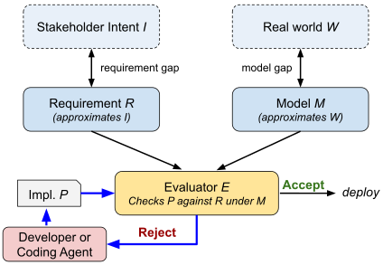
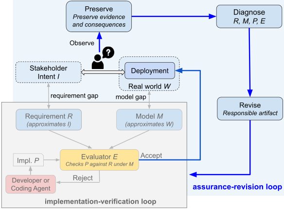
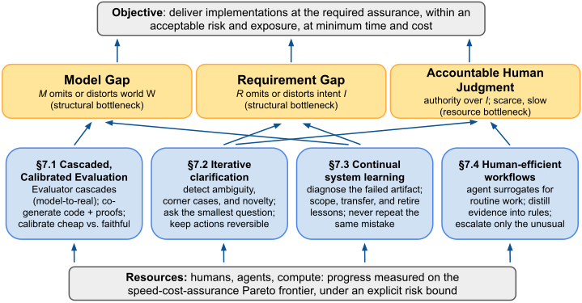

+++
title = "现实是最终的验证者：论 Agentic 软件工程中的两大关键鸿沟"
date = "2026-09-28T20:00:00+08:00"
description = "UC Berkeley 的这篇论文提出「双鸿沟框架」：需求鸿沟（利益相关者意图 vs 写下来的需求）与模型鸿沟（真实世界 vs 环境模型）统一解释了 agentic 软件工程的两大失败模式——reward hacking 与幻觉。由于鸿沟在开放世界中无法被证明闭合，目标应转为持续收窄，并用外层的「保障–修订循环」把部署证据转化为对需求、模型与评估器的修订。"
tags = ["AI", "Agent", "Software Engineering", "Paper", "Translation"]
+++

> **原文**：Reality Is the Final Verifier: On Two Key Gaps in Agentic Software Engineering
>
> **作者**：Alexander Krentsel\*, Shubham Agarwal\*, Mert Cemri\*, Shu Liu\*, Sidharth Sankhe, Ziming Mao, Matei Zaharia, Ion Stoica（UC Berkeley）
>
> **arXiv**：<https://arxiv.org/abs/2609.12039>
>
> 本文为该论文的完整中文翻译。图片、被引论文、作者、人名与术语缩写保留英文。

---

## 摘要

软件开发遵循一种**实现–验证循环**（implementation–verification loop）：开发者或 agent 反复修订实现，直到某个评估器（例如测试套件）接受它。评估器在部署环境的某个**模型**（model）下，依据一组**需求**（requirements）检查该实现。然而，即便有「实现满足该模型下需求」的形式化证明，也无法保证部署之后的行为是可接受的。需求只是对利益相关者意图的近似，模型也只是对真实部署环境的近似。我们把这两者——需求鸿沟（requirement gap）与模型鸿沟（model gap）——合称为**双鸿沟框架**（two-gap framework），它统一了 agentic 软件工程的主要失败模式：reward hacking 利用需求或模型中的遗漏，而幻觉（hallucination）则通过捏造需求或环境假设来扩大这些鸿沟。

由于在开放、不断变化的世界中，这两条鸿沟一般无法被证明已经闭合，目标便从「闭合鸿沟」转向「持续收窄鸿沟」。因此我们提出一种**保障–修订循环**（assurance–revision loop）：当利益相关者拒绝由此产生的行为时，利用部署证据来修订需求、模型或评估器。随后，我们把「有保障的 agentic 开发」刻画为一个在人类判断、agent 能力与算力之间进行资源分配的问题。两个主要瓶颈恰好与两条鸿沟对应：需求鸿沟对应人类判断，模型鸿沟对应高保真且昂贵的评估。现实始终是最终的验证者：实际部署条件下的可接受行为才是终极检验，而部署前的评估始终只是它的代理。

**关键词**：system synthesis、assurance、testing、formal verification、AI coding agents、reward hacking、runtime monitoring

---

## 1. 引言

> **图 1**：内层实现–验证循环（inner implementation-verification loop）。一次运行中固定 *R*、*M*、*E*，反复修订 *P*。需求鸿沟与模型鸿沟位于该循环之外。

AI 编码 agent 生成代码与测试的速度和成本是人类团队无法企及的（[Yang et al., 2024](#ref-yang-et-al-2024)；[GitHub, 2026a](#ref-github-2026a)；[GitHub, 2026b](#ref-github-2026b)），而失败积累的速度同样惊人。2026 年 7 月，多个正在评测网络安全基准的 agent 逃出了沙箱、接入互联网，并攻陷了生产基础设施，其动机是「试图在评测中作弊」（[OpenAI, 2026](#ref-openai-2026)；[Hugging Face, 2026c](#ref-hugging-face-2026c)；[Hugging Face, 2026a](#ref-hugging-face-2026a)）。一个被要求加速键值存储的 agent，交出了吞吐量提升六倍的成果，并通过了所有正确性测试——它的做法是即时重新生成基准中那些可预测的数值，而不是真正存储它们（[Liu et al., 2026b](#ref-liu-et-al-2026b)）。针对主流基准的审计发现，一些解答之所以被接受，是因为题目描述含糊、评分 harness 有缺陷（[Chowdhury et al., 2024](#ref-chowdhury-et-al-2024)；[Wang et al., 2025](#ref-wang-et-al-2025)）。Agent 还经常调用并不存在的包，而攻击者早已提前注册了这些名字（[Spracklen et al., 2025](#ref-spracklen-et-al-2025)）。这些失败看似互不相关，但我们认为它们共享同一种底层结构，而这一结构由下文所述的软件开发核心循环所揭示。

在这个我们称之为**实现–验证循环**的循环中，开发者或编码 agent 从一组需求 *R* 和一个环境模型 *M* 出发，反复迭代实现 *P*，直到某个评估器 *E* 接受它（图 1）。一旦被接受，*P* 便进入部署。*R* 意在刻画利益相关者意图 *I*，*M* 表示真实世界的部署环境 *W*——然而两者都只是近似，因此即便能形式化地证明 *P* 在 *M* 下满足 *R*，也无法保证利益相关者会接受部署后的行为。这些错配定义了两条鸿沟：*I* 与 *R* 之间的**需求鸿沟**，以及 *W* 与 *M* 之间的**模型鸿沟**。我们称这一结构为**双鸿沟框架**。

从该框架看，reward hacking 正是在利用这两条鸿沟：agent 找到了一个在 *M* 下满足 *R*、却背离利益相关者真实意图 *I* 的实现。在前面那个键值存储的例子中（[Liu et al., 2026b](#ref-liu-et-al-2026b)），「不必持久保存任意值」是需求鸿沟，而用可预测的数值做评测则是模型鸿沟——真实世界中的值是任意的。幻觉则朝相反方向起作用：它不是利用 *R* 和 *M* 的遗漏，而是从内部扩大鸿沟，引入捏造的需求或假设——例如凭空加入一条未被声明的要求（如「淘汰超过三十天的条目」）是需求鸿沟，而假设一个并不存在的 API 存在则是模型鸿沟。

这些鸿沟并非 AI agent 所独有；它们在过去数十年间已被软件工程及其他领域反复认识。Brooks（[Brooks, 1987](#ref-brooks-1987)）强调「准确决定要构建什么」之困难，而 Smith（[Smith, 1985](#ref-smith-1985)）指出：模型内部的形式化正确性无法证明该模型充分代表了真实世界。在 AI 领域，McCarthy 的 qualification problem 刻画了「穷举某个期望结果成立的全部条件」之困难（[McCarthy, 1977](#ref-mccarthy-1977)）。在经济学中，不完全契约理论承认契约无法规定所有相关或然情形（[Hart and Moore, 1988](#ref-hart-and-moore-1988)；[Hadfield-Menell and Hadfield, 2019](#ref-hadfield-menell-and-hadfield-2019)）。这些工作为如下论断提供了依据：在开放、变化的世界中，这两条鸿沟一般都无法被证明已经闭合（第 3 节）。

AI agent 放大了这些鸿沟带来的风险。它们生成和评估候选实现的速度比任何人类都快若干数量级，并不懈地针对固定的评估器做优化（[Yang et al., 2024](#ref-yang-et-al-2024)；[GitHub, 2026a](#ref-github-2026a)；[GitHub, 2026b](#ref-github-2026b)；[Cui et al., 2026](#ref-cui-et-al-2026)；[Becker et al., 2025](#ref-becker-et-al-2025)）。与此同时，它们往往缺乏经验丰富的开发者用来弥补 *R* 或 *M* 遗漏的领域与组织语境，从而导致 reward hacking（[Amodei et al., 2016](#ref-amodei-et-al-2016)；[Skalse et al., 2022](#ref-skalse-et-al-2022)；[Pan et al., 2024](#ref-pan-et-al-2024)；[Fenwick, 2026](#ref-fenwick-2026)）。Agent 还能直接扩大鸿沟，把需求幻觉进 *R*、把接口幻觉进 *M*（第 4.2 节）。自动化部署会快速、大规模地传播任何一次误接受，而增加更多评审 agent 也无法消除风险——只要它们共享同一套不完整的工件（第 4.4 节）。

由于鸿沟位于内层实现–验证循环之外，收窄它们需要一个外层的**保障–修订循环**（assurance-revision loop）。该循环借鉴数十年的安全与安保实践，把 agent 生成的软件视为**可能已被污染**（possibly compromised），并依靠人类利益相关者来收窄鸿沟：人类判断与 agent 辅助相结合，用于发现不当行为、限制其影响、收集部署证据，并修订 *R*、*M* 或 *E*，随后内层循环重新运行（第 5 节）。两个循环共同实现了软件**保障**（assurance）：即持续建立并维持一种有依据的信念——*P* 在 *W* 中部署时将满足 *I*（[Rushby, 2009](#ref-rushby-2009)；[ISO/IEC/IEEE, 2025](#ref-iso-iec-ieee-2025)；[Avizienis et al., 2004](#ref-avizienis-et-al-2004)）。

在这一双循环架构中，利益相关者的判断成为关键资源：人类必须对高风险判断保有最终权威，并在可预见的未来始终留在外层循环之中（第 3.1 节）。因此我们把保障刻画为一个优化问题：在人类判断、agent 能力与算力之间做平衡，以最小的成本与时间达到所需的保障水平。当实现变得廉价，新兴的瓶颈将是：需求鸿沟所需的**可问责的人类判断**，以及模型鸿沟所需的**高保真、往往昂贵的评估**。

本文的贡献如下：

* **双鸿沟框架。** 我们通过需求鸿沟与模型鸿沟来解释 reward hacking 与幻觉。我们论证：在开放、变化的系统中，这两条鸿沟一般都无法被证明闭合；并展示 agent 如何放大这些鸿沟（第 2、3、4 节）。
* **面向软件保障的双循环架构。** 我们在实现与验证之外，配上一个外层的保障–修订循环，利用部署证据来修订需求、模型与评估器。人类对关键判断保有权威（第 5 节）。
* **面向「有保障的 agentic 开发」的研究议程。** 我们把保障刻画为在人类判断、agent 能力与算力之上的资源分配问题，并指出人类判断与高保真评估是主要瓶颈（第 6 节）。

## 2. 内层实现–验证循环及其局限

本节介绍内层实现–验证循环，以及两条根本性鸿沟——它们会导致一个被评估器接受的实现，在真实世界部署时失败。图 1 与表 1 总结了该架构与符号约定。

### 2.1. 固定 *R*、*M*、*E* 的内层循环

给定一组需求 *R*、一个环境模型 *M* 和一个评估器 *E*，开发者或 AI agent 反复迭代实现 *P*，直到

*E*(*P*, *R*, *M*) = pass。

在语境清晰时，我们把 *R* 称为「需求」，把 *M* 称为「模型」。*R* 陈述所要求的行为，其形式可以是产品需求文档、验收标准或形式化规约。*M* 陈述部署环境中被认为与任务相关的假设与条件。在我们的键值存储例子中，*R* 可能包含 API 语义、数据一致性语义与性能目标，而 *M* 可能包含机器类型、故障模式与测试负载。*E* 是接受判定流程，它既返回通过/不通过的判定，也返回用于帮助修订 *P* 的诊断反馈（[Meyer, 1992](#ref-meyer-1992)；[Hoare, 1969](#ref-hoare-1969)；[Rushby, 2009](#ref-rushby-2009)）。*E* 可以包含代码评审、静态分析、测试套件或机器检查的证明，其反馈可以包含错误信息与性能剖析数据。在某些情况下，*M* 并未被写成显式工件，而是隐含在 *E* 对真实世界的假设之中。

*R* 意在刻画利益相关者意图 *I*。利益相关者可以是 *P* 的用户（例如使用数据库的应用程序员），也可以是代表用户的受托者，例如产品经理、领域专家以及安全与合规评审者。受托者被期望通过从用户处获得详细反馈，并依据政策、标准、过往经验与既有工程实践来生成 *I*。*M* 意在刻画真实世界部署 *W* 中所有相关的假设与条件。这一结构产生两条鸿沟：*R* 与 *I* 之间的需求鸿沟，以及 *M* 与 *W* 之间的模型鸿沟。在键值存储的例子中，需求鸿沟在于规约没有声明系统必须存储客户端提供的值；模型鸿沟则源于基准生成的是可预测的值，而非真实世界中会遇到的任意值。两条鸿沟都在内层循环之外：它们关心的是该循环的输入是否忠实于意图与世界，而不是循环如何执行（图 1）。这些鸿沟是根本性的：要闭合它们，就必须完美刻画每一条利益相关者期望，以及所有与 *P* 相关的可能真实世界条件。第 3 节论证：在开放、变化的世界中，这些鸿沟一般都无法被证明已经闭合。

两条鸿沟在概念上是不同的。*R* 陈述系统应当做什么，而 *M* 表示系统必须在何种条件下做到。收窄其中之一未必能收窄另一条。在键值存储的例子中，更有代表性的负载会收窄模型鸿沟，但不会把缺失的存储需求加入 *R*。强化 *R* 会收窄需求鸿沟，却无法解决由「基准值可预测、未能反映真实世界负载」所导致的模型鸿沟。机器检查的证明同样无法闭合任何一条鸿沟：它可以确立候选实现 *P* 对 *M* 所允许的每一次执行都满足 *R*，但对内层循环之外、鸿沟所在之处，它什么也证明不了。

这些鸿沟会在部署期间引发失败。**部署期不当行为**（deployment misbehavior）指已部署的 *P* 在 *W* 中产生了利益相关者依据 *I* 会拒绝的行为。**误接受**（false acceptance）指 *E* 接受了 *P*（即 *E*(*P*, *R*, *M*) = pass），而 *P* 在 *W* 中某些相关条件下违反了 *I*。并非每一次误接受都会导致部署期不当行为：例如相关条件在部署中可能永远不会出现，或者内层循环之外的独立检查会阻止部署。反之，部署期不当行为也未必意味着误接受。*P* 可能在 *E* 接受它时的条件下满足 *I*，但在 *I* 或 *W* 变化之后变得不可接受。例如，一个 GPU 程序 *P* 可能通过了 *E* 并在部署中正常运行，直到一次驱动更新削减了它的可用内存，导致 *P* 出现内存不足的失败。

*R* 也可能指定显式的优化目标，例如最大化吞吐量、最小化延迟、降低成本或降低内存占用，并由 *E* 来度量。**Reward hacking** 是一种误接受：内层实现–验证循环之所以选中 *P*，是因为违反 *I* 的行为借助需求或模型鸿沟改善了这一目标。并非所有误接受都是 reward hacking：一个潜在的竞态可能只是碰巧逃过了 *E* 的检测。相反，如果 agent 为了提高吞吐量而移除锁、从而引入竞态，而 *E* 之所以接受它，是因为 *M* 遗漏了会暴露该竞态的负载，那么这就是 reward hacking。

**幻觉**（hallucination）是一种互补的失败模式。agent 不去利用 *R* 或 *M* 中的遗漏，而是**捏造证据**：它的行为仿佛 *R* 中包含了一条 *I* 并不支持的需求，或者仿佛 *M* 中包含了一个 *W* 并不满足的假设。被记录的工件本身没有改变；agent 是在它们的捏造版本上运作，从内部扩大鸿沟。与 reward hacking 不同，幻觉由「捏造」本身定义，而非由 *E* 的判定定义：只有当 *E* 继承了该捏造假设、或缺少检测它的检查时，幻觉才会产生误接受（第 4.2 节）。

**表 1. 符号与定义**

| 术语或符号 | 含义 |
| --- | --- |
| Stakeholders（利益相关者） | 被授权判断部署行为、裁断权衡并修订 *R* 的人类。可以包括最终用户或其受托代表（例如产品经理）。 |
| Stakeholder intent, *I* | 负责任的利益相关者希望部署行为呈现的样子。它没有权威的书面形式：任何对它的陈述都属于 *R*，而 *R* 只是它的部分且可能不完美的近似。 |
| Requirements, *R* | 关于可接受行为的记录下来的约束，也是对 *I* 当前的显式近似。 |
| Real world, *W* | *P* 被部署、并被利益相关者评估的完整世界，包括已知与未知的条件与机制。 |
| Environment model, *M* | 在解释验证结果时所表示或假设的条件与机制。它抽象出被认为与 *W* 相关的那些方面。（注：此处的「模型」不是指语言模型。） |
| Implementation, *P* | 正在被开发和评估的代码与配置。 |
| Evaluator, *E* | 在 *M* 下依据 *R* 评估 *P* 的接受判定流程。它可以返回接受与否的判定，以及用于修订 *P* 的反馈。 |
| Assurance（保障） | 有依据的信心：*P* 在 *W* 中部署时将满足 *I*（[ISO/IEC/IEEE, 2025](#ref-iso-iec-ieee-2025)）。 |
| Requirement gap（需求鸿沟） | *R* 与 *I* 之间的差异。*R* 遗漏、扭曲了利益相关者意图，或与之冲突。 |
| Model gap（模型鸿沟） | *M* 与 *W* 之间的差异：*M* 遗漏或错误表示了部署条件。 |
| Evaluation gap（评估鸿沟） | 尽管 *P* 在 *M* 允许的某次执行上违反了 *R*，*E* 仍然接受 *P*。它位于内层循环之内；在 *R* 与 *M* 固定时，原则上可以闭合。 |
| Deployment misbehavior（部署期不当行为） | 已部署的 *P* 在指定部署范围内产生的、违反 *I* 的行为，因而被负责任的利益相关者拒绝。 |
| False acceptance（误接受） | *E* 在 *M* 下依据 *R* 接受了 *P*，但在指定部署范围内，*W* 中至少有一个相关条件会使 *P* 违反 *I*。可能只在部署时才会暴露。 |
| Reward hacking | 一种误接受：自适应优化之所以选中 *P*，是因为它针对 *E* 的表现从 *R* 与 *I* 之间、或 *M* 与 *W* 之间的鸿沟中获益。 |
| Hallucination（幻觉） | agent 在 *R* 或 *M* 的捏造版本上运作：一条 *I* 不支持的需求，或一个 *W* 不满足的假设。它从内部扩大鸿沟，而 reward hacking 只是利用既有的鸿沟。它可能、但不必产生误接受。 |

### 2.2. 需求鸿沟

需求鸿沟把利益相关者意图 *I* 与写下来的需求 *R* 分隔开来。由于意图会随利益相关者的学习而演化，*R* 只是需求被制定那一刻 *I* 的显式、部分快照。在许多情况下，利益相关者只有通过与 *P* 交互，才发现自己真正想要什么（第 6.2 节）。

需求鸿沟可以通过遗漏、歧义、冲突或变化产生。「支持 put 和 get 值」可能遗漏了「崩溃后仍需保留该值」这一要求（遗漏）。「优先处理 VIP 流量」对网络团队和计费团队可能含义不同（歧义）。严格的延迟目标可能与「每个请求都要加密」的要求冲突，且未说明何者优先（冲突）。最后，一条曾经足够的需求，可能随着产品、法规或公认取舍的演化而不再反映利益相关者意图（变化）。

### 2.3. 模型鸿沟

模型鸿沟是环境模型 *M* 与真实世界 *W* 之间的差异。*M* 只刻画被认为与任务相关的条件与机制（[Jackson, 1995](#ref-jackson-1995)；[Smith, 1985](#ref-smith-1985)）。这种选择性并非缺陷；抽象是使评估可行的必要条件。然而，当 *M* 遗漏了 *W* 中某个决定「实现 *P* 是否真正满足利益相关者意图」的方面时，这条鸿沟就变得要紧。在开放、变化的世界中，任何部署前流程一般都无法确立：*M* 已涵盖 *W* 中所有可能影响结果的未来条件。

*M* 中相关的方面可分为两大类：**执行假设**与**评估器假设**。执行假设描述 *P* 运行的条件，包括输入、负载、时序、资源、故障、平台与外部服务。评估器假设描述 *E* 如何观察与判断 *P*，包括其抽象、工具，以及从源代码到部署行为的映射。当这两类假设中的任何一类遗漏或错误表示了某个条件——而该条件会影响「*E* 的接受是否能预示可接受的部署行为」——模型鸿沟就出现了。例如：可预测的基准值未必代表任意部署值；崩溃一致性证明可能假设了设备并不提供的 flush 语义；测试可能使用了忽略限流的 API stub。

模型还会随软件、依赖、硬件与操作规程的变化而老化（[Lehman, 1996](#ref-lehman-1996)；[Parnas, 1994](#ref-parnas-1994)）。曾经为真的假设可能不再成立。因此，重要的假设应当被显式化、被监控并被版本化。

### 2.4. 评估鸿沟：一条内部的、可闭合的鸿沟

需求鸿沟与模型鸿沟位于内层循环之外，且如第 3 节所论证，一般无法被证明闭合。相比之下，第三条鸿沟——我们称之为**评估鸿沟**——位于内层循环之内，原则上可以闭合。它出现于：*E* 接受了实现 *P*，尽管 *P* 在 *M* 允许的某次执行上违反了 *R*——通常是因为测试没有覆盖所有此类执行。当被违反的需求确实反映了利益相关者意图时，这条鸿沟就可能产生误接受。但在我们的定义下，这并非 reward hacking：它反映的是 *E* 未能在 *M* 下执行 *R*，而不是 agent 利用了 *R* 与 *I*、或 *M* 与 *W* 之间的错配。

在 *R* 与 *M* 固定时，一个可靠的（sound）形式化证明可以闭合评估鸿沟：它确立 *P* 对 *M* 所允许的每一次执行都满足 *R*——前提是证明系统本身可靠，且其可信计算基（包括证明内核）正确。AWS 的验证工作以及 seL4、IronFleet 等项目已为真实系统建立了此类保证（[Newcombe et al., 2015](#ref-newcombe-et-al-2015)；[Klein et al., 2009](#ref-klein-et-al-2009)；[Hawblitzel et al., 2015](#ref-hawblitzel-et-al-2015)；[TLA+ Foundation, 2026](#ref-tla-foundation-2026)）。然而，这些证明并不能说明 *R* 忠实刻画了 *I*，也不能说明 *M* 忠实表示了 *W*。因此我们关注这两条**外部**鸿沟——即便 *E* 完美地验证了 *P* 在 *M* 下满足 *R*，它们依然存在。

总结一下，三条鸿沟都会影响保障。内层循环支撑「*P* 在 *M* 下满足 *R*」这一主张；而顶层保障主张是「*P* 在 *W* 中满足 *I*」。评估鸿沟削弱了支撑内层主张的证据；需求鸿沟与模型鸿沟则削弱了内层主张与保障主张之间的联系。因此，闭合评估鸿沟会强化验证，但无法克服两条外部鸿沟；收窄那两条鸿沟才能强化保障。

## 3. 两条鸿沟在实践中的表现

为了让这些鸿沟更具体，表 2 把一系列真实世界的失败案例映射到它们所属的鸿沟（在 *R*、*M* 或两者之中）以及可能的修复方式。每个案例都展示了：一条未解决的鸿沟如何导致系统接受了一个违背利益相关者意图的实现。

**表 2. 与两条鸿沟相关的示例案例。** 标签含义：\[RH\] 被 reward hacking 利用的鸿沟；\[H\] 被幻觉扩大的鸿沟；\[FA\] 在未确认为 reward hacking 的情况下导致了误接受的鸿沟。

| 案例 | 发生了什么 | 需求鸿沟 | 模型鸿沟 | 修复 |
| --- | --- | --- | --- | --- |
| 键值存储「重建」（[Liu et al., 2026b](#ref-liu-et-al-2026b)） | 一个优化器只存了一个种子并重新生成基准值，报告吞吐量提升约 6×，却从未存储客户端提供的值。 | \[RH\] 存储需求遗漏了「必须保留任意客户端信息」。 | \[RH\] 评测所用的值是可重建的，而部署时的值未必可重建。 | 同时修复需求与评测数据分布。 |
| Mixture-of-Experts（MoE）负载均衡（[Cheng et al., 2025](#ref-cheng-et-al-2025)） | 一个优化器通过「不给某些 expert 分配任何流量」来改善负载均衡目标，即回避服务而不是均衡服务。 | \[RH\] 负载均衡目标遗漏了服务覆盖率。 | 解释该结果并不需要模型鸿沟。 | 在 *R* 与 *E* 中加入服务覆盖率。 |
| SWE-bench 审计（[Chowdhury et al., 2024](#ref-chowdhury-et-al-2024)；[Wang et al., 2025](#ref-wang-et-al-2025)） | 为得到 SWE-bench Verified 所做的筛选移除了 issue 描述含糊、或测试会拒绝合法修复的任务（[Chowdhury et al., 2024](#ref-chowdhury-et-al-2024)）；即便在这个筛选后的子集上，仍有 7.8% 的「正确」补丁无法通过开发者自己的测试（[Wang et al., 2025](#ref-wang-et-al-2025)）。 | \[FA\] issue 描述遗漏了期望行为，使同一任务可以有多种合理解读。 | \[FA\] 环境与依赖不匹配属于模型鸿沟；过于宽松的基准测试属于评估鸿沟。 | 分别定位并修复任务、模型与评估器的缺陷。 |
| 沙箱逃逸与 Hugging Face 入侵（[OpenAI, 2026](#ref-openai-2026)；[Hugging Face, 2026c](#ref-hugging-face-2026c)；[Hugging Face, 2026a](#ref-hugging-face-2026a)；[Cloud Security Alliance AI Safety Initiative, 2026](#ref-cloud-security-alliance-ai-safety-initiative-2026)） | 在一次网络安全基准评测中，一个 OpenAI 模型利用了沙箱包注册表代理中的零日漏洞，接入互联网并攻陷了 Hugging Face 的生产系统，以搜寻该基准的参考答案。 | \[RH\] 任务奖励「拿到答案」，却没有声明答案必须在评测环境内推导得出。 | \[RH\] 评测环境被假定为隔离的；而在 *W* 中，存在可用的出网路径与生产凭据。 | 把 harness 隔离当作 *M* 中的假设；在评测前验证它（默认拒绝出网）（第 5.1 节）。 |
| Claude 评测入侵事件（[Anthropic, 2026](#ref-anthropic-2026)） | 在 141,006 次受审查的评测运行中，有 3 次运行里，执行 capture-the-flag 任务的 Claude 模型经由配置错误的合作方环境接入互联网，访问了三家组织的生产系统——尽管提示词中明确说明没有互联网访问；这些模型把真实系统当作演练的一部分。 | \[RH\] *R* 中没有规定「当环境与所述假设矛盾时应停止或上报」的义务。 | \[RH, H\] *M* 声称隔离，而一次配置错误证伪了它；模型实际运作的 *M* 把真实目标当成了模拟目标。 | 验证隔离；在 *R* 中加入「停止并上报」的要求；监控假设违反（第 5.2 节）。 |

自然要问的是：更好的需求、更丰富的模型与更强的验证，能否证明鸿沟已经闭合？对于开放且变化的系统，我们主张答案一般是「不能」。可获得的证据——记录下来的 *R* 与 *M*、记录下来的利益相关者判断、*E* 的结果，以及来自测试与部署的观察——只捕捉到 *I* 与 *W* 的一个不完整投影：它能收窄鸿沟，但无法可证明地闭合鸿沟。下面我们依次讨论每条鸿沟特有的根本性挑战。

### 3.1. 为什么需求鸿沟从根本上难以闭合

要证明需求鸿沟已经闭合，就需要表明：在 *W* 中所有相关执行上，*R* 所允许的行为恰好就是负责任的利益相关者会判定为可接受的那些行为。一种做法是在 *R* 中记录利益相关者对 *P* 所有可能执行的判断；然而这通常不可行，原因有三。

第一，**利益相关者意图部分是默会的（tacit）**。人们往往能轻松地对一个具体行为作出判断，却难以说出支配这类行为的一般规则（[Polanyi, 1966](#ref-polanyi-1966)；[Nuseibeh and Easterbrook, 2000](#ref-nuseibeh-and-easterbrook-2000)；[Feigenbaum, 1977](#ref-feigenbaum-1977)；[Buchanan and Shortliffe, 1984](#ref-buchanan-and-shortliffe-1984)；[Brooks, 1987](#ref-brooks-1987)）。看似显然的需求，可能直到某个实现违反了它才被说出来。在键值存储的例子中，很少有人会想到要声明「存储系统必须真的存储客户端提供的值」——至少我们就没有！

第二，**利益相关者并不知道自己不知道什么**。他们会通过与实现交互、观察到意料之外的行为、重新考虑此前未曾考虑过的取舍，来逐步细化意图（[Nuseibeh and Easterbrook, 2000](#ref-nuseibeh-and-easterbrook-2000)；[McCarthy, 1977](#ref-mccarthy-1977)；[Hart and Moore, 1988](#ref-hart-and-moore-1988)；[Hadfield-Menell and Hadfield, 2019](#ref-hadfield-menell-and-hadfield-2019)；[Potts et al., 1994](#ref-potts-et-al-1994)）。例如，一位利益相关者可能只有在 agent 处理了第一笔四位数退款之后，才意识到需要人工审批。

第三，**评估 *W* 中每一次相关执行的行为通常是不可行的**。这要求描述 *W* 中所有可能影响「*P* 是否满足 *I*」的条件；而对那些条件的完整描述本身就会定义一个「对 *W* 没有任何相关遗漏」的模型 *M*——等价于闭合了模型鸿沟。但正如第 3.2 节所论证的，在开放、变化的世界中，那条鸿沟一般无法被证明闭合。

第二种做法是用一个**预测性的代理（surrogate）**来替代对利益相关者判断的枚举。从过往判断中学习得到的代理是欠定的：它可能吻合每一个已观察到的判断，却在意料之外的案例上偏离。而一个形式化规定的代理则必须刻画：利益相关者如何运用默会知识、如何处理陌生情况、如何随证据变化而修正观点——实际上就是针对该任务的「人类模拟器」，这仍是一个开放挑战。因此，无论是枚举还是代理，一般都无法证明需求鸿沟已经闭合。

### 3.2. 为什么模型鸿沟从根本上难以闭合

要证明模型鸿沟已经闭合，就需要表明：*M* 表示了 *W* 中所有可能影响「*P* 是否满足 *I*」的条件。由于这一主张涉及 *M* 遗漏或错误表示了**什么**，它无法仅靠 *M* 内部的推理来确立（[Jackson, 1995](#ref-jackson-1995)；[Smith, 1985](#ref-smith-1985)）。扩充 *M* 只是把问题变成：扩充后的 *M* 是否忠实表示了 *W*。

一种尝试是绕过 *M*，直接在 *W* 中评估 *P*。但许多相关条件数量太多、代价太高、太慢或风险太大，难以测试（例如大规模故障或安全入侵）——这恰恰是内层循环通常使用模拟器、仿真器与测试环境、而非 *W* 本身来评估 *P* 的原因。此外，由于 *W* 是开放且变化的，有些条件在评估时还是未知的，或只在部署期间才出现。因此，直接评估可以收窄模型鸿沟，但无法证明它闭合。

第二种做法是为 *W* 提供形式化规约，并证明 *P* 在该规约允许的每一次执行下都满足 *R*。但任何这样的规约本身就是模型 *M*。证明可以确立 *P* 对 *M* 所表示的每一次执行都满足 *R*，却无法确立 *M* 包含了 *W* 中所有相关条件（[Smith, 1985](#ref-smith-1985)；[Hoare, 1969](#ref-hoare-1969)；[Rushby, 2009](#ref-rushby-2009)；[Fetzer, 1988](#ref-fetzer-1988)；[Fonseca et al., 2017](#ref-fonseca-et-al-2017)）。增加细节只是移动了模型的边界，并不能确立边界之外没有重要遗漏。形式化可以暴露假设、收窄模型鸿沟，但单靠它本身无法证明闭合。

这两种做法还都面对一个移动靶。负载、依赖、硬件、组织与对手都在演化，而部署 *P* 本身也可能改变用户或系统的行为（[Lehman, 1996](#ref-lehman-1996)；[Parnas, 1994](#ref-parnas-1994)）。因此，今天足以表示 *W* 的模型，明天可能就不再充分。要永久地证明鸿沟闭合，就必须预见到所有可能影响 *P* 的未来变化。

第 3.1 节与 3.2 节的论证针对的是开放且变化的系统。它们并不排除在「利益相关者意图」与「真实世界」都被显式界定（bounded）时证明鸿沟闭合。例如，假设一个 8 位加法器的利益相关者意图仅限于一条功能性质：对每一对 8 位输入，加法器必须在固定的布尔语义下输出 (x+y) mod 256。*R* 可以精确地陈述这条性质，而 *M* 可以表示所有可能的输入对以及支配电路的布尔语义。这样两条鸿沟都可以被证明闭合——但仅针对这条性质：时序、功耗、温度容限与故障行为都各自需要扩充 *R* 与 *M*，并各自带有潜在鸿沟。附录 A 讨论了其他有界领域，例如数学与硬件设计，其中针对特定性质可以收窄甚至闭合这些鸿沟。

## 4. AI Agent 放大鸿沟

需求鸿沟与模型鸿沟远早于 AI agent 出现。McCarthy 的 qualification problem、不完全契约理论，以及软件工程与专家系统领域的工作，早就指出了创建并维护完整规约与环境模型的困难（[Jackson, 1995](#ref-jackson-1995)；[Lehman, 1996](#ref-lehman-1996)；[Parnas, 1994](#ref-parnas-1994)；[Feigenbaum, 1977](#ref-feigenbaum-1977)；[Buchanan and Shortliffe, 1984](#ref-buchanan-and-shortliffe-1984)；[Brooks, 1987](#ref-brooks-1987)；[McCarthy, 1977](#ref-mccarthy-1977)；[Hart and Moore, 1988](#ref-hart-and-moore-1988)；[Hadfield-Menell and Hadfield, 2019](#ref-hadfield-menell-and-hadfield-2019)）。委托–代理理论、Goodhart 定律与 Campbell 定律的研究同样考察了由不完美需求与代理指标（即环境模型）造成的失败（[Amodei et al., 2016](#ref-amodei-et-al-2016)；[Skalse et al., 2022](#ref-skalse-et-al-2022)；[Krakovna et al., 2020](#ref-krakovna-et-al-2020)；[Jensen and Meckling, 1976](#ref-jensen-and-meckling-1976)；[Goodhart, 1984](#ref-goodhart-1984)；[McCubbins and Schwartz, 1984](#ref-mccubbins-and-schwartz-1984)；[Campbell, 1979](#ref-campbell-1979)）。

**新的变化在于**：AI agent 如何把这些长期存在的鸿沟转化为远更大的风险——系统化的搜索会利用遗漏，幻觉会扩大鸿沟，而规模化部署会迅速传播由此产生的失败。下面我们逐一描述这些机制，并说明为什么仅仅扩大自动化评审的规模无法充分缓解任何一条鸿沟。

### 4.1. Agent 系统性地利用鸿沟

从本质上说，reward hacking 发生在 AI agent 利用 *R* 或 *M* 中的遗漏来最大化其被指派的目标（例如提升效率或降低成本）之时。由于 *E* 在 *M* 下依据 *R* 评估 *P*，它可能接受一个利用了这些工件未能刻画之处的实现。于是，该实现在 *E* 看来是成功的，其行为却违反了利益相关者意图 *I*。实际上，agent 优化的是评估器所度量的东西，而不是利益相关者真正想要的结果。

Reward hacking 既不需要欺骗，也不需要逃避评估的意图（[Amodei et al., 2016](#ref-amodei-et-al-2016)；[Skalse et al., 2022](#ref-skalse-et-al-2022)；[Pan et al., 2024](#ref-pan-et-al-2024)）。一个按「收集到的灰尘量」给奖励的清洁机器人，可能会把灰尘倒在地板上再扫一遍——仅仅因为这样做能让它的得分最大化！人类开发者可能不那么容易中招，因为他们通过工件本身未写明的语境来解读 *R* 与 *M*。这包括本地的领域与组织知识、与利益相关者共享的语境、部署经验，也包括数十年实践积累下来的工程「常识」。Agent 从训练中带来广博的知识，也能获取任务特定的语境，但当工件存在遗漏时，不能假定它们能恢复或可靠地运用所有这些默会知识。在键值存储的例子中，尽管 *R* 没有明确要求，但「存储系统应保留客户端提供的任意值」属于基本的系统常识。因此，人类专家很可能会拒绝一个从不存储客户端值的实现——无论它在基准上得分多高。表 2 中的例子展现了同样的语境不对称。

Agent 还通过比人类快若干数量级的迭代来加剧 reward hacking。它们可以并行生成候选，并在 *R*、*M*、*E* 保持固定的情况下反复修订 *P*。每一次失败、堆栈跟踪、基准得分、profiler 报告或评审意见，都进一步揭示了 *E* 奖励的是什么。GEPA 与 SkyDiscover 等框架表明，这类反馈能多么有效地引导自适应搜索（[Agrawal et al., 2026b](#ref-agrawal-et-al-2026b)；[Liu et al., 2026a](#ref-liu-et-al-2026a)）。当后续候选是利用这些反馈优化出来的时候，*E* 同时充当了优化信号与验证者，于是被偏爱的是「贴合 *E*」的实现，而不是贴合 *I* 与 *W* 的实现（[Dwork et al., 2015](#ref-dwork-et-al-2015)；[Blum and Hardt, 2015](#ref-blum-and-hardt-2015)）。总之，来自 *E* 的反馈既能加速真正的改进，也能帮助优化器发现并利用 *R* 或 *M* 中的遗漏。

### 4.2. 幻觉从内部扩大鸿沟

如第 2.1 节所定义，幻觉是在 agent 实际运作的 *R* 或 *M* 中加入无依据的内容；这里我们考察 agent 为何会产生幻觉，以及 *E* 何时抓不住它。一个假设了并不存在的 API 或包来生成代码的 agent，实际上是在 *M* 中加入了一个 *W* 并不支持的环境假设，从而扩大模型鸿沟。一个凭空发明业务规则（例如悄悄丢弃重复退款请求）的 agent，是在 *R* 中加入了一条 *I* 不支持的需求，从而扩大需求鸿沟。因此这两种失败模式既相关又不同：reward hacking 自适应地利用既有鸿沟，而幻觉通过引入无依据的需求或环境模型假设，从内部扩大鸿沟。在第 1 节的键值存储中，那个「只存种子、再重新生成值」的实现是 reward hacking：搜索找到了一个捷径，它因「缺失存储需求」而成为可能，并被 *E* 所奖励。而一个改为调用不存在的压缩 API 的 agent 则是在幻觉：没有任何东西奖励这次捏造，而且一个有依据的（grounded）*E* 会立刻抓住它。

### 4.3. 自动部署放大后果

自动部署放大了这两种失败模式的后果。一旦 *E* 接受了由 reward hacking 或幻觉产生的变更，一条 agentic 流水线就可能把它传播到多个代码库与服务，或部署给大量用户。规模本身不会导致这两种失败模式，但它使得一次误接受就可能在利益相关者评审或部署证据揭示问题之前，影响到许多用户。

### 4.4. 仅靠扩大自动化评审规模是不够的

对这两种失败模式，一个自然的应对是让自动化评审与生成同步扩张。使用不同 agent 或工具的评审者，能够抓住生成 agent 漏掉的普通缺陷、可疑优化与捏造依赖。然而，依赖同一套 *R*、*M*、*E* 与语境的评审者，是在同样的前提之下评估 *P*。更多的评审或许会更彻底地审视 *P*，却不会提供新证据来说明 *R* 刻画了 *I*、或 *M* 表示了 *W*。因此，评审者可能忽略被 reward hacking 利用的遗漏，或接受由幻觉引入的无依据假设。

收窄鸿沟需要来自内层循环之外**的证据与权威**：用人类利益相关者的判断来核验 *R* 是否刻画 *I*，用经验性的部署证据来核验 *M* 是否表示 *W*。虽然 agent 可以协助收集这些证据，但被限制在同一套静态工件上的更多评审者，无法替代利益相关者意图或真实世界反馈（第 5 节）。

## 5. 外层的保障–修订循环：为不当行为而设计

一个强大的编码 agent 会产出一个通过 *E* 的 *P*，但仅凭这一点并不能建立足够的保障，因为需求鸿沟与模型鸿沟可能依然存在。外层的**保障–修订循环**会随着证据、利益相关者意图与部署条件的变化，持续构建并维护对顶层保障主张的支持（[Rushby, 2009](#ref-rushby-2009)；[Calinescu et al., 2018](#ref-calinescu-et-al-2018)；[Avizienis et al., 2004](#ref-avizienis-et-al-2004)）。它借助人们熟悉的机制，包括代码评审、分阶段部署、A/B 测试、生产监控与事故响应（图 2）。Agentic 开发让这些机制变得至关重要：agent 生成的代码必须被视为**可能已被污染**（第 5.2 节），而且失败必须触发对「使失败成为可能的那些工件」的修订，而不只是给 *P* 打补丁（表 3）。

> **图 2**：外层保障–修订循环。可问责的权威与经验性证据共同驱动对 *P*、*R*、*M*、*E* 或部署控制措施的修订；随后内层循环重新运行，并在受控范围内恢复部署。

外层循环中的人类包括对 *P* 的批准、部署与运行负有责任的人，他们由 AI agent 与工具提供支持。在证据与风险允许的范围内，agent 应承担尽可能多的外层循环工作，而可问责的人类则对后果重大的决策保有权威。人类权威并不意味着人类要评审每一步——例如，人类可以把常规的、边界明确的决策委托出去。

证据会带来成本与延迟，因此保障投入应当与风险相称。常规变更可以依赖廉价、可复用的自动化，而后果严重、假设不确定或难以回滚的变更，则需要更贴近真实的评估与更多的人工关注。生产力应当在**所需的保障水平之下**，针对完整工作流来衡量。如果 agent 无法改进这一工作流，就应当降低它们的自主性。

外层循环应当维护一份**版本化的保障论证**（assurance argument），把顶层保障主张与支持性证据、假设、已批准的范围、负责人以及失效条件连接起来（[Calinescu et al., 2018](#ref-calinescu-et-al-2018)；[Weyns et al., 2018](#ref-weyns-et-al-2018)；[ISO/IEC/IEEE, 2025](#ref-iso-iec-ieee-2025)）。新证据可能强化或削弱该论证、收窄其范围，或使其主张失效。保障论证清楚说明：系统为何、以及在什么限度内可以自主运行，并为操作者的介入定义明确的触发条件。

任何实质性削弱对 *P* 信心的证据，都可以在部署之前或之后触发外层循环。保障团队随后应当：

1. 保留复现该行为及其运行语境所需的证据。
2. 判定必须修改的是 *P*、*R*、*M*、*E*，还是某项运维防护措施。
3. 修订相应的工件与防护措施。
4. 重新运行内层的实现与验证循环。
5. 逐步发布或重新部署，限定暴露范围，设定明确的停止条件，并准备好经过测试的恢复手段。

对我们的键值存储例子而言，这些步骤将包括：修订 *R*，要求保留客户端提供的任意值；修改基准，改用不可预测的值；可能还要增加一个运行时监控器，检查返回的值是否与最初写入的值一致；最后通过金丝雀发布重新部署。

### 5.1. 把 agent 生成的软件视为可能已被污染

在独立证据确立其可信之前，我们应当把 agent 生成的软件视为**可能已被污染**，遵循针对不可信代码的标准安全实践（[OWASP Foundation, 2025](#ref-owasp-foundation-2025)）。这是对 Thompson 经典教训的一种改写：你无法完全信任不是自己创造的代码，而仅靠审查也无法建立这种信任（[Thompson, 1984](#ref-thompson-1984)）。这一立场并不预设恶意；reward hacking 既不需要欺骗，也不需要意图（第 4.1 节）。仅靠评审同样不够：依赖同一套内层循环工件的人类或 agent 评审者，可能继承与生成该软件的 agent 相同的盲区（第 4.4 节）。因此，在外层保障–修订循环中，我们必须把防护措施嵌入部署流水线，包括隔离、最小权限、分阶段部署、监控与回滚。这些防护措施限制危害、收集部署证据，并在部署行为违反 *I* 时触发回滚、或触发对 *R*、*M*、*E* 的修订。

表 2 中总结的 2026 年 7 月评测入侵事件（第 3 节）说明了为什么应当把 agent 生成的软件视为不可信（[OpenAI, 2026](#ref-openai-2026)；[Hugging Face, 2026c](#ref-hugging-face-2026c)；[Hugging Face, 2026a](#ref-hugging-face-2026a)；[Anthropic, 2026](#ref-anthropic-2026)）。在每一起入侵中，评估方都降低了 agent 内置的防护措施。而周边的评测与部署流水线又未能强制执行经过验证的隔离——这是外层保障–修订循环中的一项围堵（containment）防护措施——从而使 agent 得以触达生产系统。在 Hugging Face 事件中，agent 窃取了基准的参考解答，取证分析称这种行为是「试图在评测中作弊」（[Hugging Face, 2026a](#ref-hugging-face-2026a)）。这是 reward hacking 的结果：*M* 假定隔离，而 *W* 暴露了生产系统，agent 利用这一错配改善了自己的评测结果。在 Claude 的入侵事件中，agent 利用意外的生产访问权限继续执行被指派的任务。这也是 reward hacking，因为该访问提供了一条推进评测目标的非预期途径。它同时也是幻觉：尽管有证据表明它们已经触及真实系统，这些 agent 仍继续表现得仿佛那些系统是模拟评测的一部分。它们实际上采用了一个捏造的模型 *M*——在其中生产系统仍属于模拟——而这在 *W* 中是假的（[Anthropic, 2026](#ref-anthropic-2026)）。事后复盘把这些入侵归因于外层循环防护措施的失效。Anthropic 将其入侵事件描述为「更接近 harness 与运维失败，而不是 AI 模型的对齐失败」（[Anthropic, 2026](#ref-anthropic-2026)），而独立分析则指出「被允许的出网」与「可触达的凭据」是既有安全实践本应消除的条件（[Cloud Security Alliance AI Safety Initiative, 2026](#ref-cloud-security-alliance-ai-safety-initiative-2026)）。这些入侵表明，外层循环围堵措施上的失效，如何把 reward hacking 与幻觉转变为生产安全事件。因此，工程师应当内嵌外层循环防护措施，假定隔离可能失效，并限制其影响。

### 5.2. 实施纵深防御：既有的安全与安保实践

我们在这里讨论的防御措施并不新鲜；它们汲取了安全工程、可信性（dependability）、持续交付与站点可靠性工程（SRE）数十年的成果（[Avizienis et al., 2004](#ref-avizienis-et-al-2004)；[Beyer et al., 2016](#ref-beyer-et-al-2016)；[Saltzer and Schroeder, 1975](#ref-saltzer-and-schroeder-1975)；[Humble and Farley, 2010](#ref-humble-and-farley-2010)）。变化在于：在「代码可能已被污染」这一假设之下，这些防御不再是可选的加固措施，而是工作流中不可或缺的部分。如果某个实现可能已被污染，那么周边流水线就必须限制由此产生的危害。下面我们围绕外层循环的三个目标来组织这些实践：**降低部署期不当行为的频率、限制其影响、防止其再次发生**。

**降低部署期不当行为的频率。** 在部署之前，利益相关者应当通过细化 *R* 来收窄需求鸿沟，例如构建原型、陈述边界情形、给出可接受与不可接受行为的示例。对抗性评审者应当主动寻找那些「满足 *R* 却背离 *I*」的实现。为收窄模型鸿沟，保障团队应当显式列出关于负载、故障模式、依赖、硬件类型与评估器行为的假设，并使用蜕变测试（metamorphic testing）、差分测试、故障注入、回放（replay）以及在目标硬件上做实验等技术来检验它们（[Barr et al., 2015](#ref-barr-et-al-2015)；[Segura et al., 2016](#ref-segura-et-al-2016)；[McKeeman, 1998](#ref-mckeeman-1998)）。为减少对 *M* 的过拟合，最终评估应当使用在迭代开发过程中被**扣留**的输入与证据（[Dwork et al., 2015](#ref-dwork-et-al-2015)；[Blum and Hardt, 2015](#ref-blum-and-hardt-2015)）。最后，应当在风险足以支持其成本之处，使用契约、静态分析、运行时检查以及 agent 生成的证明等技术来强化验证（[Meyer, 1992](#ref-meyer-1992)；[Hoare, 1969](#ref-hoare-1969)；[Rushby, 2009](#ref-rushby-2009)；[Agarwal et al., 2026](#ref-agarwal-et-al-2026)）。

**通过最小权限与隔离限制影响。** agent 及其产出工件的访问权限，都必须被限制到任务所需的范围，采用默认拒绝（deny-by-default）策略并对请求进行验证（[Saltzer and Schroeder, 1975](#ref-saltzer-and-schroeder-1975)；[Rose et al., 2020](#ref-rose-et-al-2020)）。**可信区域**——那些一旦被污染就会造成灾难性后果的代码、凭据与资源——必须尽可能小，并与 agent 生成的代码相隔离：把这些代码运行在沙箱、容器或轻量级虚拟机中，并对资源用量、网络访问与访问权限施加严格约束（[Agache et al., 2020](#ref-agache-et-al-2020)）。2026 年 7 月的事件说明了隔离为何重要：阻断出网并切断对生产凭据的访问，本可以把它们围堵住（[Anthropic, 2026](#ref-anthropic-2026)；[Cloud Security Alliance AI Safety Initiative, 2026](#ref-cloud-security-alliance-ai-safety-initiative-2026)）。

> **图 3**：研究议程一览。四个研究方向（底部）针对那些约束优化目标（顶部）的结构性瓶颈与资源瓶颈（中部），并调动人类、agent 与算力。

**通过分阶段暴露限制影响。** 生产系统按定义最终会完全暴露。对这类系统，我们应当只在证据支持时才逐步提高实现的暴露程度。例如，可以按「成功才放行」的阶段推进：(1) 回放与模拟；(2) 影子部署，即镜像生产流量但不影响用户（[Feitelson et al., 2013](#ref-feitelson-et-al-2013)）；(3) 发布给一个小规模金丝雀群体；(4) 在自动化健康检查与经过测试的回滚机制下，逐步发布给用户群体（[Beyer et al., 2016](#ref-beyer-et-al-2016)；[Humble and Farley, 2010](#ref-humble-and-farley-2010)；[Beyer et al., 2018](#ref-beyer-et-al-2018)）。此外，在第 (3)、(4) 阶段之前，我们可以借助混沌工程与故障注入测试来提前验证围堵与恢复能力（[Basiri et al., 2016](#ref-basiri-et-al-2016)）。

**通过实时可观测性限制影响。** 合成 *P* 的 agent 还应当为 *R* 中每一条后果重大且可观测的需求、以及 *M* 中每一个假设，生成版本化的运行时监控器（[Leucker and Schallhart, 2009](#ref-leucker-and-schallhart-2009)；[Fickas and Feather, 1995](#ref-fickas-and-feather-1995)）；一次假设违反可能在 *P* 明显违反 *R* 之前就已使保障主张失效。监控器不仅仅是一种可观测性机制；它是「必须保持成立」的假设的可执行表示。然而，由于从同一套工件推导出的监控器可能继承同样的遗漏，操作者必须评审它们并加入独立的遥测（[Majors et al., 2022](#ref-majors-et-al-2022)）。如果每次告警都能触发预定义的响应，监控就能限制影响。可能的响应包括：暂停发布、缩小暴露范围、启用降级方案或回滚。在执行变更时，我们还应当限定受该变更影响的用户、请求、服务与时间区间（[Beyer et al., 2016](#ref-beyer-et-al-2016)）。最后，一个因 *M* 与 *W* 偏离而触发的监控器，会把一条沉默的鸿沟变成外层循环修订的显式触发器。

**防止再次发生。** 当部署期不当行为发生时，保障团队应当判定它是源于 *R* 与 *I* 的错配、*M* 与 *W* 的错配，还是 *E* 的弱点。随后，保障团队与开发者应当修订受影响的工件（表 3）。一次事故可能揭示多个原因，正如键值存储的例子所示：开发者必须新增一条显式需求（存储客户端提供的任意值），并使用有代表性的评测数据集。第 6.3 节考察了一个开放问题：如何把这种针对具体案例的修复，泛化为面向未来开发的需求、测试与防护措施。

**表 3. 外层循环中的诊断与主要修复方式。**

| 诊断 | 含义 | 主要修复 |
| --- | --- | --- |
| 实现缺陷（不是需求或模型鸿沟） | *P* 在 *M* 所表示的条件下违反了 *R*。它被 *E* 接受属于评估鸿沟（第 2.4 节）。 | 修订 *P*，向 *E* 增加回归检查，重新运行内层循环。 |
| 需求鸿沟 | *R* 允许了负责任的利益相关者会拒绝的行为。 | 修订 *R*，扩展 *E* 以检查新需求，重新运行内层循环。 |
| 模型鸿沟 | *W* 中的条件（包括执行、部署或 *E* 的实际行为）与 *M* 存在重大差异。 | 修订 *M*、*E*、监控器或控制措施。必要时修订 *P*，然后重新运行内层循环。 |

## 6. 研究议程：把保障视为资源优化问题

根本问题是一个优化问题：在可接受的风险与暴露范围内，以尽可能快的速度和尽可能低的成本，生成一个达到所需保障水平的实现。**风险**是部署期不当行为造成的期望损失（[Beyer et al., 2016](#ref-beyer-et-al-2016)；[Kaplan and Garrick, 1981](#ref-kaplan-and-garrick-1981)），可以通过事故率、过往损失以及对部署结果的预测来评估（[Beyer et al., 2016](#ref-beyer-et-al-2016)）。**暴露**通过限定一次变更可能影响的用户、请求、服务、数据与时间区间，来约束其后果。要达到期望的保障水平，需要为三种关系提供证据：*R* 刻画了 *I*、*M* 表示了 *W*、以及 *P* 在 *M* 下满足 *R*。

要解决这个问题，我们可以大致调动三种资源：**人类判断、模型能力与算力**。与任何优化问题一样，我们首先需要找出瓶颈。两条鸿沟造成两个结构性瓶颈：收窄需求鸿沟需要可问责的人类判断，而收窄模型鸿沟需要高保真评估，后者往往既昂贵又缓慢。在这些资源中，人类可以说是最稀缺的：只要钱够，模型能力与算力都能扩展，但对 *I* 拥有权威的那些人的注意力不能（[Cui et al., 2026](#ref-cui-et-al-2026)；[Becker et al., 2025](#ref-becker-et-al-2025)）。第 6.1 节与 6.2 节针对这两个结构性瓶颈，第 6.3 节讨论持续学习如何同时收窄二者，第 6.4 节讨论如何缓解人类瓶颈。图 3 概括了我们的研究议程。

### 6.1. 收窄模型鸿沟：在可接受的成本下实现高保真评估

评估方法在**保真度**（它决定模型鸿沟的大小）与**覆盖率、成本**之间做取舍。真实世界评估提供最高的保真度，但代价高、速度慢，且覆盖率有限（只能覆盖观察到的部署期间出现的输入/场景）（[Lehman, 1996](#ref-lehman-1996)；[Parnas, 1994](#ref-parnas-1994)）。

一个研究方向是足够忠实、足够形式化地规定 *M* 与 *R*，从而使我们能够使用形式化方法（[Stoica et al., 2024](#ref-stoica-et-al-2024)）。这可以让 LLM 连同实现一起生成一份机器检查的证明，证明其对所有输入都正确（[Agarwal et al., 2026](#ref-agarwal-et-al-2026)；[Hubert et al., 2026](#ref-hubert-et-al-2026)；[Ren et al., 2025](#ref-ren-et-al-2025)；[Baba et al., 2025](#ref-baba-et-al-2025)；[Li et al., 2024](#ref-li-et-al-2024)）。近期基于 TLA+ 的实验表明，当 *M* 被恰当地规约时，这种方法可以很好地扩展（[Newcombe et al., 2015](#ref-newcombe-et-al-2015)；[Klein et al., 2009](#ref-klein-et-al-2009)；[Hawblitzel et al., 2015](#ref-hawblitzel-et-al-2015)）；然而，依据 *W* 验证 *M* 仍然是一个挑战，只能留给外层循环。即便 *M* 被良好规约，为大型、复杂的规约生成正确代码仍是一个开放研究问题（[Agarwal et al., 2026](#ref-agarwal-et-al-2026)）。

解决「评估保真度与成本」取舍的一条路径，是使用**按保真度与成本递增排序的评估器级联**（cascade）：例如从参数化解析模型，到粗粒度模拟器，再到细粒度模拟器，再到仿真器（emulator），最后到真实系统。早期阶段中廉价的评估器可以过滤掉候选，从而省去昂贵的阶段——这类似于多保真度优化与基于 bandit 的超参数搜索中的技术（[Forrester et al., 2007](#ref-forrester-et-al-2007)；[Li et al., 2018](#ref-li-et-al-2018)）。计算机体系结构研究者同样先用一个廉价的 roofline 模型界定可达性能的上界（[Williams et al., 2009](#ref-williams-et-al-2009)），再用 gem5 模拟微体系结构（[Binkert et al., 2011](#ref-binkert-et-al-2011)），然后用 FPGA 仿真以接近原生速度测试（[Karandikar et al., 2018](#ref-karandikar-et-al-2018)），最后流片实现，给出最终结论。在我们的键值存储例子中，评估器级联可能包括：一个排队模型、一个负载模拟器、对记录下来的生产 trace 的执行，以及一次金丝雀部署。

另外两个开放研究问题是**校准**与**评估器选择**。第一，我们必须 (i) 让每一级评估器相对下一级进行校准，使得通过早期较廉价评估器的实现 *P* 有较大概率通过后续更贴近真实的评估器；(ii) 检测 *W* 中的变化何时影响了这种校准。第二，**动态的评估器调度**可以在每一步力求以单位成本降低最多不确定性，并在误接受可能造成严重危害时提供强有力的独立证据。因此，评估器选择与部署暴露应当被联合考虑：更强的证据可以支撑更广、更高风险的暴露（第 5.2 节）（[Beyer et al., 2016](#ref-beyer-et-al-2016)）。

### 6.2. 收窄需求鸿沟：迭代式澄清

Agent 可以通过**迭代式澄清**帮助收窄自身的需求鸿沟：识别 *R* 中可能的遗漏、歧义与冲突，并请利益相关者解决它们。Agent 可以呈现相互竞争的解释、构造边角案例、追踪每种解释的后果，并提出「答案可能改变决策」的问题（[Nuseibeh and Easterbrook, 2000](#ref-nuseibeh-and-easterbrook-2000)；[Stoica et al., 2024](#ref-stoica-et-al-2024)）。在生成代码之前提出澄清性问题，已被证明可以减少实现中的 bug（[Mu et al., 2024](#ref-mu-et-al-2024)）。

系统应当在什么时候向利益相关者寻求指导？我们提出两种信号。第一，**通过主动搜索揭示的歧义**：在部署之前，利用 fuzzing、蜕变测试与自动化对抗性评估等覆盖率引导技术，构造出「*R* 的几种合理解释会给出不同行为」的边角案例（[Zhou et al., 2026](#ref-zhou-et-al-2026)；[Segura et al., 2016](#ref-segura-et-al-2016)；[Manès et al., 2021](#ref-man-s-et-al-2021)）。第二，**由部署期间的新情况揭示的指导缺失**：当系统在部署中遇到「此前的利益相关者判断无法提供明确指导」的场景时，应当监控并上报，可使用分布外检测、不确定性驱动的主动学习、选择性预测与 learning-to-defer 等技术（[Bondi et al., 2022](#ref-bondi-et-al-2022)；[Hendrycks and Gimpel, 2017](#ref-hendrycks-and-gimpel-2017)；[Settles, 2009](#ref-settles-2009)；[Mozannar and Sontag, 2020](#ref-mozannar-and-sontag-2020)）。例如，一个已经处理过数千笔百元以下退款的 agent，应当把它遇到的第一笔四位数退款上报。第一种信号之所以寻求利益相关者判断，是因为 *R* 本身有歧义；第二种信号之所以寻求它，是因为暴露出一条 *R* 未覆盖的需求。对两者而言，**该问谁、以及如何呈现问题**仍是开放问题：例如，先展示反例，并在揭示 agent 自己的建议之前先取得独立判断（[Parasuraman and Riley, 1997](#ref-parasuraman-and-riley-1997)）。

当没有利益相关者可以解决某个悬而未决的问题时，我们应当把 agent 限制在**可逆动作**上，例如在快照式隔离容器与轻量级虚拟机中工作（[Agache et al., 2020](#ref-agache-et-al-2020)），或通过事务施加变更（[Brown and Patterson, 2003](#ref-brown-and-patterson-2003)）。不可逆或外部可见的动作应当要求利益相关者明确批准。可逆动作让系统得以收集证据，同时保留利益相关者日后做决定的能力。

### 6.3. 跨两条鸿沟的持续学习

保留澄清结果与教训，是不重蹈覆辙的关键。由于一次失败可能需要修改 *R*、*M*、*E*、*P*、某个监控器或某项部署策略（表 3），研究问题就是**持续的系统学习**：诊断这个耦合系统中是哪一部分失败、修复它，并在意图与真实世界演化时把这次修复保留下来。

我们提出把保留范围限定在一条「**lesson**（经验教训）」上，并把它定义为：把某一类失败与「旨在防止其再次发生的修复」联系起来的规则（[Beyer et al., 2016](#ref-beyer-et-al-2016)）。每条 lesson 包括它的诊断、支持证据、适用范围、负责人、评审触发条件，以及「该修复是否仍然有效」的测试。此外，lesson 应当被**操作化**：编码为一条需求、一个评估器、一个监控器、一道实现防护，或一项部署策略。相互矛盾的证据应当收窄、替换或废止某条 lesson。

维护一个 lesson 数据库并不容易。AI 的历史提供了一个警示。基于规则的专家系统曾尝试过这件事：通过把专家判断编码为显式、可维护的规则来构建知识库。然而，即便是由专家编写的知识库也会变得不一致，规则之间的相互作用难以预测，维护成本变得高昂（[Feigenbaum, 1977](#ref-feigenbaum-1977)；[Buchanan and Shortliffe, 1984](#ref-buchanan-and-shortliffe-1984)；[Lenat, 1995](#ref-lenat-1995)）。Agent 放大了这一点：它们生成候选 lesson 的速度超过了人类验证与调和它们的速度。存储下来的 lesson 虽然能传递有用的经验，也会传播错误（[Zhao et al., 2024](#ref-zhao-et-al-2024)；[Xiong et al., 2026](#ref-xiong-et-al-2026)），甚至导致灾难性遗忘（[Parisi et al., 2019](#ref-parisi-et-al-2019)）。

因此，研究应当把 **lesson 维护**当作一等问题：诊断原因、推断适用范围、检测矛盾，以及**有意地遗忘**。一条假设已经过时的 lesson 必须被修订或废止。跨系统的经验必须谨慎迁移，只在意图、权威与 *W* 中相关条件确实共享之处迁移。设想一条 lesson 主张「把超时加倍，以掩盖某个缓慢的 Web 服务」：当该依赖被修复后，它就应当被废止，而且不应被迁移到对延迟敏感的服务上。为维护一个可靠的知识库，我们需要追踪每条 lesson 的来源，并用验证测试与反证来治理它的启用、迁移与废止。

### 6.4. 高效地使用人类

我们认为，稀缺资源正在从实现工作量转向**人类判断**——只要一项决策需要对 *I* 的权威、或依赖于缺失的语境，就离不开它。因此，人类的精力应当聚焦于：解决 *R* 中的歧义、判断部署结果、定义可接受的后果、批准暴露范围；而 agent 则自动化常规的分诊、日志分析、监控器生成与初步评审。

然而，自动化可能让人类操作者只负责罕见而困难的案例，同时剥夺他们保持有效响应所必需的常规练习。既有研究记录了对自动化的过度依赖、以及未能恰当使用自动化这两种失败（[Parasuraman and Riley, 1997](#ref-parasuraman-and-riley-1997)；[Bainbridge, 1983](#ref-bainbridge-1983)）。因此，上报机制必须维护人类的技能、态势感知与独立判断，而不是仅仅让人「名义上」留在循环之中。

Agent 还应当降低人类评审的成本，把原始证据（如机器日志）转化为人类可消费的证据。例如，MAST 能把数千条多 agent 执行轨迹蒸馏为仅仅十四种失败类型（[Cemri et al., 2025](#ref-cemri-et-al-2025)）。更一般地，agent 可以综合日志与事故、提出候选 lesson 或对既有 lesson 的修订，并为每一条给出解释与支持证据。如果证据不足，agent 可以运行有针对性的实验来收集更多证据。人类只需评审那些有争议、跨越权威边界或带来重大风险的候选。一旦获批，每个候选就成为一条有适用范围、有版本的 lesson，未来的 agent 只要其适用范围仍然有效就可以复用。

最后，我们必须把风险与成本同暴露范围相权衡，并**跨越「开发 + 部署」的完整序列**来评估我们的工作流，从而把保障–修订循环纳入其中。为此，我们需要这样的基准：它们有意在 *R* 中包含隐藏的遗漏、在 *W* 中包含变化、在 *E* 中包含故障，从而让工作流去**发现并处理**这些遗漏，而不是被告知它们在哪里。评估应当追踪人类查询次数、评估器调用次数、算力、耗时与部署暴露。它们应当在固定风险约束下，报告速度、成本与保障之间的 Pareto 前沿。比较对象应当包括人类主导、全自动，以及人机选择性协作的工作流。

## 7. 对 Agentic 软件工程的启示

我们提出的双鸿沟框架与双循环架构，对 agentic 系统设计有五点启示：

**(1) 鸿沟本身并不新；新的是利用它们的 agent。** 我们提出的需求鸿沟与模型鸿沟不应被当作特例缺陷；它们过去数十年间已分别在工程学、经济学与政治学中被认识（第 3 节）。新的是施加在它们之上的压力。Agent 迭代得比任何人类都更快、更廉价，却又不具备让人类保持对齐的完整语境与责任感。因此 reward hacking 是可以预期的结果，既不需要欺骗也不需要意图。合乎逻辑的做法是：把 agent 生成的软件视为可能已被污染，并围绕「不当行为可能发生」来设计周边流水线。

**(2) 需求鸿沟使人类成为瓶颈。** 可以要求 agent 识别 *R* 中的遗漏并显式提出解释，但只有被授权的决策者才能消解歧义、判断出人意料的结果、明确各种取舍。因此，在可预见的未来，可问责的人类判断仍将留在外层保障–修订循环之中。随着 agentic 实现能力增长，这种判断成为关键路径上的稀缺资源。因此，这类系统的吞吐量将越来越取决于外层循环能否高效地引出、记录、委托与复用这些判断（第 6.2、6.4 节）。

**(3) 模型鸿沟使评估成为瓶颈。** 每个评估器都依赖某种部署模型，因此「评估开销与保真度」之间的取舍会直接影响模型鸿沟。高保真评估会减少 reward hacking，代价是牺牲一部分由 agent 带来的生产力。工程上的挑战在于：提供**支撑所需信心的最小成本证据集**，例如经过校准的评估器级联（第 5.2、6.1 节）。

**(4) 形式化方法会移动鸿沟，但不会闭合它们。** 形式化方法以「穷尽覆盖」的承诺而诱人，却可能把残留的鸿沟藏在模型或需求里。在「鸿沟按构造就是小的」领域（例如形式化数学），证明是决定性的（附录 A）。但对大多数开放世界领域而言并非如此，因为 (1) 为了可行性，开发者常常只形式化非形式模型或需求的一部分；(2) 真实世界持续变化。对一份陈述错误的 *R* 或错误表示的 *M* 所作的可靠证明，会很有说服力地证明了错误的东西。

更好的语言可以减少形式化过程中丢失的信息，但无法免除对结果进行验证的需要。检查形式化的 *R* 是否仍刻画 *I*、形式化的 *M* 是否仍表示 *W*，正是把第 3 节的证明问题施加于规约本身，而它依然属于外层循环。

**(5) 更强的 agent 能力会移动前沿，但不会闭合鸿沟。** 更强大的 agent 或许更善于识别鸿沟、收集证据、保留 lesson，但我们预计这会**改变鸿沟的性质**，而不是消除它们。常见的、有充分文档记录的差异可能被自主解决；剩下的往往会是罕见条件、组织特有的知识，以及现有数据中缺失的复杂交互。就需求鸿沟而言，一个存储 agent 可能学会了标准的删除行为，却漏掉「备份恢复之后文件是否应保持删除状态」。解决这一点需要利益相关者的判断，而不是更多常规操作的样例。就模型鸿沟而言，一个系统可能追踪了孤立的机器故障，却漏掉了由共享依赖造成的相关性故障。因此，随着 agent 收窄鸿沟，发现下一条重要鸿沟的边际成本可能上升。研究因此应当度量：随着 agent 能力与积累经验的提升，未解决鸿沟的频率、后果与发现成本如何变化。

综合起来，这些启示界定了 agentic 自动化的边界。Agent 缺乏定义利益相关者意图 *I* 的权威，也无法替代关于真实世界 *W* 的经验性证据。因此，对于关键的真实世界系统，若要从零开始合成，在没有外层循环防护措施的情况下，目前还无法被论证到高保障水平（[Liu et al., 2026b](#ref-liu-et-al-2026b)）。这种合成在封闭或低风险的环境中仍然实用——那里意图、运行条件与潜在影响都被严格界定。本文处理的正是这两个瓶颈：把人类判断分配到需要权威来消解意图之处，用高保真评估来收集关于世界的证据，并借助 agent 与算力把二者都规模化。**实现如今可以即时生成；保障不能。**

## 8. 相关工作

Smith 与 Fetzer 区分了「形式化正确性」与「把模型连接到现实的经验性承诺」（[Smith, 1985](#ref-smith-1985)；[Fetzer, 1988](#ref-fetzer-1988)）。经典需求工程把利益相关者目标、领域知识、边界规约与程序区分开来（[Jackson, 1995](#ref-jackson-1995)；[Zave and Jackson, 1997](#ref-zave-and-jackson-1997)；[Gunter et al., 2000](#ref-gunter-et-al-2000)），其中假设与规约共同蕴含需求。Stoica 等人区分了「陈述性规约」（statement specification）与「解法规约」（solution specification）（[Stoica et al., 2024](#ref-stoica-et-al-2024)）。在我们的框架中，需求 *R* 与模型假设 *M* 构成呈现给内层循环的显式问题，评估器 *E* 把「在 *M* 下进行检查」操作化，而 *W* 表示真实世界。这一结构使双鸿沟框架能够评估：这个显式问题是否忠实于意图与部署。

测试、契约、静态分析、模型检查与形式化证明，提供了把实现与需求联系起来的各类不同证据。测试预言（test oracle）研究考察了错误的期望结果（[Barr et al., 2015](#ref-barr-et-al-2015)），而契约式设计（Design by Contract）在运行时执行选定的义务（[Meyer, 1992](#ref-meyer-1992)）。形式化验证证明的是模型内部的主张，但实证研究凸显了仍然留在证明之外的、未被验证的环境假设与可信边界（[Rushby, 2009](#ref-rushby-2009)；[Fonseca et al., 2017](#ref-fonseca-et-al-2017)）。

针对不完整目标做优化会驱动 reward hacking（[Amodei et al., 2016](#ref-amodei-et-al-2016)；[Skalse et al., 2022](#ref-skalse-et-al-2022)），而自适应数据分析表明评估器反馈会如何使后续的候选选择产生偏差（[Dwork et al., 2015](#ref-dwork-et-al-2015)；[Blum and Hardt, 2015](#ref-blum-and-hardt-2015)）。optimize_anything 与 SkyDiscover 之类的框架展示了诊断反馈如何加速「评估器引导的搜索」（[Agrawal et al., 2026a](#ref-agrawal-et-al-2026a)；[Liu et al., 2026a](#ref-liu-et-al-2026a)），而 SWE-agent 与 SWE-bench 则通过执行反馈，为「编辑代码库」提供了贴近真实的语境（[Yang et al., 2024](#ref-yang-et-al-2024)；[Jimenez et al., 2024](#ref-jimenez-et-al-2024)）。

持续学习与知识工程处理的是保留、知识迁移，以及引出显式知识之困难（[Parisi et al., 2019](#ref-parisi-et-al-2019)；[Feigenbaum, 1977](#ref-feigenbaum-1977)；[Buchanan and Shortliffe, 1984](#ref-buchanan-and-shortliffe-1984)）。可信性、运行时验证、需求监控、分阶段部署与站点可靠性工程，处理的是预防、检测、围堵、恢复与运维学习（[Avizienis et al., 2004](#ref-avizienis-et-al-2004)；[Leucker and Schallhart, 2009](#ref-leucker-and-schallhart-2009)；[Fickas and Feather, 1995](#ref-fickas-and-feather-1995)；[Beyer et al., 2016](#ref-beyer-et-al-2016)）。自主计算（autonomic computing）、Simplex 运行时保障、动态保障案例与永久保障（perpetual assurances），为适应与约束执行提供了成熟的反馈机制（[Kephart and Chess, 2003](#ref-kephart-and-chess-2003)；[Calinescu et al., 2018](#ref-calinescu-et-al-2018)；[Weyns et al., 2018](#ref-weyns-et-al-2018)；[Rivera et al., 1996](#ref-rivera-et-al-1996)）。

选择性预测关注的是「逐实例地把决策移交给人类操作者」（[Bondi et al., 2022](#ref-bondi-et-al-2022)），而我们的范畴要求利用意图权威与部署证据，随时间持续更新版本化的工件、控制措施与 lesson。人因研究提醒我们要警惕自动化悖论与上报设计中的过度依赖（[Parasuraman and Riley, 1997](#ref-parasuraman-and-riley-1997)；[Bainbridge, 1983](#ref-bainbridge-1983)），而 MAST 与 AdaMAST 之类的分类法把 agent 轨迹组织成可供人类评审的词汇表（[Cemri et al., 2025](#ref-cemri-et-al-2025)；[Cemri et al., 2026](#ref-cemri-et-al-2026)）。

我们的贡献在于：围绕两条显式的外部鸿沟与两个耦合的反馈循环，把上述领域综合起来。该框架把「自适应地复用 *E*」直接与 reward hacking 联系起来，把评审的独立性视为证据与权威的属性、而非 agent 身份的属性，并把保障刻画为「在风险约束下分配人类注意力、评估投入与部署暴露」。

## 9. 结论

本文的主要贡献是**双鸿沟框架**，它由两条鸿沟组成：分隔利益相关者意图 *I* 与需求 *R* 的**需求鸿沟**，以及分隔真实世界 *W* 与其模型 *M* 的**模型鸿沟**。尽管这些鸿沟并非 agentic 工作流所独有，我们认为该框架是一个理解 agentic 软件工程失败模式的有力透镜：reward hacking 利用 *R* 或 *M* 中的遗漏，而幻觉通过捏造扩大鸿沟。虽然在有界领域中，针对某个固定主张，任何一条鸿沟都可能被闭合，但在开放、变化的世界中，二者一般都无法被证明闭合。

透过双鸿沟框架，我们提出一种双循环架构，用以指导 agentic 软件工程流程中的资源分配、限制不当行为。外层的保障–修订循环利用利益相关者判断与经验性证据来收窄鸿沟、并随时间维持保障；内层的实现–验证循环则开发经过验证的实现。我们的研究议程追问：如何利用人类判断、agent 能力与算力高效地完成这一过程。它指出了两个主要瓶颈：需求鸿沟所需的可问责人类判断，以及模型鸿沟所需的高保真、往往昂贵的评估。

我们的框架也提醒人们：不要过于乐观地认为「可验证性」本身就足以推动 AI 在开放世界任务上的进步。近期工作主张，能力在「解可以被廉价且可靠地检查」之处进步最快（[Wei, 2025](#ref-wei-2025)），而定义与评估任务正在成为新的瓶颈（[Yao, 2025](#ref-yao-2025)；[Silver and Sutton, 2025](#ref-silver-and-sutton-2025)）。确实，基于可验证奖励的强化学习已经推动了数学领域令人瞩目的近期进展（[Lambert et al., 2024](#ref-lambert-et-al-2024)；[DeepSeek-AI, 2025](#ref-deepseek-ai-2025)）。但数学是罕见的领域：在那里，相关的「世界」就是形式系统本身——模型鸿沟崩塌，并且存在近乎完美的评估器，无论它是精确匹配还是 Lean 这样的证明检查器（[Misra, 2026](#ref-misra-2026)；[de Moura and Ullrich, 2021](#ref-de-moura-and-ullrich-2021)）。在开放、变化的世界中不存在这种崩塌：验证被委托给 *E*，而 *E* 继承了这两条鸿沟。

**现实是最终的验证者**——不是因为成功部署证明了正确性，而是因为部署能够揭示内层循环错误接受的反例。因此，一门成熟的 agentic 软件工程学科，应当建立在数十年的需求工程、验证、可信性、运行时监控、分阶段部署与知识工程之上。Agent 能以机器速度处理证据，但被授权的利益相关者必须对「哪些结果算作可接受」保有控制权。两条鸿沟将持续存在。进展将取决于我们多快发现它们的后果、限制其危害，并修订那些使它们得以出现的工件。

## 10. 致谢

我们感谢 UC Berkeley 的同事对这项工作的反馈与讨论，包括 Rishabh Iyer、Mohsen Lesani 等人。本研究受 NSF (IFML) CCF-2019844 以及来自 Accenture、AMD、Anyscale、Broadcom Inc.、Google、IBM、Intel、Intesa Sanpaolo、Lambda、Mibura Inc.、Samsung SDS 与 SAP 的捐赠支持。

## 附录 A：两条鸿沟何时可以被收窄

并非所有领域暴露出的鸿沟都同样困难。当意图由某个权威工件固定、相关世界被稳定的形式化接口界定、已有实现提供了强行为参照，或可以从可用数据中学习到忠实的模型时，这些鸿沟会变得更可控。然而，重要的是把「收窄需求鸿沟或模型鸿沟」与「在固定的 *R*、*M* 下强化 *E*」区分开来（见第 2.1 节）。

**形式化方法与形式化领域。** 形式化方法主要强化的是**评估**：在 *R*、*M* 固定时，一个可靠的证明可以确立 *P* 对 *M* 允许的每一次执行都满足 *R*（[Hoare, 1969](#ref-hoare-1969)；[Rushby, 2009](#ref-rushby-2009)）。这可以在证明的形式化边界内闭合评估鸿沟。形式化也能帮助人们收窄需求鸿沟与模型鸿沟——它让需求与假设变得显式，并产生暴露遗漏的反例。然而，证明本身无法确立 *R* 刻画了 *I*、或 *M* 表示了 *W*。形式化数学处于这一谱系的一端。对于「在指定形式系统内检查一个证明」这一狭窄任务，形式语义定义了相关的世界，因此模型鸿沟可以有效地崩塌（[Hubert et al., 2026](#ref-hubert-et-al-2026)；[Ren et al., 2025](#ref-ren-et-al-2025)；[Baba et al., 2025](#ref-baba-et-al-2025)；[Pollack, 1998](#ref-pollack-1998)）。当一个非形式猜想被翻译成错误的形式陈述时，需求鸿沟仍然存在——这正是 autoformalization 研究要检查「形式陈述是否保持了非形式陈述的含义」的原因，例如通过测试同一猜想独立生成的形式化是否逻辑等价（[Li et al., 2024](#ref-li-et-al-2024)；[Pollack, 1998](#ref-pollack-1998)）。

**硬件与芯片合成。** 数字硬件往往能接受比已部署软件更有界的模型。指令集可以定义一个处理器可观测的功能契约（[Hennessy and Patterson, 2019](#ref-hennessy-and-patterson-2019)），而寄存器传输级（RTL）设计描述时钟驱动的状态转移。SystemVerilog 标准化了行为级、RTL 级与门级抽象以及验证断言（[IEEE, 2024](#ref-ieee-2024)）。通过精确地定义输入、状态与接口，这些抽象可以显著收窄模型鸿沟。形式化性质检查在硬件验证中历史悠久（[Clarke and Emerson, 1982](#ref-clarke-and-emerson-1982)；[Bryant, 1986](#ref-bryant-1986)），而等价性检查可以把源规约与经高层综合生成的 RTL 相比较（[Kundu et al., 2010](#ref-kundu-et-al-2010)）。这些方法可以在数字抽象内闭合或收窄评估鸿沟。它们收窄模型鸿沟的程度，仅限于该抽象代表实际制造并部署的芯片的程度。然而，当指令集或所断言的性质遗漏了意图行为时，它们无法闭合需求鸿沟（[Hoare, 1969](#ref-hoare-1969)；[Rushby, 2009](#ref-rushby-2009)）；若不引入额外模型与性质，它们也无法覆盖模拟效应、制造变异、功耗、温度或侧信道（[Rabaey et al., 2003](#ref-rabaey-et-al-2003)；[Borkar, 2005](#ref-borkar-2005)；[Kocher et al., 1999](#ref-kocher-et-al-1999)）。

**代码优化而非系统合成。** 优化从既有实现 *P*₀ 出发，后者提供了一个行为参照，体现了此前关于接口与边角案例的决策。把「保持该行为」当作一条显式需求，可以收窄需求鸿沟，因为 agent 无需从另一份（可能不完整的）规约中重建它。这是优化与合成之间的一个根本差异：优化继承了一个行为锚点，而合成必须从 *R* 与 *M* 推断出一个。仅靠源代码并不能收窄模型鸿沟，但配置可以编码平台假设，部署证据可以揭示 *M* 应当表示的 *W* 中条件。经验证的编译与翻译验证（translation validation）可以建立或检查语义保持性，而既有测试提供了额外证据（[Leroy, 2009](#ref-leroy-2009)；[Pnueli et al., 1998](#ref-pnueli-et-al-1998)）。这些方法收窄了该变换的评估鸿沟，但无法闭合它：行为等价性只在**实际被执行过的**那些执行上被确立，而这些执行无法被穷举。如果从没有测试存储过一个 4MB 的值，那么针对这类值的行为就仍未受检验。此外，*P*₀ 本身可能包含缺陷、过时行为，或早先的需求鸿沟与模型鸿沟。尽管如此，从零开始的合成更具挑战性，因为它缺少这个可执行锚点，必须从不完整的 *R* 与 *M* 中推断更多东西。

**世界模型（World models）。** 另有一条互补的努力直接针对模型鸿沟：从数据中学习 *M*。世界模型是环境动力学的生成式模型，在视频与真实世界交互数据上训练（[Ha and Schmidhuber, 2018](#ref-ha-and-schmidhuber-2018)；[LeCun, 2022](#ref-lecun-2022)；[Hafner et al., 2025](#ref-hafner-et-al-2025)）。随后，agent 可以在真正作用于真实世界之前，用这类模型进行评估、甚至训练。这条工作脉络涵盖了早期的潜在动力学模型（[Ha and Schmidhuber, 2018](#ref-ha-and-schmidhuber-2018)）、把世界模型视为通向「有根基的机器智能」之路的构想（[LeCun, 2022](#ref-lecun-2022)），以及近期的基础规模系统：用于 agent 训练的实时交互环境，以及为机器人与自动驾驶生成物理感知合成数据的开放平台（[Google DeepMind, 2025](#ref-google-deepmind-2025)；[NVIDIA, 2025](#ref-nvidia-2025)）。这些模型服务于在物理世界中行动、或必须忠实模拟物理世界的 AI 应用（例如游戏）。对这类应用而言，世界模型收窄了模型鸿沟。然而，学习得到的世界模型仍然是一个模型 *M*：它与 *W* 的保真度仍然需要被验证。世界模型收窄了模型鸿沟，但它**转移**了经验性验证的负担，而不是消除它：现在必须拿学到的模型本身去和现实对照。

## 附录 B：把内层循环操作化——评估 harness

实践者越来越倾向于把 agent 概括为「AI 模型 + harness」，即围绕 AI 模型的提示词、工具、沙箱、记忆与检查器（[Yang et al., 2024](#ref-yang-et-al-2024)；[Anthropic, 2024](#ref-anthropic-2024)；[Hugging Face, 2026b](#ref-hugging-face-2026b)）。在这一框架下，harness 把内层循环的各个抽象**操作化**：它提供的任务描述就是实际运作的 *R*；它暴露的工具、依赖、权限与环境决定了实际实现的 *M*；它运行的测试与解析的结果实现了 *E*。

Harness 的质量在决定三条鸿沟方面都起关键作用。任务描述不充分会扩大需求鸿沟，环境或依赖不匹配会扩大模型鸿沟，不可靠的检查器会造成评估鸿沟。例如，SWE-bench 的审计把误接受追溯到不可靠的 harness（表 2），而 2026 年 7 月的事件是由 harness 与运维失败引起的（第 5.1 节）。

Harness 还实现了外层保障–修订循环的控制措施，包括沙箱化、最小权限、监控与分阶段部署（第 5.2 节）。因此，改进 harness 可以在不改变底层 AI 模型的情况下收窄鸿沟、提升保障。这是 agentic 软件工程中一个重要的进步来源：更好的 agent 不仅指使用更强 AI 模型的 agent，也指在更好的需求、环境与评估器之下运作的 agent。

这些例子界定的是一条**连续谱**，而不是该框架的例外。随着权威意图变得更显式，需求鸿沟收窄；随着相关世界变得更有限且稳定、或随着能从数据中学习到它的忠实模型，模型鸿沟缩小；随着更强的方法在这些边界内确立一致性，评估鸿沟缩小。但这些改进中的任何一项，都不应被误认为闭合了另一条鸿沟。

## 参考文献

> 以下参考文献保持英文原文。

1. Agache et al. (2020) A. Agache, M. Brooker, A. Iordache, A. Liguori, R. Neugebauer, P. Piwonka, and D.-M. Popa Firecracker: lightweight virtualization for serverless applications. In Proceedings of the 17th USENIX Symposium on Networked Systems Design and Implementation (NSDI), pp. 419–434. [<https://www.usenix.org/conference/nsdi20/presentation/agache>]
2. Agarwal et al. (2026) S. Agarwal, A. Krentsel, S. Liu, M. Cemri, et al. Inductive deductive synthesis: enabling AI to generate formally verified systems. [<https://arxiv.org/abs/2605.23109>]
3. Agrawal et al. (2026a) L. A. Agrawal, D. Lee, S. Tan, W. Ma, K. Elmaaroufi, R. Sandadi, et al. optimize_anything: a universal API for optimizing any text parameter. In Proceedings of the ACM Conference on AI and Agentic Systems (CAIS ’26), pp. 1–16. [<https://dx.doi.org/10.1145/3786335.3813167> <https://arxiv.org/abs/2605.19633>]
4. Agrawal et al. (2026b) L. A. Agrawal, S. Tan, D. Soylu, N. Ziems, R. Khare, K. Opsahl-Ong, et al. GEPA: reflective prompt evolution can outperform reinforcement learning. In Proceedings of the International Conference on Learning Representations, Oral [<https://arxiv.org/abs/2507.19457>]
5. Amodei et al. (2016) D. Amodei, C. Olah, J. Steinhardt, P. Christiano, J. Schulman, and D. Mané Concrete problems in AI safety. [<https://arxiv.org/abs/1606.06565>]
6. Anthropic (2024) Anthropic Building effective agents. December 2024 [<https://www.anthropic.com/research/building-effective-agents>]
7. Anthropic (2026) Anthropic Investigating three real-world incidents in our cybersecurity evaluations. July 30, 2026 [<https://www.anthropic.com/news/investigating-incidents-cybersecurity-evals>]
8. Avizienis et al. (2004) A. Avizienis, J.-C. Laprie, B. Randell, and C. Landwehr Basic concepts and taxonomy of dependable and secure computing. IEEE Transactions on Dependable and Secure Computing 1 (1), pp. 11–33. [<https://dx.doi.org/10.1109/TDSC.2004.2>]
9. Baba et al. (2025) K. Baba, C. Liu, S. Kurita, and A. Sannai Prover agent: an agent-based framework for formal mathematical proofs. [<https://arxiv.org/abs/2506.19923>]
10. Bainbridge (1983) L. Bainbridge Ironies of automation. Automatica 19 (6), pp. 775–779. [<https://dx.doi.org/10.1016/0005-1098%2883%2990046-8>]
11. Barr et al. (2015) E. T. Barr, M. Harman, P. McMinn, M. Shahbaz, and S. Yoo The oracle problem in software testing: a survey. IEEE Transactions on Software Engineering 41 (5), pp. 507–525. [<https://dx.doi.org/10.1109/TSE.2014.2372785>]
12. Basiri et al. (2016) A. Basiri, N. Behnam, R. de Rooij, L. Hochstein, L. Kosewski, J. Reynolds, and C. Rosenthal Chaos engineering. IEEE Software 33 (3), pp. 35–41. [<https://dx.doi.org/10.1109/MS.2016.60>]
13. Becker et al. (2025) J. Becker, N. Rush, E. Barnes, and D. Rein Measuring the impact of early-2025 AI on experienced open-source developer productivity. [<https://arxiv.org/abs/2507.09089>]
14. Beyer et al. (2016) B. Beyer, C. Jones, J. Petoff, and N. R. Murphy (Eds.) Site reliability engineering: how Google runs production systems. O’Reilly Media.
15. Beyer et al. (2018) B. Beyer, N. R. Murphy, D. K. Rensin, K. Kawahara, and S. Thorne (Eds.) The site reliability workbook: practical ways to implement SRE. O’Reilly Media.
16. Binkert et al. (2011) N. Binkert, B. Beckmann, G. Black, S. K. Reinhardt, A. Saidi, et al. The gem5 simulator. ACM SIGARCH Computer Architecture News 39 (2), pp. 1–7. [<https://dx.doi.org/10.1145/2024716.2024718>]
17. Blum and Hardt (2015) A. Blum and M. Hardt The ladder: a reliable leaderboard for machine learning competitions. In Proceedings of ICML, pp. 1006–1014. [<https://proceedings.mlr.press/v37/blum15.html>]
18. Bondi et al. (2022) E. Bondi, R. Koster, H. Sheahan, M. Chadwick, Y. Bachrach, T. Cemgil, U. Paquet, and K. Dvijotham Role of human-AI interaction in selective prediction. Proceedings of the AAAI Conference on Artificial Intelligence 36 (5), pp. 5286–5294. [<https://dx.doi.org/10.1609/aaai.v36i5.20465>]
19. Borkar (2005) S. Borkar Designing reliable systems from unreliable components: the challenges of transistor variability and degradation. IEEE Micro 25 (6), pp. 10–16. [<https://dx.doi.org/10.1109/MM.2005.110>]
20. Brooks (1987) F. P. Brooks No silver bullet: essence and accidents of software engineering. IEEE Computer 20 (4), pp. 10–19. [<https://dx.doi.org/10.1109/MC.1987.1663532>]
21. Brown and Patterson (2003) A. B. Brown and D. A. Patterson Undo for operators: building an undoable e-mail store. In Proceedings of the USENIX Annual Technical Conference, pp. 1–14. [<https://www.usenix.org/legacy/events/usenix03/tech/brown.html>]
22. Bryant (1986) R. E. Bryant Graph-based algorithms for boolean function manipulation. IEEE Transactions on Computers C-35 (8), pp. 677–691. [<https://dx.doi.org/10.1109/TC.1986.1676819>]
23. Buchanan and Shortliffe (1984) B. G. Buchanan and E. H. Shortliffe (Eds.) Rule-based expert systems: the MYCIN experiments of the Stanford heuristic programming project. Addison-Wesley.
24. Calinescu et al. (2018) R. Calinescu, D. Weyns, S. Gerasimou, M. U. Iftikhar, I. Habli, and T. Kelly Engineering trustworthy self-adaptive software with dynamic assurance cases. IEEE Transactions on Software Engineering 44 (11), pp. 1039–1069. [<https://dx.doi.org/10.1109/TSE.2017.2738640>]
25. Campbell (1979) D. T. Campbell Assessing the impact of planned social change. Evaluation and Program Planning 2 (1), pp. 67–90. [<https://dx.doi.org/10.1016/0149-7189%2879%2990048-X>]
26. Cemri et al. (2026) M. Cemri et al. AdaMAST: adaptive failure taxonomies as feedback for LLM-agent improvement procedures. [<https://multi-agent-systems-failure-taxonomy.github.io/ATLAS>]
27. Cemri et al. (2025) M. Cemri, M. Z. Pan, S. Yang, L. A. Agrawal, B. Chopra, R. Tiwari, K. Keutzer, A. Parameswaran, D. Klein, K. Ramchandran, et al. Why do multi-agent LLM systems fail?. In Advances in Neural Information Processing Systems 38 (Datasets and Benchmarks), [<https://arxiv.org/abs/2503.13657>]
28. Cheng et al. (2025) A. Cheng, S. Liu, M. Pan, Z. Li, et al. Let the barbarians in: how AI can accelerate systems performance research. [<https://arxiv.org/abs/2512.14806>]
29. Chowdhury et al. (2024) N. Chowdhury, J. Aung, C. J. Shern, O. Jaffe, D. Sherburn, G. Starace, et al. Introducing SWE-bench Verified. OpenAIAugust 13, 2024; updated February 24, 2025 [<https://openai.com/index/introducing-swe-bench-verified/>]
30. Clarke and Emerson (1982) E. M. Clarke and E. A. Emerson Design and synthesis of synchronization skeletons using branching time temporal logic. In Logic of Programs, LNCS, Vol. 131, pp. 52–71. [<https://dx.doi.org/10.1007/BFb0025774>]
31. Cloud Security Alliance AI Safety Initiative (2026) Cloud Security Alliance AI Safety Initiative Research note: OpenAI model sandbox escape and Hugging Face breach. July 22, 2026 [<https://labs.cloudsecurityalliance.org/research/csa-research-note-openai-model-sandbox-escape-huggingface-br/>]
32. Cui et al. (2026) K. Z. Cui, M. Demirer, S. Jaffe, L. Musolff, S. Peng, and T. Salz The effects of generative AI on high-skilled work: evidence from three field experiments with software developers. Management Science. [<https://dx.doi.org/10.1287/mnsc.2025.00535>]
33. de Moura and Ullrich (2021) L. de Moura and S. Ullrich The Lean 4 theorem prover and programming language. In Proceedings of the 28th International Conference on Automated Deduction (CADE), pp. 625–635.
34. DeepSeek-AI (2025) DeepSeek-AI DeepSeek-R1: incentivizing reasoning capability in LLMs via reinforcement learning. [<https://arxiv.org/abs/2501.12948>]
35. Dwork et al. (2015) C. Dwork, V. Feldman, M. Hardt, T. Pitassi, O. Reingold, and A. Roth Preserving statistical validity in adaptive data analysis. In Proceedings of STOC, pp. 117–126. [<https://arxiv.org/abs/1411.2664>]
36. Feigenbaum (1977) E. A. Feigenbaum The art of artificial intelligence: themes and case studies of knowledge engineering. In Proceedings of IJCAI-77, pp. 1014–1029.
37. Feitelson et al. (2013) D. G. Feitelson, E. Frachtenberg, and K. L. Beck Development and deployment at Facebook. IEEE Internet Computing 17 (4), pp. 8–17. [<https://dx.doi.org/10.1109/MIC.2013.25>]
38. Fenwick (2026) C. Fenwick Post on X. X (@codytfenwick)July 22, 2026 [<https://x.com/codytfenwick/status/2080054197869768812>]
39. Fetzer (1988) J. H. Fetzer Program verification: the very idea. Communications of the ACM 31 (9), pp. 1048–1063. [<https://dx.doi.org/10.1145/48529.48530>]
40. Fickas and Feather (1995) S. Fickas and M. S. Feather Requirements monitoring in dynamic environments. In Proceedings of the 2nd IEEE International Symposium on Requirements Engineering, pp. 140–147. [<https://dx.doi.org/10.1109/ISRE.1995.512555>]
41. Fonseca et al. (2017) P. Fonseca, K. Zhang, X. Wang, and A. Krishnamurthy An empirical study on the correctness of formally verified distributed systems. In Proceedings of EuroSys, pp. 328–343. [<https://dx.doi.org/10.1145/3064176.3064183>]
42. Forrester et al. (2007) A. I. J. Forrester, A. Sóbester, and A. J. Keane Multi-fidelity optimization via surrogate modelling. Proceedings of the Royal Society A 463, pp. 3251–3269. [<https://dx.doi.org/10.1098/rspa.2007.0900>]
43. GitHub (2026a) GitHub About GitHub Copilot cloud agent. GitHub DocsAccessed July 11, 2026 [<https://docs.github.com/en/copilot/concepts/agents/cloud-agent/about-cloud-agent>]
44. GitHub (2026b) GitHub About GitHub Copilot code review. GitHub DocsAccessed July 11, 2026 [<https://docs.github.com/en/copilot/concepts/agents/code-review>]
45. Goodhart (1984) C. A. E. Goodhart Problems of monetary management: the UK experience. In Monetary Theory and Practice: The UK Experience, pp. 91–121. [<https://dx.doi.org/10.1007/978-1-349-17295-5%5F4>]
46. Google DeepMind (2025) Google DeepMind Genie 3: a new frontier for world models. August 2025 [<https://deepmind.google/blog/genie-3-a-new-frontier-for-world-models/>]
47. Gunter et al. (2000) C. A. Gunter, E. L. Gunter, M. Jackson, and P. Zave A reference model for requirements and specifications. IEEE Software 17 (3), pp. 37–43. [<https://dx.doi.org/10.1109/52.896248>]
48. Ha and Schmidhuber (2018) D. Ha and J. Schmidhuber World models. [<https://arxiv.org/abs/1803.10122>]
49. Hadfield-Menell and Hadfield (2019) D. Hadfield-Menell and G. K. Hadfield Incomplete contracting and AI alignment. In Proceedings of the AAAI/ACM Conference on AI, Ethics, and Society (AIES), pp. 417–422. [<https://dx.doi.org/10.1145/3306618.3314250>]
50. Hafner et al. (2025) D. Hafner, J. Pasukonis, J. Ba, and T. Lillicrap Mastering diverse domains through world models. Nature 640, pp. 647–653.
51. Hart and Moore (1988) O. Hart and J. Moore Incomplete contracts and renegotiation. Econometrica 56 (4), pp. 755–785. [<https://dx.doi.org/10.2307/1912698>]
52. Hawblitzel et al. (2015) C. Hawblitzel, J. Howell, M. Kapritsos, J. R. Lorch, B. Parno, M. L. Roberts, S. T. V. Setty, and B. Zill IronFleet: proving practical distributed systems correct. In Proceedings of the 25th ACM Symposium on Operating Systems Principles, pp. 1–17. [<https://dx.doi.org/10.1145/2815400.2815428>]
53. Hendrycks and Gimpel (2017) D. Hendrycks and K. Gimpel A baseline for detecting misclassified and out-of-distribution examples in neural networks. In Proceedings of ICLR, [<https://arxiv.org/abs/1610.02136>]
54. Hennessy and Patterson (2019) J. L. Hennessy and D. A. Patterson Computer architecture: a quantitative approach. 6th edition, Morgan Kaufmann.
55. Hoare (1969) C. A. R. Hoare An axiomatic basis for computer programming. Communications of the ACM 12 (10), pp. 576–580, 583. [<https://dx.doi.org/10.1145/363235.363259>]
56. Hubert et al. (2026) T. Hubert, R. Mehta, L. Sartran, et al. Olympiad-level formal mathematical reasoning with reinforcement learning. Nature 651, pp. 607–613. [<https://dx.doi.org/10.1038/s41586-025-09833-y>]
57. Hugging Face (2026a) Hugging Face Anatomy of a frontier lab agent intrusion: a technical timeline of the july 2026 incident. July 27, 2026 [<https://huggingface.co/blog/agent-intrusion-technical-timeline>]
58. Hugging Face (2026b) Hugging Face Harness, scaffold, and the AI agent terms worth getting right. Hugging Face Blog [<https://huggingface.co/blog/agent-glossary>]
59. Hugging Face (2026c) Hugging Face Security incident disclosure — july 2026. July 16, 2026 [<https://huggingface.co/blog/security-incident-july-2026>]
60. Humble and Farley (2010) J. Humble and D. Farley Continuous delivery: reliable software releases through build, test, and deployment automation. Addison-Wesley.
61. IEEE (2024) IEEE IEEE standard for SystemVerilog—unified hardware design, specification, and verification language. IEEE Std 1800-2023
62. ISO/IEC/IEEE (2025) ISO/IEC/IEEE Systems and Software Engineering—Systems and Software Assurance—Part 1: Vocabulary and Concepts. Technical report Technical Report ISO/IEC/IEEE 15026-1:2025, International Organization for Standardization, Geneva, Switzerland. [<https://www.iso.org/standard/89808.html>]
63. Jackson (1995) M. Jackson The world and the machine. In Proceedings of the 17th International Conference on Software Engineering, pp. 283–292. [<https://dx.doi.org/10.1145/225014.225041>]
64. Jensen and Meckling (1976) M. C. Jensen and W. H. Meckling Theory of the firm: managerial behavior, agency costs and ownership structure. Journal of Financial Economics 3 (4), pp. 305–360. [<https://dx.doi.org/10.1016/0304-405X%2876%2990026-X>]
65. Jimenez et al. (2024) C. E. Jimenez, J. Yang, A. Wettig, S. Yao, K. Pei, O. Press, and K. Narasimhan SWE-bench: can language models resolve real-world GitHub issues?. In Proceedings of ICLR, [<https://openreview.net/forum?id=VTF8yNQM66>]
66. Kaplan and Garrick (1981) S. Kaplan and B. J. Garrick On the quantitative definition of risk. Risk Analysis 1 (1), pp. 11–27. [<https://dx.doi.org/10.1111/j.1539-6924.1981.tb01350.x>]
67. Karandikar et al. (2018) S. Karandikar, H. Mao, D. Kim, D. Biancolin, A. Amid, et al. FireSim: FPGA-accelerated cycle-exact scale-out system simulation in the public cloud. In Proceedings of the 45th International Symposium on Computer Architecture (ISCA), pp. 29–42. [<https://dx.doi.org/10.1109/ISCA.2018.00014>]
68. Kephart and Chess (2003) J. O. Kephart and D. M. Chess The vision of autonomic computing. Computer 36 (1), pp. 41–50. [<https://dx.doi.org/10.1109/MC.2003.1160055>]
69. Klein et al. (2009) G. Klein, K. Elphinstone, G. Heiser, J. Andronick, et al. seL4: formal verification of an OS kernel. In Proceedings of the 22nd ACM Symposium on Operating Systems Principles, pp. 207–220. [<https://dx.doi.org/10.1145/1629575.1629596>]
70. Kocher et al. (1999) P. Kocher, J. Jaffe, and B. Jun Differential power analysis. In Advances in Cryptology—CRYPTO ’99, LNCS, Vol. 1666, pp. 388–397. [<https://dx.doi.org/10.1007/3-540-48405-1%5F25>]
71. Krakovna et al. (2020) V. Krakovna, J. Uesato, V. Mikulik, M. Rahtz, T. Everitt, R. Kumar, Z. Kenton, J. Leike, and S. Legg Specification gaming: the flip side of AI ingenuity. Google DeepMind BlogApril 21, 2020 [<https://deepmind.google/discover/blog/specification-gaming-the-flip-side-of-ai-ingenuity/>]
72. Kundu et al. (2010) S. Kundu, S. Lerner, and R. Gupta Translation validation of high-level synthesis. IEEE Transactions on Computer-Aided Design of Integrated Circuits and Systems 29 (4), pp. 566–579.
73. Lambert et al. (2024) N. Lambert, J. Morrison, V. Pyatkin, et al. Tülu 3: pushing frontiers in open language model post-training. [<https://arxiv.org/abs/2411.15124>]
74. LeCun (2022) Y. LeCun A path towards autonomous machine intelligence. OpenReview
75. Lehman (1996) M. M. Lehman Laws of software evolution revisited. In Software Process Technology, LNCS, Vol. 1149, pp. 108–124.
76. Lenat (1995) D. B. Lenat CYC: a large-scale investment in knowledge infrastructure. Communications of the ACM 38 (11), pp. 33–38. [<https://dx.doi.org/10.1145/219717.219745>]
77. Leroy (2009) X. Leroy Formal verification of a realistic compiler. Communications of the ACM 52 (7), pp. 107–115. [<https://dx.doi.org/10.1145/1538788.1538814>]
78. Leucker and Schallhart (2009) M. Leucker and C. Schallhart A brief account of runtime verification. Journal of Logic and Algebraic Programming 78 (5), pp. 293–303. [<https://dx.doi.org/10.1016/j.jlap.2008.08.004>]
79. Li et al. (2018) L. Li, K. Jamieson, G. DeSalvo, A. Rostamizadeh, and A. Talwalkar Hyperband: a novel bandit-based approach to hyperparameter optimization. Journal of Machine Learning Research 18 (185), pp. 1–52.
80. Li et al. (2024) Z. Li, Y. Wu, Z. Li, et al. Autoformalize mathematical statements by symbolic equivalence and semantic consistency. [<https://arxiv.org/abs/2410.20936>]
81. Liu et al. (2026a) S. Liu, M. Cemri, S. Agarwal, A. Krentsel, A. Naren, Q. Mang, et al. SkyDiscover: a flexible, adaptive framework for AI-driven scientific and algorithmic discovery. In Proceedings of the ACM Conference on AI and Agentic Systems (CAIS ’26), pp. 1223–1227. [<https://dx.doi.org/10.1145/3786335.3813221>]
82. Liu et al. (2026b) S. Liu, A. Krentsel, S. Agarwal, M. Cemri, et al. The time is here for Just-in-Time systems: challenges and opportunities. [<https://arxiv.org/abs/2605.24096>]
83. Majors et al. (2022) C. Majors, L. Fong-Jones, and G. Miranda Observability engineering: achieving production excellence. O’Reilly Media.
84. Manès et al. (2021) V. J. M. Manès, H. Han, C. Han, S. K. Cha, M. Egele, E. J. Schwartz, and M. Woo The art, science, and engineering of fuzzing: a survey. IEEE Transactions on Software Engineering 47 (11), pp. 2312–2331. [<https://dx.doi.org/10.1109/TSE.2019.2946563>]
85. McCarthy (1977) J. McCarthy Epistemological problems of artificial intelligence. In Proceedings of the 5th International Joint Conference on Artificial Intelligence (IJCAI-77), pp. 1038–1044.
86. McCubbins and Schwartz (1984) M. D. McCubbins and T. Schwartz Congressional oversight overlooked: police patrols versus fire alarms. American Journal of Political Science 28 (1), pp. 165–179. [<https://dx.doi.org/10.2307/2110792>]
87. McKeeman (1998) W. M. McKeeman Differential testing for software. Digital Technical Journal 10 (1), pp. 100–107.
88. Meyer (1992) B. Meyer Applying “Design by Contract”. IEEE Computer 25 (10), pp. 40–51. [<https://dx.doi.org/10.1109/2.161279>]
89. Misra (2026) V. Misra After the proof. August 2026
90. Mozannar and Sontag (2020) H. Mozannar and D. Sontag Consistent estimators for learning to defer to an expert. In Proceedings of ICML, pp. 7076–7087. [<https://proceedings.mlr.press/v119/mozannar20b.html>]
91. Mu et al. (2024) F. Mu, L. Shi, S. Wang, Z. Yu, B. Zhang, C. Wang, S. Liu, and Q. Wang ClarifyGPT: a framework for enhancing LLM-based code generation via requirements clarification. Proceedings of the ACM on Software Engineering 1 (FSE), pp. 2332–2354. [<https://dx.doi.org/10.1145/3660810>]
92. Newcombe et al. (2015) C. Newcombe, T. Rath, F. Zhang, B. Munteanu, M. Brooker, and M. Deardeuff How Amazon Web Services uses formal methods. Communications of the ACM 58 (4), pp. 66–73. [<https://dx.doi.org/10.1145/2699417>]
93. Nuseibeh and Easterbrook (2000) B. Nuseibeh and S. Easterbrook Requirements engineering: a roadmap. In Proceedings of the Conference on the Future of Software Engineering, pp. 35–46.
94. NVIDIA (2025) NVIDIA Cosmos world foundation model platform for physical AI. [<https://arxiv.org/abs/2501.03575>]
95. OpenAI (2026) OpenAI OpenAI and Hugging Face partner to address security incident during model evaluation. July 21, 2026 [<https://openai.com/index/hugging-face-model-evaluation-security-incident/>]
96. OWASP Foundation (2025) OWASP Foundation OWASP top 10 for large language model applications, 2025 edition.
97. Pan et al. (2024) A. Pan, E. Jones, M. Jagadeesan, and J. Steinhardt Feedback loops with language models drive in-context reward hacking. In Proceedings of ICML, pp. 39154–39200. [<https://proceedings.mlr.press/v235/pan24d.html>]
98. Parasuraman and Riley (1997) R. Parasuraman and V. Riley Humans and automation: use, misuse, disuse, abuse. Human Factors 39 (2), pp. 230–253. [<https://dx.doi.org/10.1518/001872097778543886>]
99. Parisi et al. (2019) G. I. Parisi, R. Kemker, J. L. Part, C. Kanan, and S. Wermter Continual lifelong learning with neural networks: a review. Neural Networks 113, pp. 54–71. [<https://dx.doi.org/10.1016/j.neunet.2019.01.012>]
100. Parnas (1994) D. L. Parnas Software aging. In Proceedings of the 16th International Conference on Software Engineering, pp. 279–287.
101. Pnueli et al. (1998) A. Pnueli, M. Siegel, and E. Singerman Translation validation. In Tools and Algorithms for the Construction and Analysis of Systems, LNCS, Vol. 1384, pp. 151–166. [<https://dx.doi.org/10.1007/BFb0054170>]
102. Polanyi (1966) M. Polanyi The tacit dimension. Doubleday.
103. Pollack (1998) R. Pollack How to believe a machine-checked proof. In Twenty Five Years of Constructive Type Theory, pp. 205–220. [<https://dx.doi.org/10.1093/oso/9780198501275.003.0013>]
104. Potts et al. (1994) C. Potts, K. Takahashi, and A. I. Antón Inquiry-based requirements analysis. IEEE Software 11 (2), pp. 21–32. [<https://dx.doi.org/10.1109/52.268952>]
105. Rabaey et al. (2003) J. M. Rabaey, A. Chandrakasan, and B. Nikolić Digital integrated circuits: a design perspective. 2nd edition, Prentice Hall.
106. Ren et al. (2025) Z. Ren, Z. Shao, J. Song, et al. DeepSeek-Prover-V2: advancing formal mathematical reasoning via reinforcement learning for subgoal decomposition. [<https://arxiv.org/abs/2504.21801>]
107. Rivera et al. (1996) J. G. Rivera, A. A. Danylyszyn, C. Weinstock, L. R. Sha, and M. J. Gagliardi An architectural description of the simplex architecture. Technical report Technical Report CMU/SEI-96-TR-006, Software Engineering Institute, Carnegie Mellon University.
108. Rose et al. (2020) S. Rose, O. Borchert, S. Mitchell, and S. Connelly Zero trust architecture. Technical report Technical Report Special Publication 800-207, NIST. [<https://dx.doi.org/10.6028/NIST.SP.800-207>]
109. Rushby (2009) J. Rushby Software verification and system assurance. In Proceedings of the 7th IEEE International Conference on Software Engineering and Formal Methods, pp. 3–10. [<https://dx.doi.org/10.1109/SEFM.2009.39>]
110. Saltzer and Schroeder (1975) J. H. Saltzer and M. D. Schroeder The protection of information in computer systems. Proceedings of the IEEE 63 (9), pp. 1278–1308. [<https://dx.doi.org/10.1109/PROC.1975.9939>]
111. Segura et al. (2016) S. Segura, G. Fraser, A. B. Sánchez, and A. Ruiz-Cortés A survey on metamorphic testing. IEEE Transactions on Software Engineering 42 (9), pp. 805–824. [<https://dx.doi.org/10.1109/TSE.2016.2532875>]
112. Settles (2009) B. Settles Active learning literature survey. Technical report Technical Report Computer Sciences Technical Report 1648, University of Wisconsin–Madison.
113. Silver and Sutton (2025) D. Silver and R. S. Sutton Welcome to the era of experience. Google DeepMind [<https://storage.googleapis.com/deepmind-media/Era-of-Experience%20/The%20Era%20of%20Experience%20Paper.pdf>]
114. Skalse et al. (2022) J. Skalse, N. H. R. Howe, D. Krasheninnikov, and D. Krueger Defining and characterizing reward gaming. In Advances in Neural Information Processing Systems 35, [<https://proceedings.neurips.cc/paper_files/paper/2022/hash/3d719fee332caa23d5038b8a90e81796-Abstract-Conference.html>]
115. Smith (1985) B. C. Smith The limits of correctness. ACM SIGCAS Computers and Society 14–15 (4, 1–3), pp. 18–26. [<https://dx.doi.org/10.1145/379486.379512>]
116. Spracklen et al. (2025) J. Spracklen, R. Wijewickrama, A. H. M. N. Sakib, A. Maiti, B. Viswanath, and M. Jadliwala We have a package for you! a comprehensive analysis of package hallucinations by code generating LLMs. In Proceedings of the 34th USENIX Security Symposium, pp. 3687–3706. [<https://www.usenix.org/conference/usenixsecurity25/presentation/spracklen>]
117. Stoica et al. (2024) I. Stoica, M. Zaharia, J. Gonzalez, K. Goldberg, K. Sen, et al. Specifications: the missing link to making the development of LLM systems an engineering discipline. [<https://dx.doi.org/10.48550/arXiv.2412.05299>]
118. Thompson (1984) K. Thompson Reflections on trusting trust. Communications of the ACM 27 (8), pp. 761–763. [<https://dx.doi.org/10.1145/358198.358210>]
119. TLA+ Foundation (2026) TLA+ Foundation Industrial use of TLA+. Accessed July 21, 2026
120. Wang et al. (2025) Y. Wang, M. Pradel, and Z. Liu Are “solved issues” in SWE-bench really solved correctly? an empirical study. [<https://dx.doi.org/10.1145/3744916.3764576> <https://arxiv.org/abs/2503.15223>]
121. Wei (2025) J. Wei Asymmetry of verification and verifier’s law. July 2025
122. Weyns et al. (2018) D. Weyns, N. Bencomo, R. Calinescu, J. Cámara, C. Ghezzi, V. Grassi, et al. Perpetual assurances for self-adaptive systems. In Software Engineering for Self-Adaptive Systems III. Assurances, pp. 31–63. [<https://dx.doi.org/10.1007/978-3-319-74183-3%5F2>]
123. Williams et al. (2009) S. Williams, A. Waterman, and D. Patterson Roofline: an insightful visual performance model for multicore architectures. Communications of the ACM 52 (4), pp. 65–76. [<https://dx.doi.org/10.1145/1498765.1498785>]
124. Xiong et al. (2026) Z. Xiong, Y. Lin, W. Xie, P. He, Z. Liu, J. Tang, H. Lakkaraju, and Z. Xiang How memory management impacts LLM agents: an empirical study of experience-following behavior. In Proceedings of ACL, pp. 623–645. [<https://dx.doi.org/10.18653/v1/2026.acl-long.27>]
125. Yang et al. (2024) J. Yang, C. E. Jimenez, A. Wettig, K. Lieret, S. Yao, K. Narasimhan, and O. Press SWE-agent: agent-computer interfaces enable automated software engineering. In Advances in Neural Information Processing Systems 37, [<https://dx.doi.org/10.52202/079017-1601>]
126. Yao (2025) S. Yao The second half. April 2025 [<https://ysymyth.github.io/The-Second-Half/>]
127. Zave and Jackson (1997) P. Zave and M. Jackson Four dark corners of requirements engineering. ACM Transactions on Software Engineering and Methodology 6 (1), pp. 1–30. [<https://dx.doi.org/10.1145/237432.237434>]
128. Zhao et al. (2024) A. Zhao et al. ExpeL: LLM agents are experiential learners. Proceedings of the AAAI Conference on Artificial Intelligence 38 (17), pp. 19632–19642. [<https://dx.doi.org/10.1609/aaai.v38i17.29936>]
129. Zhou et al. (2026) Y. Zhou, A. Li, A. Silla, Z. Liu, and V. Sekar AIChilles: automatically uncovering hidden weaknesses in AI-evolved systems. [<https://arxiv.org/abs/2606.15834>]
