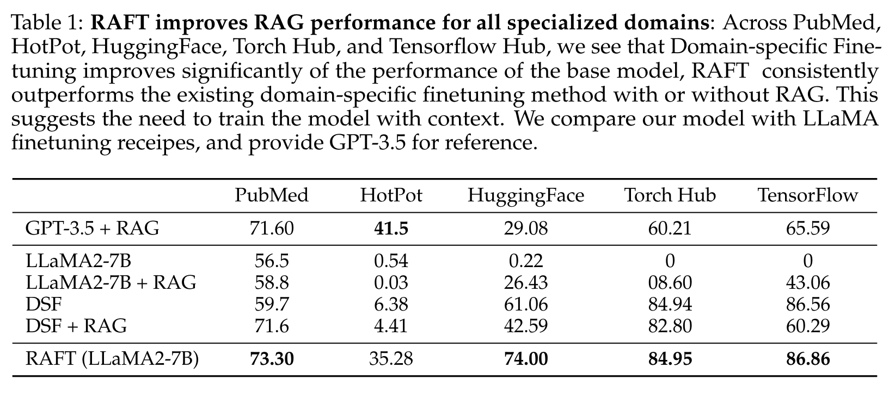

+++
title = "RAFT: 为特定领域的 RAG 应用微调 Llama 2"
date = "2024-08-30T11:37:26+08:00"
description = "An optional description for SEO. If not provided, an automatically created summary will be used."
tags = ["RAG", "Paper"]
+++

## 引言

在人工智能和自然语言处理领域，检索增强生成 (Retrieval-Augmented Generation, RAG) 技术正在迅速崛起。RAG 通过结合大型语言模型的生成能力和外部知识库的准确性，为许多应用提供了强大的解决方案。然而，如何让语言模型更好地适应特定领域的 RAG 任务仍然是一个挑战。最近发表的一篇论文提出了一种新颖的方法来解决这个问题。

## 论文概述

> Zhang, Tianjun, Shishir G. Patil, Naman Jain, Sheng Shen, Matei Zaharia, Ion Stoica, and Joseph E. Gonzalez. "RAFT: Adapting Language Model to Domain Specific RAG." arXiv, June 5, 2024. [http://arxiv.org/abs/2403.10131](http://arxiv.org/abs/2403.10131).

这篇论文介绍了一种名为 RAFT (Retrieval Augmented Fine Tuning) 的新技术，旨在针对 RAG 任务对大型语言模型进行微调。研究团队使用特定领域的文档对 Llama 2 7B 模型进行了监督式微调 (Supervised Fine-tuning, SFT)。

## 核心思想

RAFT 的核心思想是在训练过程中模拟真实世界 RAG 系统的检索环境。在实际应用中，RAG 系统通常会检索出 top K 个相关文档作为上下文提供给语言模型，但这些文档中可能包含一些不太相关的内容。RAFT 通过在训练数据中混合黄金文档（准确相关的文档）和干扰文档（可能不太相关的文档），教会模型如何在噪声中提取有用信息。

## 方法详解

RAFT 的训练数据包括以下组成部分：

1. 问题 ($Q$): 用户查询或需要回答的问题。
2. 文档集合 ($D$): 包括两部分：
   - $P\\%$ 的黄金文档 ($D*$): 与问题高度相关的文档。
   - $(1-P)\\%$ 的干扰文档 ($D_k$): 可能不太相关的文档。
3. 答案 ($A$): 使用 GPT-4 模型，基于问题 $Q$、黄金文档 $D*$ 和 Chain-of-Thought (CoT) 方法生成的高质量答案。

这种训练方法不仅提高了模型生成答案的质量，还增强了模型的可解释性。通过 CoT 方法要求模型在回答问题时引用原文，RAFT 确保了模型的回答是基于检索到的文档，而不是凭空想象。

## 与传统微调方法的区别

传统的微调方法通常只使用高质量的相关文档进行训练，这可能导致模型在面对实际 RAG 场景中的噪声数据时表现不佳。RAFT 通过引入干扰文档，模拟了更真实的检索环境，从而提高了模型在实际应用中的鲁棒性。

## 实验结果

研究团队在多个领域特定的数据集上进行了实验，结果显示 RAFT 相比基线方案都有显著提升：

值得注意的是，实验发现最佳的黄金文档比例 ($P\\%$) 因数据集而异。这一发现提醒我们，在应用 RAFT 时需要根据具体任务和领域进行调整。

## 优势与局限性

优势：

1. 提高了模型在噪声数据中提取有用信息的能力。
2. 增强了模型在面对不同数量检索文档时的鲁棒性。
3. 通过要求引用原文，提高了模型回答的可解释性。

潜在局限性：

1. 需要为每个特定领域重新训练模型，可能耗时耗力。
2. 最佳黄金文档比例需要通过实验确定，增加了调优的复杂性。
3. 在极度专业或罕见的领域，可能难以获得足够的训练数据。

## 结论

RAFT 为改进领域特定的 RAG 系统提供了一种有前景的方法。通过模拟真实的检索环境，RAFT 成功地提高了语言模型在处理特定领域查询时的性能和鲁棒性。
