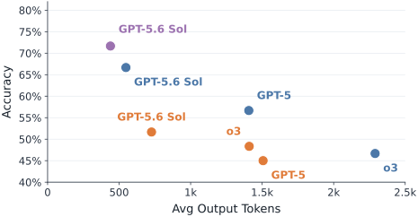
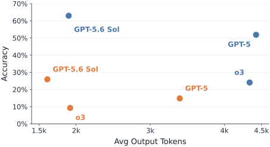
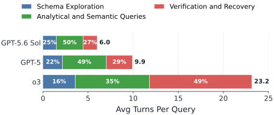
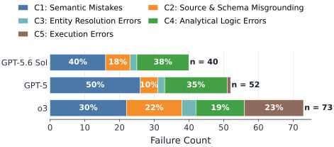
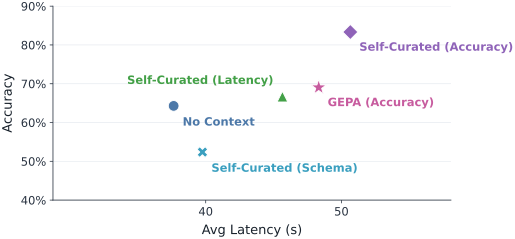
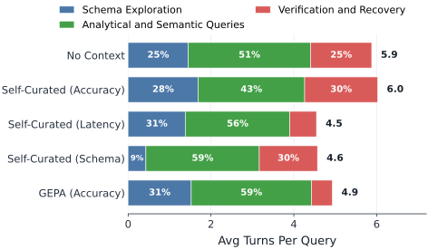

+++
title = "当模型吞下整个技术栈：重新思考数据 Agent 如何抵御「苦涩教训」"
date = "2026-09-28T21:35:00+08:00"
description = "随着通用模型逐步内化数据处理能力，数据系统的研究重点正从任务脚手架转向可跨查询复用的持久语义上下文。"
tags = ["AI", "Agent", "Software Engineering", "Paper", "Translation"]
+++

> **原文**：What Happens When the Model Eats the Stack? Rethinking the Research Agenda for Data Agents to Withstand the Bitter Lesson
>
> **作者**：Liana Patel（Stanford University）、Siddharth Jha（Stanford University）、Negar Arabzadeh（UC Berkeley）、Carlos Guestrin（Stanford University）、Ion Stoica（UC Berkeley）、Matei Zaharia（UC Berkeley）
>
> **arXiv**：<https://arxiv.org/abs/2609.03141>

---

## 摘要

「苦涩教训」（bitter lesson）向数据系统社区提出了一个关乎存续的问题：端到端训练的大语言模型（LLM）正在迅速内化过去需要精心设计的数据 Agent 才能实现的新能力。基于实证观察，我们认为，随着模型持续进步，许多为弥补模型在特定任务上能力不足而设计的系统层，将越来越多地被模型本身吸收。相较之下，持久的研究机会在于帮助数据 Agent 跨越多个查询，利用经过整理的数据环境上下文；我们将其称为**持久语义上下文（persistent semantic context）**。我们发现，这种上下文层在提升数据 Agent 性能方面前景显著，但也带来了重要的系统挑战。因此，未来数据系统的一项关键要求，是将持久语义上下文作为一等抽象原生提供，以支持能力强大的数据 Agent 处理庞大而复杂的知识语料。围绕这一愿景，我们提出了一系列新的研究机会，包括设计高效的上下文数据结构、存储方法、压缩技术和语义一致性（semantic consistency）协议，确保所存上下文知识的完整性与正确性。

## 1. 引言 {#sec-1}

在日益强大的前沿大语言模型（LLM）推动下，Agent 能力正经历剧烈转变，迅速改写数据 Agent 的发展格局，并有望让用户通过自然语言询问自己的数据。过去几年里，LLM 已从简单的文本生成器，演进为能够自主执行复杂、长时程任务的系统：它们可以推理、调用工具、执行代码，并在配备终端、文件系统和执行循环后派生子 Agent。

这一发展轨迹向数据系统社区提出了一个关乎存续的问题。Richard Sutton 将其概括为「苦涩教训」（bitter lesson）（[Sutton, 2019](#ref-sutton-2019)）：能够扩展计算规模的通用方法（例如端到端模型训练），最终会取代手工设计的领域知识。因此，我们提出这样的问题：随着模型持续进步、将内化的能力纳入自身并逐步「吞下整个技术栈」，哪些系统问题仍将长期存在，并变得对未来数据 Agent 更加重要？

为了以实证方式探究这个问题，我们研究过去两年数据处理 Agent 能力的演进。我们使用 2025 至 2026 年的前沿模型，在近期数据 Agent 基准上测量了先进的人类设计数据 Agent 和通用编码 Agent 的性能。实验分析带来了一些出人意料的发现，也挑战了以 Agent 为先的系统设计中的常见看法。首先，我们发现，随着模型能力提升，通用编码 Agent 的表现大幅超过人类设计的数据 Agent；它们准确率更高，也不再需要那些通过僵化脚手架和任务分解注入人类先验的流水线。此外，新模型正迅速提升通用编码 Agent 的**效率**，显著减少每个查询平均所需的轮数和 token 数。这一趋势直接挑战了近期研究的基本前提（[Liu et al., 2026](#ref-liu-et-al-2026)）：该研究认为，未来数据系统将受制于「Agent 式推测」（agentic speculation），即 Agent 发出的查询数量庞大且效率低下，数据系统需要针对这种工作负载进行优化。相反，我们观察到，新模型本身就在提升特定任务的执行效率：随着模型代际演进，平均而言，模型以更少的操作、更低的失败频率解决每项任务。

有意思的是，在为数据 Agent 提供丰富的数据环境上下文、并支持其跨越多个查询方面，仍然存在重大挑战。即使最强的 Agent，也必须反复重新获取环境上下文；为了再次发现此前查询已经揭示过的 schema、连接路径和数据语义，它们仍要付出显著的相对成本。这些持续存在的低效并非模型**推理**能力不足——模型正快速内化推理能力——而是缺乏关于特定数据环境的**知识**。这类知识存在于模型之外，会随数据变化，而且可能被反复、徒劳地重新推导。

因此，非参数化上下文信息将成为更强大数据 Agent 日益重要的需求。它是关于工作环境的显式知识，不会在训练期间作为参数化知识被模型习得。我们将这种上下文知识称为**持久语义上下文**。系统将在离线阶段构建这种状态，以语言形式表示数据环境知识，其相关成本可在多个用户查询之间分摊。我们展示了语义上下文的潜力：即使是简单的、由 Agent 编写的上下文（例如，Agent 根据历史轨迹并利用数据环境访问权限离线写成的文件），也能显著提升准确率，减少每项任务的探索工作量；近期研究也证实了这一发现（[agentsm2026, 2026](#ref-agentsm2026-2026)；[Lin et al., 2025](#ref-lin-et-al-2025)；[Agrawal et al., 2025](#ref-agrawal-et-al-2025)）。不过，我们也发现，持久语义上下文会引入显著的系统开销，形成一系列新的重要挑战，而这些正是数据库社区有能力应对的问题。




（a）TAG-Bench



（b）DAB

> <a id="fig-1"></a>**图 1**：通用编码 Agent（蓝色）和人类设计的数据 Agent（橙色）在两个数据 Agent 基准——TAG-Bench 和 DAB——上的表现。图中对比了不同代模型，包括 2025 年初发布的 o3、2025 年中发布的 GPT-5，以及 2026 年中发布的 GPT-5.6 Sol。

为了服务能力更强的数据 Agent，未来的数据系统需要将持久语义上下文作为一等抽象原生提供。围绕这一愿景，我们提出了新的研究机会：既要设计新的语义一致性协议，确保所存上下文知识的完整性与正确性，也要为这一层设计高效的物理布局、数据结构和压缩技术。本文的主要贡献如下：

- 我们研究了过去两年通用编码 Agent 和人类设计的数据 Agent 能力的演进，测量它们在近期数据 Agent 基准上的任务性能、效率和失败模式。
- 我们展示了：不断增强的模型虽然提升了单项任务的性能与效率，但一个长期存在的重要挑战，是通过持久语义上下文为数据 Agent 提供跨查询支持，使其能够掌握丰富的数据环境信息。
- 基于这些发现，我们提出了新的研究机会，着眼于未来数据系统的一项关键需求：原生支持 Agent 使用持久语义上下文。

## 2. 理解 Agent 能力与失败模式的演进 {#sec-2}

本节研究过去两年数据处理 Agent 能力的演进，对比通用编码 Agent 与先进的人类设计数据 Agent 的表现。我们使用两个近期的数据 Agent 基准：TAG-Bench（[Biswal et al., 2025](#ref-biswal-et-al-2025)）包含需要在关系数据库上结合精确计算、语义推理和世界知识的问题；Data-Agent Benchmark（DAB）（[dab2025, 2026](#ref-dab2025-2026)）则评估在碎片化企业数据上执行多步分析任务的能力。我们评估了覆盖 2025 至 2026 年的三个模型系列：2025 年初发布的 o3（[OpenAI, 2025b](#ref-openai-2025b)）、2025 年中发布的 GPT-5（[OpenAI, 2025a](#ref-openai-2025a)），以及 2026 年中发布的 GPT-5.6 Sol（[OpenAI, 2026](#ref-openai-2026)）。每个模型都通过 Codex 编码 Agent harness 进行评估，并与先进的人类设计数据 Agent 进行比较。在 TAG 上，我们评估了人类设计的数据 Agent Agentar-Scale-SQL（[Wang et al., 2025](#ref-wang-et-al-2025)）。它是 BIRD 排行榜（[Li et al., 2023](#ref-li-et-al-2023)）上的先进系统，但其完整推理代码并未公开。我们采用其已发表的 SQL 生成提示，并依照论文中描述的流程添加了自定义的、由执行结果引导的修订步骤。在 DAB 上，Agentar-SQL 并非为多轮任务而设计，因此我们评估了 DeepEye（[Li et al., 2026](#ref-li-et-al-2026)）：这是 BIRD-SQL 排行榜上表现次优且可执行多轮任务的开源系统。DeepEye 是一个多 Agent 系统，会先生成数据分析工作流，再按需执行并修复该工作流。对于每种基线，我们都测试了所有模型推理等级；为简洁起见，本文报告低推理等级的结果，而其他等级也呈现出一致趋势。

_模型能力越强，通用编码 Agent 就越能大幅超越人类设计的数据 Agent。_ [图 1](#fig-1) 展示了通用编码 Agent 和先进的人类设计数据 Agent 在 TAG-Bench 与 DAB 上的表现。值得注意的是，使用 GPT-5.6 Sol 时，通用编码 Agent 在两个基准上的准确率都显著高于使用同一模型的人类设计数据 Agent。有意思的是，在较弱的 o3 模型下，TAG-Bench 上的人类设计 Agentar-Scale-SQL 数据 Agent 准确率更高、token 效率也优于 o3 编码 Agent。然而，随着模型代际演进，这一趋势发生逆转：使用同一模型时，编码 Agent 的准确率和 token 效率都超过了人类设计的数据 Agent。这些结果表明，随着模型逐渐内化规划、代码生成、调试和验证等能力，其性能与泛化能力很可能会超过依赖人类先验和固定设计的数据 Agent。

_通用编码 Agent 的准确率和 token 效率都在迅速提升。_ [图 1](#fig-1) 显示，在 TAG-Bench 上，随着模型版本迭代，编码 Agent 的准确率和 token 效率均有所提高。事实上，GPT-5.6 Sol 编码 Agent 的准确率已接近 Oracle 基线；该基线由专家编写查询，并通过 LOTUS runtime 执行（[Patel et al., 2024](#ref-patel-et-al-2024)）。类似地，在 DAB 上，GPT-5.6 编码 Agent 的表现显著超过此前的 Agent；相较于 o3 编码 Agent，其准确率提高了超过 35 个百分点，token 效率则提高了 2 倍以上。这些提升来自一个通用 Agent harness，没有针对具体任务或数据进行专门工程设计。



> <a id="fig-2"></a>**图 2**：不同代际编码 Agent 在 DAB 上每个查询所需的轮数。

_新模型大幅减少每个查询的轮数，提升 token 效率。_ 我们通过测量 DAB 上编码 Agent 每个查询所需的轮数来研究其效率，并按 schema 探索、分析计算和验证等操作类型进行拆分。[图 2](#fig-2) 显示，随着模型代际演进，编码 Agent 每个查询所需的轮数急剧下降。值得注意的是，与 o3 编码 Agent 相比，GPT-5.6 Sol 编码 Agent 每项任务所需轮数减少了约 4 倍。这一效率提升来自分析和语义查询轮数的显著减少，以及验证或恢复步骤的减少。有意思的是，这一趋势与先前研究提出的前提相反（[Liu et al., 2026](#ref-liu-et-al-2026)）：该研究认为，Agent 工作负载会产生大量低效的推测性查询，数据系统必须为此做准备。相反，我们应当预期模型会持续提高效率，以更少的查询轮数得出正确答案。

_随着模型代际演进，schema 探索的相对成本有所上升。_ 从[图 2](#fig-2) 还可以看出，能力更强的模型虽然总体操作轮数更少，但对于 GPT-5.6 Sol 编码 Agent 来说，schema 探索仍占据相当大的相对成本。随着推理、规划和调试能力增强，Agent 越来越多的精力将用于获取模型无法预先知道的信息：有哪些数据、数据代表什么，以及哪些数据源与当前任务相关。我们预计，随着模型能力进一步增强，成本将从反复构造查询和验证结果，逐步转向理解数据环境本身。

_现存挑战在于理解环境与上下文。_ 为了理解失败模式的变化趋势和剩余缺口，我们分析了 TAG 与 DAB 上每个失败的编码 Agent 查询轨迹。我们使用 GPT-5.6 Sol，按照[表 1](#tbl-1) 所述的五类失败模式对每条轨迹进行根因聚类。[图 3](#fig-3) 展示了两个基准上的失败分布。我们发现，随着模型能力增强，因工具使用或执行不正确而产生的执行错误有所减少。与此同时，GPT-5.6 Sol 的剩余错误主要源于**环境知识缺失**。具体来说，超过 60% 的失败来自语义误解，包括误解任务含义或依赖无效代理指标（C1）、使用了错误的数据源、表、字段或指标（C2），以及错误使用实体、连接键和标识符。



> <a id="fig-3"></a>**图 3**：TAG 和 DAB 上不同代际编码 Agent 的失败根因类别分布。



（a）加入不同持久上下文后的编码 Agent 性能



（b）每个查询的轮数

> <a id="fig-4"></a>**图 4**：在 GPT-5.6 Sol 编码 Agent 执行任务时，额外提供自整理上下文或 GEPA 生成上下文的效果。上下文由 GPT-5.6 Sol 利用 12 条样本轨迹离线构建，分别针对不同指标（延迟、准确率和 schema 知识）进行优化；评估时将上下文附加到模型提示中，并在留出的 DAB 任务上测试。

<a id="tbl-1"></a>**表 1. 根因失败类别的统一分类法**

| 类别 | 失败模式 |
| --- | --- |
| C1 | 误解任务含义，或依赖无效的代理指标 |
| C2 | 选择了错误的数据源、表、字段或指标 |
| C3 | 实体、连接键或标识符不匹配 |
| C4 | 筛选、聚合、排序或输出逻辑不正确 |
| C5 | 运行时、工具或命令执行失败 |

_持久语义上下文能够提升性能，并分摊每项任务的探索成本，但也会带来显著的系统开销。_ 为了研究利用更丰富上下文信息对性能的影响，我们为 GPT-5.6 编码 Agent 提供了通过不同技术离线生成的额外持久上下文。具体来说，我们通过提示编码 Agent 自行编写上下文，生成**自整理**（Self-Curated）上下文，并针对不同目标进行优化：降低延迟（Latency）、提高准确率（Accuracy），或记录 schema 知识以减少在线探索（Schema）。我们还评估了针对准确率优化的 GEPA（[Agrawal et al., 2025](#ref-agrawal-et-al-2025)）。每种上下文生成基线都使用 GPT-5.6 Sol，并向其开放 DAB 中的 12 条样本查询和全部数据库。评估时，我们在其余留出的 DAB 任务上运行 GPT-5.6 Sol 编码 Agent，并将生成的上下文附加到用户提示中。我们将其与「无上下文」基线进行比较：该基线不会向模型输入附加持久上下文，但允许模型像前面的实验一样，在每个查询执行时探索环境。

[图 4](#fig-4) 展示了 Agent 生成的上下文能够有效改善不同目标指标。正如[图 4](#fig-4)（a）所示，自整理（准确率）上下文使准确率比无上下文编码 Agent 提高了 19 个百分点。有意思的是，自整理（延迟）上下文比准确率导向的上下文减少了 Agent 每个查询的平均轮数和延迟，但如[图 4](#fig-4)（b）所示，其延迟仍高于无上下文基线。另一方面，自整理（Schema）上下文有效记录了数据环境知识，使 Agent 在评估时花在 schema 探索上的查询轮数显著减少，如[图 4](#fig-4)（b）所示。不过，如[图 4](#fig-4)（a）所示，编码 Agent 的整体准确率略有下降。这可能是因为 Agent 对整理后的上下文过度依赖，也可能是因为上下文过拟合了数量较少的 12 条轨迹样本。

<a id="tbl-2"></a>**表 2. 不同上下文构建技术的构建时间、成本和内存开销**

| 方法 | 构建时间 | 构建成本 | 上下文大小（KB） |
| --- | ---: | ---: | ---: |
| 自整理（准确率） | 164.9 秒 | $1.09 | 2.52 |
| 自整理（延迟） | 154.9 秒 | $1.13 | 2.25 |
| 自整理（Schema） | 3413.6 秒 | $9.60 | 162.14 |
| GEPA（准确率） | 1359.8 秒 | $12.16 | 7.55 |

再看[表 2](#tbl-2)，构建和存储持久上下文的成本可能很高，构建时间、构建成本和内存开销都相当可观，由此带来了新的系统挑战。值得注意的是，我们的设置只在小规模环境中构建上下文，仅使用了 12 条历史轨迹和 12 个数据集；而现实中的数据 Agent 环境可能包含数 TB 数据、数千张表，以及长时程 Agent 轨迹。即使在我们的小规模实验设置中，构建上下文也需要数百至数千秒。自整理（Schema）上下文的成本最高：构建时间超过 3400 秒，成本为 $9.60，上下文大小为 162 KB。这些开销源于 Agent 对数据集进行大范围离线搜索，并存储大量数据环境知识，以减少在线探索。我们预计，构建、存储和维护持久上下文所需的系统成本，将随着数据存储规模与复杂度，以及 Agent 任务的范围和时程而增长。

## 3. 面向抵御「苦涩教训」的研究议程 {#sec-3}

随着模型持续进步，过去需要精心设计 Agent 流水线才能实现的许多能力——包括规划、代码生成、工具使用、调试和迭代验证——正越来越多地由底层模型直接提供。因此，那些主要用于弥补这些能力短板的系统层，重要性很可能会逐渐降低。这一趋势体现了「苦涩教训」（[Sutton, 2019](#ref-sutton-2019)）：通用学习系统的进步，最终会胜过日益复杂的手工算法和启发式方法。

然而，即使能力很强的模型，在与庞大而复杂的数据环境交互时，也无法只依赖参数化知识。为了准确回答用户请求，它们必须利用关于当前数据环境的组织专属知识。例如，要回答「撰写一份季度业务回顾，解释欧洲收入为何未达预测，与财务部门的官方数据核对差异，并提出纠正措施」，就必须找出分散在多个系统中的权威数据集、解决相互冲突的指标定义、理解组织专属的业务惯例、解释半结构化文档，并验证中间结果。底层数据环境可能覆盖数 TB——远大于典型代码库——其中还包含动态的、组织专属的、未记录在案的惯例。这使上下文信息对任务完成至关重要，也让反复重新获取上下文的成本变得高昂。

因此，我们为数据库社区提出一项研究议程，核心是支持**持久语义上下文**：以语言形式显式表示数据环境知识，在离线阶段构建、在线阶段高效访问，并将成本分摊到多个查询之间。随着模型能力增强、用户任务变得更复杂，这一层的价值和规模都会持续增长。任务的范围与时程会不断扩大，Agent 需要保留更多外部信息，例如规范的指标定义、权威数据源、实体关系、历史发现、组织惯例和用户偏好。此外，持久语义上下文可以由模型自身有效编写，这意味着其质量和规模能够随模型能力同步提升：更强的模型能够利用并维护更多上下文，也能更有效地将已掌握的环境知识提炼为质量更高的持久上下文。与成本更高、需要更新模型参数的训练技术相辅相成（[Tandon et al., 2025](#ref-tandon-et-al-2025)；[Zweiger et al., 2025](#ref-zweiger-et-al-2025)；[Shenfeld et al., 2026](#ref-shenfeld-et-al-2026)），上下文层需要保留显式知识状态，使其易于编辑、保持新鲜、可靠且便于人工审计。要支持这些功能，就必须解决大量新的挑战，也由此为数据库社区带来令人振奋的机会。我们提出了若干关键方向：开发新的语义一致性技术，确保持久上下文正确且完整；同时设计经过优化的数据结构、构建方法、物理设计和压缩技术。

### 3.1. 维护语义一致性 {#sec-3-1}

随着时间推移，数据环境会不断变化：新表会加入，schema 会演进，文档会更新，业务定义会改写，用户会提出更正，底层数据会出现统计分布变化，查询模式也会改变。这些更新可能使持久上下文失效，导致 Agent 执行错误或效率低下。这带来了一项重大挑战，我们称之为**语义一致性**：确保上下文层包含的自然语言知识或语义知识始终准确、及时。传统一致性模型通常针对明确的数据对象和操作（例如读取、写入和更新）进行推理；语义一致性之所以困难，是因为上下文层包含自然语言材料之间隐含的关系。某个概念、数据集或工作流发生变化，可能会使看似无关的上下文条目失效，而这些依赖关系并未被显式记录。因此，系统必须围绕含义的变化而非状态的变化进行推理。下面我们概述若干挑战和有待进一步探索的方向。

_一致性范围。_ 未来的上下文层可能需要类似命名空间或多版本数据管理的机制，允许多个语义视图共存，同时确保每个视图在其预期范围内保持一致。在最细粒度上，单个用户可以维护个性化上下文层，记录其偏好的数据集、过往交互和积累的执行历史。在更广的范围内，项目团队通常共享通用业务定义、推荐数据集、操作指导和示例，这些内容应在协作者之间保持同步。在企业层面，治理政策、可信数据产品或规范业务指标的更新，应一致地传播到组织内运行的所有 Agent。最后，有些上下文来自企业之外，例如公开文档、监管指南或外部 API；这引入了全局范围，要求组织上下文与外部来源保持同步。因此，确定语义更新的适用范围本身就成为一个基本的系统问题。获取新知识后，系统必须确定哪些人应看到这项更新、更新如何在重叠的范围之间传播，以及何时应协调相互冲突的语义视图，或允许它们继续共存。

_一致性模型。_ 确定一致性范围之后，下一个问题是系统应提供哪些保证。经典数据库系统提供了丰富的一致性模型，包括强一致性和最终一致性；它们分别体现了新鲜度、可用性和维护成本之间的权衡。语义上下文也存在类似的设计空间。监管报告或生产仪表盘等应用可能要求强语义一致性，确保每个 Agent 在执行前都能看到最新获批的上下文。相反，协作式分析可能可以接受最终语义一致性，允许语义更新异步传播，从而降低维护开销。最后，系统也可以采用查询触发的语义一致性：仅当 Agent 访问上下文层的某部分时，才按需重新验证该部分。这种方式能够将维护成本分摊到未来工作负载中，对于包含数千个语义材料的大型上下文层可能特别有吸引力。如何选择合适的语义一致性模型，以及理解它对准确率、延迟、可扩展性和维护成本的影响，仍然是一个开放的研究问题。

_一致性方法。_ 检测到不一致后，系统必须决定如何恢复一致性。一种方法是增量语义维护：将上下文层拆分为细粒度语义材料，在新信息出现时有选择地重新验证并更新。这类似于增量视图维护：系统传播变化来更新派生表示，而不必从头开始重新计算。但与传统视图不同，语义上下文来自多种异构来源，包括 schema、文档、历史查询和 Agent 轨迹；变化可能沿着隐式语义依赖传播，而不是显式关系依赖。另一种极端做法是整体重新生成；随着长上下文模型能力增强，这可能成为一种有吸引力的选择。系统不必维护复杂的依赖结构，而可以定期直接从底层环境重新生成上下文层。维护粒度的选择由此形成了丰富的设计空间：对大型上下文层而言，细粒度增量更新可能更具可扩展性，并降低 token 成本；对于较小环境，端到端模型或许可以推理整个上下文，整体重新生成也可能更有优势。理解这种权衡并开发感知工作负载的语义维护策略，是一个重要的研究机会。

### 3.2. 上下文构建与物理设计 {#sec-3-2}

关键在于，语义上下文层可以将重复的在线查询处理转移到离线预处理阶段，并分摊其成本。Agent 不再需要反复探索 schema、检查表格和重新发现组织知识；系统可以构建可复用的语义表示，例如自然语言 Markdown 文件。已有多项工作展示了执行离线处理步骤的潜力（[Lin et al., 2025](#ref-lin-et-al-2025)；[Zhang et al., 2025](#ref-zhang-et-al-2025)；[Agrawal et al., 2025](#ref-agrawal-et-al-2025)；[agentsm2026, 2026](#ref-agentsm2026-2026)），它们能够提升 Agent 执行下游查询的效率。然而，要为通用数据 Agent 构建语义上下文层，就必须处理大规模数据环境和大量历史轨迹，因此离线构建的可扩展性与效率成为核心问题。社区仍需回答一个开放问题：如何设计可大规模构建上下文层的技术，同时保证构建时间短、内存占用小、访问速度快。值得振奋的是，其中许多系统挑战与传统索引问题类似，而数据库社区完全有能力深入探索。

_数据结构。_ 一个核心开放问题是：应当用什么数据结构表示语义上下文？与 B-tree 或哈希索引不同，语义上下文结构必须编码异构信息，包括 schema、文档、历史查询、执行轨迹和组织知识，同时支持高效构建、更新和检索。已有研究提出了多种候选方案，从自由形式的文本文件，到结构化知识图谱和向量索引（[Zhang et al., 2025](#ref-zhang-et-al-2025)；[Edge et al., 2024](#ref-edge-et-al-2024)；[Lewis et al., 2021](#ref-lewis-et-al-2021)）。这些技术在构建时间、内存开销、更新复杂度、检索效率和新鲜度方面各有取舍。未来需要研究哪些表示方式最适合不同工作负载。正如经典数据库系统会组合多种物理结构（例如索引、物化视图和缓存），语义上下文也可能需要根据工作负载组合不同表示方式。

_物理设计。_ 语义上下文的物理组织提供了新的研究机会。在执行过程中，Agent 可能既依赖**查询无关上下文**——例如可在多次执行中复用的 schema 描述、业务术语和组织文档——也依赖**查询相关上下文**，例如中间推理、执行轨迹或针对特定工作负载生成的见解。这些异构访问模式带来了经典的物理设计问题：哪些上下文应持久存储？哪些应缓存或建立索引？语义记忆应如何在快速但昂贵的表示（例如 KV cache 或本地文本记忆）与较慢但紧凑的长期存储之间进行分区？

_压缩。_ 长期存在的语义上下文层最终可能包含数百万 token 的 schema、文档、历史查询轨迹、执行日志和 Agent 生成的推理，远超 LLM 能够直接消化的规模。近期研究已经探索了对 KV cache 进行**压缩整理**（compaction）（[Eyuboglu et al., 2025](#ref-eyuboglu-et-al-2025)；[Zweiger et al., 2026](#ref-zweiger-et-al-2026)），用以支持 Agent 在单次会话中的工作记忆；但对持久语义记忆压缩的关注还少得多。未来的系统需要高效技术，在整合累积知识的同时，保留对下游任务最有用的信息。更广泛地说，语义上下文带来了新的生命周期管理问题：Agent 不断生成新的观察结果，系统必须决定保留、合并、压缩或丢弃哪些内容，因此需要新的垃圾回收与压缩策略。

## 4. 结论 {#sec-4}

我们提出了一个愿景：面对模型能力的快速演进，未来数据库研究应致力于赋能数据 Agent。对于先进 Agent 而言，理解庞大而复杂的数据环境仍是一项重大挑战，因此持久语义上下文至关重要。我们既展示了持久语义上下文的潜力，也指出了与之相关的系统挑战，并提出了令人振奋的研究机会：设计能够原生支持 Agent 的数据系统，包括高效的上下文数据结构、存储与压缩技术，以及语义一致性机制。

###### 致谢

本研究部分由 Stanford DAWN 项目的附属成员和其他支持者资助，其中包括 Meta、Google 和 VMware，以及 Cisco、SAP 和 Sloan Fellowship。本文表达的任何观点、发现、结论或建议均属于作者，并不一定反映资助方的观点。

## 附录 A 实验细节

### A.1. 人类设计的基线

_受 Agentar 启发的 SQL 流水线。_ 对于 TAG-Bench 中 60 个非聚合查询，我们实现了 Agentar-Scale-SQL（[Wang et al., 2025](#ref-wang-et-al-2025)）的 SQL 专用近似方案。模型根据原始问题和实时 SQLite schema 生成 SQL，然后根据一轮执行反馈修订查询。由于完整的 Agentar 推理流水线尚未公开，我们的基线使用了已发表的生成提示，但没有复现尚未发布的多生成器、审阅器或选择器组件。

**清单 1：受 Agentar 启发的 SQL 生成提示。**

```text
任务概述：
你是一名数据科学专家。下面会提供数据库 schema 和一个自然语言问题。你的任务是理解 schema 并生成有效的 SQL 查询来回答问题。

数据库引擎：
SQLite

数据库 schema：
{db_schema}
该 schema 描述数据库结构，包括表、列、主键、外键，以及相关关系或约束。

问题：
{question}

指示：
- 确保只输出问题所要求的信息。如果问题要求特定列，SELECT 子句中就只包含该列，不要多选。
- 生成的查询应返回问题要求的全部信息，不能遗漏，也不能多给。
- 生成最终 SQL 查询之前，请先逐步思考如何编写查询。

输出格式：
请将生成的 SQL 查询放在代码块中：
'''sql
-- 你的 SQL 查询
'''

深呼吸，逐步思考，找出正确的 SQL 查询。
```

**清单 2：由执行结果引导的修订提示。**

```text
你正在执行由结果引导的迭代 SQL 修订。

请检查原始任务、先前生成的 SQL 及其执行结果。判断该结果是否完整回答了原始问题。如果没有，请修订 SQL。你可以利用自己的知识，以及结果中可见值的语义信息。修订后的 SQL 必须可独立执行，且执行结果必须恰好包含所请求的答案，不能遗漏，也不能多给。
你无法访问参考答案或标准答案。

原始任务：
{original_prompt}

先前的 SQL：
'''sql
{previous_sql}
'''

执行结果：
{execution_preview}

请只返回一个修订后的 SQL 查询，并将其放在 '''sql 代码块中。
```

_DeepEye。_ 在 DAB 上，我们端到端运行 DeepEye 的开源 Supervisor/工作流 Agent（[Li et al., 2026](#ref-li-et-al-2026)），并为 DuckDB 和 MongoDB 添加数据源连接器。

### A.2. 上下文生成基线

所有上下文生成实验均使用 DAB 上固定的分层划分：12 个开发查询（每个数据库环境各一个）和 42 个留出查询。上下文使用 GPT-5.6 Sol 离线构建。构建完成后，每份上下文材料都会被冻结，并附加到第一个用户提示中。

#### A.2.1. 自整理

_准确率与延迟上下文。_ 对于每个目标，单次生成器调用会接收全部 12 条开发轨迹：问题、正确性与验证器反馈、Agent 消息、有序命令及其输出、token 测量值和延迟测量值。清单 3–4 展示了通用生成提示及针对不同目标添加的后缀。生成的指令块会在评估时原样注入，详见清单 5 和清单 6。

**清单 3：自整理上下文的通用生成提示。**

```text
你正在为数据库问答 Agent 设计可复用的操作指令。你以 GPT-5.6 Sol、高推理等级运行。

你只能访问 `development_traces.jsonl` 中恰好 12 条由 GPT-5.6 Sol/高推理等级先前运行产生的开发轨迹。

每一行 JSON 都包含问题、正确性与验证器反馈、延迟和 token 指标、Agent 消息，以及带工具输出的有序命令轨迹。这些是你唯一可以使用的实证示例。

分析全部 12 条轨迹，包括成功和失败的轨迹。找出反复出现的根本原因、低效行为、可靠策略，以及准确率与操作次数之间的相互影响。区分偶然解决单个问题的修复方法与可复用的行为规则。

对于每条拟议指令，先在内部建立一张证据表，记录：（a）该指令针对的反复出现行为；（b）这种行为出现的频率；（c）它出现在正确轨迹、错误轨迹，还是两者之中；（d）它可能带来的准确率收益；（e）它可能造成的延迟或操作成本。不要输出这张表；用它剔除仅由一个特例支持的规则，除非该规则可以避免一大类严重错误。

生成一段简洁的指令，供未见过的留出数据库问题使用，并原样注入第一个用户提示。评估器不会挂载 skill，下游 Agent 也不得耗费操作去寻找或读取 skill。

`instructions` 要求：
- 写成可独立使用的祈使性指导，不要写分析或回顾。
- 适用于 SQLite、DuckDB、PostgreSQL、MongoDB、结构化元数据、自由文本、多数据源、聚合、排序和精确格式等情形。
- 不要提及 DataAgentBench、轨迹、开发集/留出集划分、查询 ID、数据集名称、标准答案或特定示例常量。
- 不要要求下游 Agent 阅读 skill 或辅助指令文件。
- 遵守基准规则：只使用获准的数据库，实际执行计算，并按要求的格式返回答案。
- 优先采用带条件的决策规则，而非无条件的额外步骤。明确说明可观察的触发条件、要执行的操作和停止条件。
- 不要对各种异构问题规定单一的硬性操作上限。如果需要设定预算，应采用基于风险的软预算，并明确何时可以升级。
- 将不可或缺的正确性检查与冗余确认区分开。只有在检查能够区分合理的候选答案时才要求执行。
- 避免给出基础模型大概已经掌握的全面数据库 Agent 建议。
- 只纳入轨迹支持的行为改进。
- 指令块长度应为 120 至 450 词。每条指令都必须证明其提示 token 成本和行为成本合理。
- 在 `predicted_tradeoffs` 结尾提出可证伪的预测，分别涉及每个查询的命令数、输出 token 数、延迟和相对基线的准确率。

回答前，确认你分析了 12 条互不重复的轨迹。只返回包含 `analysis_summary`、`instructions` 和 `predicted_tradeoffs` 的 JSON 对象。
```

**清单 4：自整理上下文的目标专属后缀。**

```text
[准确率]
首要目标：最大限度提高未见任务的准确率。

设计数量尽可能少、价值尽可能高的防错规则，以避免反复出现的错误答案。只有当轨迹提供支持时，才优先处理总体数量/粒度错误、语义解读、跨数据源键对齐、稀疏字段语义、排序与并列、日期边界、解析覆盖率和精确输出格式。

不要把每种风险都变成强制操作。对于每项检查，说明可检测到的风险触发条件和成本低且具有决定性的测试。保留基线模型的成功行为：避免用僵化流程取代模型判断、避免重复读取 schema、避免冗长规划。优先采用一次组合计算，加一次由风险触发的验证，而不是多轮递增式探查。如果两种计算结果不一致，应说明如何根据问题和数据所支持的语义选择解释，而不是仅仅运行更多变体。

在尽量少增加中位数命令数、token 数和延迟的前提下，争取实现可测量的准确率提升。移除所有只会鼓励泛泛谨慎的指令。

[延迟]
首要目标：在保持 Agent 原有准确率的前提下，尽量降低未见任务的端到端延迟和操作次数。

既要减少工具耗时，也要减少模型推理时间。去掉冗余探索、脆弱命令、重复读取 schema、不必要的叙述、无法改变答案的备选计算，以及无条件验证。优先采用合并后的目录/schema 读取和一次完整、稳健的计算。

不要为了提速而过早接受看似合理的结果。不要再使用全局硬性操作上限，或几乎彻底取消验证；应改用按风险触发的策略：
- 对低风险直接查找，一旦得到所需的结果形式，就立即停止；
- 若语义、连接、日期、并列、解析、稀疏字段或聚合粒度可能改变答案，则执行一次成本低且针对性强的检查；
- 只有命令失败、连接或解析覆盖率低、证据矛盾，或尚未解决且会影响结果的歧义出现时，才超过软预算。

明确说明哪些操作应当合并、哪些小型诊断值得其延迟成本，以及具有决定性的检查完成后应如何停止。保留对正确性至关重要的语义处理。预期的改进应来自减少恢复操作和冗余分析，而不是减少以数据为依据的操作。
```

**清单 5：生成的自整理准确率上下文。**

```text
仅使用获准的数据库，实际执行计算，并返回所要求的答案，而不是未经执行的查询。

检查一次目录、schema 和代表性记录。将请求转换为目标总体、实体粒度、筛选条件、度量、分组、排序和输出基数。若一个实体可能对应重复行、多个版本、标签或事件，则在请求指定的阶段按规范 ID 去重；只有重复数据可能改变结果时，才检查去重计数或基数。

组合多个数据源时，先用少量记录测试拟议的连接键，并同时计算匹配覆盖率和连接扇出。在存在 ID 或关联表时，不要将样例名称、显示文本或仓库示例当作规范归属依据。只有当数据表明存在大小写、空格、前后缀等差异时，才做相应规范化。

如果请求的是主题、意图、资格或类别，而数据中没有结构化字段，就不要用字面关键词是否出现来替代。应依据相关文本和知识证据采用以覆盖率为导向的语义规则；检查少量对照样本和类别占比，当解释稳定后就停止。只有当数据源包含完整的合格总体时，才将缺少记录或空值视为「不存在」。

如果自由文本解析会实质影响答案，就测量解析覆盖率和歧义。只有在漏项或多重匹配可能影响胜出结果时，才检查这些情况；应扩展解析，直到覆盖完整，或证明剩余漏项不会改变结果。筛选日期之前先解析日期格式变体，并将包含首尾日期的日历区间表示为左闭右开的范围。对于移动窗口或 EMA 计算，应构造预期的周期序列，并根据问题含义判断缺失周期应记为零还是未知。

对于 top-k 结果，检查截断点是否存在并列。使用请求指定的次级键或数据定义的次级键；如果都没有，就应明确呈现并列，不要捏造任意的决胜规则。

优先采用一次组合计算，再进行一次成本低且能判定胜出结果的验证。仅当连接存在丢失/扇出、解析器漏项显著、截断处有并列、稀疏字段的缺失语义不确定，或确实存在相互竞争的解释时，才升级检查。如果不同方案结果不一致，应选择最符合问题措辞、schema 和数据语义的方案；不要取平均、投票，或在缺少决策标准时继续查询。最后严格按照要求返回字段、顺序、条数、精度和格式；如果要求「只返回」，就不要添加额外解释。
```

**清单 6：生成的自整理延迟上下文。**

```text
仅使用所提供目录/说明中获准的数据库，实际执行计算，并严格按要求返回字段、顺序、舍入方式和格式。

从已提供的目录入手；如果其中已经包含连接信息，就不要扫描文件系统。用一条初始命令读取目录/说明，并仅检查候选数据源中相关的 schema、样例值和基本计数。直接使用 `python3` 进行跨数据库编排，以只读方式打开分析文件，对非常规标识符加引号，并避免使用保留字作为别名。

计算之前，在内部明确语义约定：合格总体、实体粒度和唯一键、连接键、日期边界、指标、分组、排序、并列处理方式及输出格式。尊重对键/粒度的明确要求：先按指定 ID 去重或统计引用，再将结果归属到仓库、软件包、企业或其他上级实体。优先使用结构化字段和关系；除非数据明确表明自由文本关键词就是该类别的编码，否则不要用它替代类别标签。

将筛选、键规范化、去重、连接、聚合、排序和格式化合并为一次稳健计算。如果不得不解析文本，应覆盖已观察到的措辞变体，并保留匹配/未匹配计数。如果连接或解析会影响答案，就执行一次成本低的覆盖率诊断，并且只检查那些可能改变胜出结果的未匹配记录。只有在可能改变结果时，才检查日期、滚动统计或 EMA 的包含边界、缺失周期处理和初始化方法。对于 top-N 结果，检查截断点的并列情况，绝不要捏造任意的决胜规则。

低风险直接查找一旦得到所需结果形式，就立即停止。否则，执行一次针对性检查，比较可能改变答案的备选方案；一旦结果排序保持不变或歧义得到解决，就停止。直接结构化查询以 2–3 次工具操作为软目标；多数据源、文本解析或统计任务以 3–5 次为软目标。只有在命令失败、覆盖率低、证据矛盾或结果相关歧义未解决时，才超过该目标。不要重复读取 schema，也不要重复执行无法改变结果的计算。
```

#### A.2.2. GEPA

我们使用 GEPA 0.1.1 版（[Agrawal et al., 2025](#ref-agrawal-et-al-2025)）优化面向准确率的持久指令提示。优化从空指令开始，并将相同的 12 个开发任务同时用作训练数据和验证数据。每个候选方案都通过与无上下文基线相同的隔离 Codex harness 进行评估。优化最多进行 60 次逻辑指标评估。

## 参考文献

1. <a id="ref-agentsm2026-2026"></a>agentsm2026 (2026) AgentSM: semantic memory for agentic text-to-sql. https://arxiv.org/abs/2601.15709 [<https://arxiv.org/abs/2601.15709>]
2. <a id="ref-agrawal-et-al-2025"></a>Agrawal et al. (2025) L. A. Agrawal et al. GEPA: reflective prompt evolution can outperform reinforcement learning. https://arxiv.org/abs/2507.19457 [<https://arxiv.org/abs/2507.19457>]
3. <a id="ref-biswal-et-al-2025"></a>Biswal et al. (2025) A. Biswal, L. Patel, S. Jha, A. Kamsetty, S. Liu, J. E. Gonzalez, C. Guestrin, and M. Zaharia Text2SQL is not enough: unifying AI and databases with TAG. CIDR 2025https://arxiv.org/abs/2408.14717 [<https://arxiv.org/abs/2408.14717>]
4. <a id="ref-dab2025-2026"></a>dab2025 (2026) DAB: a benchmark for data agents over fragmented enterprise data. https://arxiv.org/abs/2603.20576 [<https://arxiv.org/abs/2603.20576>]
5. <a id="ref-edge-et-al-2024"></a>Edge et al. (2024) D. Edge, H. Trinh, N. Cheng, et al. From local to global: a graph RAG approach to query-focused summarization. https://arxiv.org/abs/2404.16130 [<https://arxiv.org/abs/2404.16130>]
6. <a id="ref-eyuboglu-et-al-2025"></a>Eyuboglu et al. (2025) S. Eyuboglu, R. Ehrlich, S. Arora, N. Guha, D. Zinsley, E. Liu, W. Tennien, A. Rudra, J. Zou, A. Mirhoseini, and C. Re Cartridges: lightweight and general-purpose long context representations via self-study. [<https://arxiv.org/abs/2506.06266>]
7. <a id="ref-lewis-et-al-2021"></a>Lewis et al. (2021) P. Lewis, E. Perez, A. Piktus, F. Petroni, V. Karpukhin, N. Goyal, H. Küttler, M. Lewis, W. Yih, T. Rocktäschel, S. Riedel, and D. Kiela Retrieval-Augmented Generation for Knowledge-Intensive NLP Tasks. arXiv (en). arXiv:2005.11401 [cs]Comment: Accepted at NeurIPS 2020 [<http://arxiv.org/abs/2005.11401>]
8. <a id="ref-li-et-al-2026"></a>Li et al. (2026) B. Li, Y. Peng, Y. Xie, S. Lu, Y. Zhu, X. Mu, X. Liu, and Y. Luo DeepEye: a steerable self-driving data agent system. In Companion of the International Conference on Management of Data, pp. 74–77. [<http://dx.doi.org/10.1145/3788853.3801612> <https://dx.doi.org/10.1145/3788853.3801612>]
9. <a id="ref-li-et-al-2023"></a>Li et al. (2023) J. Li, B. Hui, G. Qu, J. Yang, B. Li, B. Li, B. Wang, B. Qin, R. Cao, R. Geng, N. Huo, X. Zhou, C. Ma, G. Li, K. C. C. Chang, F. Huang, R. Cheng, and Y. Li Can LLM Already Serve as A Database Interface? A BIg Bench for Large-Scale Database Grounded Text-to-SQLs. arXiv (en). arXiv:2305.03111 [cs]Comment: NeurIPS 2023 [<http://arxiv.org/abs/2305.03111>]
10. <a id="ref-lin-et-al-2025"></a>Lin et al. (2025) K. Lin, C. Snell, Y. Wang, et al. Sleep-time compute: beyond inference scaling at test-time. https://arxiv.org/abs/2504.13171 [<https://arxiv.org/abs/2504.13171>]
11. <a id="ref-liu-et-al-2026"></a>Liu et al. (2026) S. Liu, S. Ponnapalli, S. Shankar, et al. Supporting our AI overlords: redesigning data systems to be agent-first. CIDR 2026https://arxiv.org/abs/2509.00997 [<https://arxiv.org/abs/2509.00997>]
12. <a id="ref-openai-2025a"></a>OpenAI (2025a) OpenAI Introducing gpt-5. https://openai.com/index/introducing-gpt-5/Accessed 2026-08-04 [<https://openai.com/index/introducing-gpt-5/>]
13. <a id="ref-openai-2025b"></a>OpenAI (2025b) OpenAI Introducing openai o3 and o4-mini. https://openai.com/index/introducing-o3-and-o4-mini/Accessed 2026-08-04 [<https://openai.com/index/introducing-o3-and-o4-mini/>]
14. <a id="ref-openai-2026"></a>OpenAI (2026) OpenAI GPT-5.6: frontier intelligence that scales with your ambition. https://openai.com/index/gpt-5-6/Accessed 2026-08-04 [<https://openai.com/index/gpt-5-6/>]
15. <a id="ref-patel-et-al-2024"></a>Patel et al. (2024) L. Patel, S. Jha, C. Guestrin, and M. Zaharia LOTUS: Enabling Semantic Queries with LLMs Over Tables of Unstructured and Structured Data. arXiv. arXiv:2407.11418 [cs] [<http://arxiv.org/abs/2407.11418> <https://dx.doi.org/10.48550/arXiv.2407.11418>]
16. <a id="ref-shenfeld-et-al-2026"></a>Shenfeld et al. (2026) I. Shenfeld, M. Damani, J. Hübotter, and P. Agrawal Self-distillation enables continual learning. [<https://arxiv.org/abs/2601.19897>]
17. <a id="ref-sutton-2019"></a>Sutton (2019) R. S. Sutton The bitter lesson. http://www.incompleteideas.net/IncIdeas/BitterLesson.html [<http://www.incompleteideas.net/IncIdeas/BitterLesson.html>]
18. <a id="ref-tandon-et-al-2025"></a>Tandon et al. (2025) A. Tandon, K. Dalal, X. Li, D. Koceja, M. Rød, S. Buchanan, X. Wang, J. Leskovec, S. Koyejo, T. Hashimoto, C. Guestrin, J. McCaleb, Y. Choi, and Y. Sun End-to-end test-time training for long context. [<https://arxiv.org/abs/2512.23675>]
19. <a id="ref-wang-et-al-2025"></a>Wang et al. (2025) P. Wang, B. Sun, X. Dong, Y. Dai, H. Yuan, M. Chu, Y. Gao, X. Qi, P. Zhang, and Y. Yan Agentar-scale-sql: advancing text-to-sql through orchestrated test-time scaling. [<https://arxiv.org/abs/2509.24403>]
20. <a id="ref-zhang-et-al-2025"></a>Zhang et al. (2025) Q. Zhang et al. Agentic context engineering: evolving contexts for self-improving language models. https://arxiv.org/abs/2510.04618 [<https://arxiv.org/abs/2510.04618>]
21. <a id="ref-zweiger-et-al-2026"></a>Zweiger et al. (2026) A. Zweiger, X. Fu, H. Guo, and Y. Kim Fast kv compaction via attention matching. [<https://arxiv.org/abs/2602.16284>]
22. <a id="ref-zweiger-et-al-2025"></a>Zweiger et al. (2025) A. Zweiger, J. Pari, H. Guo, E. Akyürek, Y. Kim, and P. Agrawal Self-adapting language models. [<https://arxiv.org/abs/2506.10943>]
